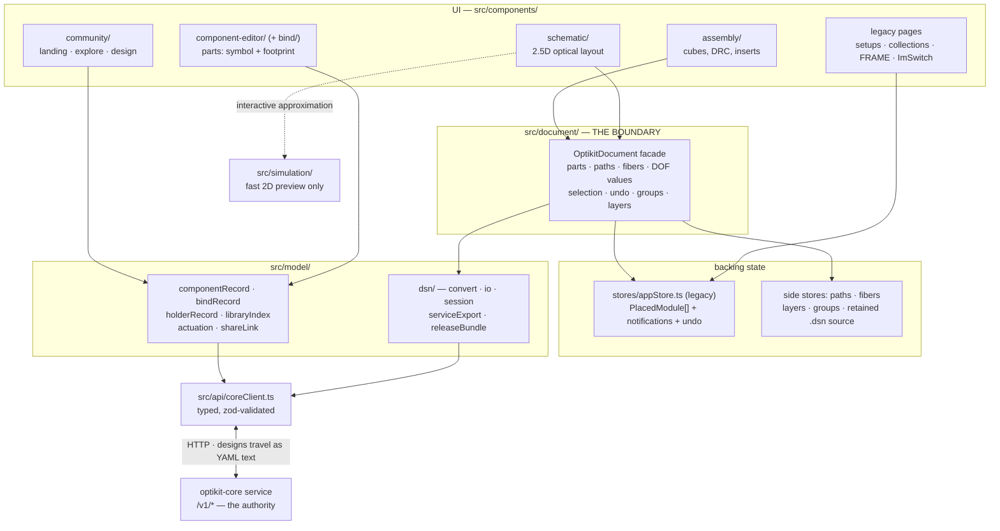
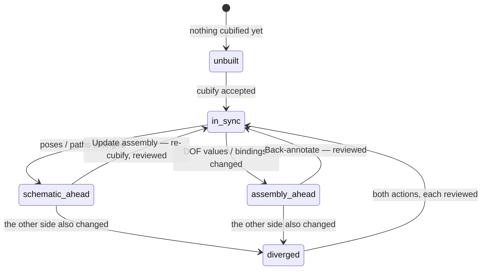
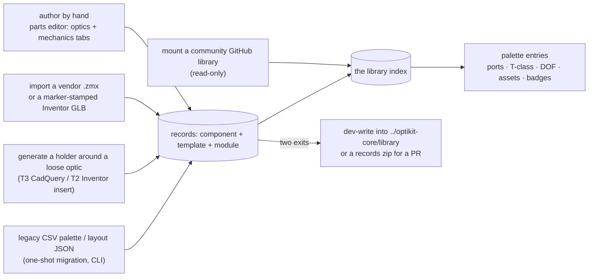

# openUC2-OptiKit — architecture walkthrough

**Status:** current as of 2026-07-30 — the editor side is through **WP-86**
(calibrate from the running instrument), with WP-71 (ad-hoc grouping) in the
working tree. The per-package history is the status ledger in
[kicad-for-optics-execution.md](kicad-for-optics-execution.md).
**Audience:** anyone picking up this repo who needs to know what the editor can
do and what each part of `src/` is for, before changing anything.

This is the counterpart of `../../optikit-core/DOCS/ARCHITECTURE.md`: same
shape, other side of the wire. It says *what the editor can do*, then *how it is
put together*, then *which conventions you must not break*.

| Also read | For |
|---|---|
| `../../optikit-core/DOCS/DSN-CONTRACT.md` | **the normative frontend↔backend contract** — document frame, the 24 rotations (`rot24.svg`), pose composition, ports, API surface. We speak DSN; start external contributors here |
| [CODEBASE-GUIDE.md](CODEBASE-GUIDE.md) | the file-by-file map across **both** repos, plus a diagram per user flow and a debugging map |
| `../../optikit-core/DOCS/ARCHITECTURE.md` | the engine: what every `/v1/*` endpoint actually computes |
| `../../optikit-core/DOCS/LIBRARY.md` | how to author and contribute a part record |
| `../../optikit-core/DOCS/WORKING_WITH_FRONTEND.md` | running both repos together day to day |
| [kicad-for-optics-execution.md](kicad-for-optics-execution.md) | the work-package ledger — *why* each thing exists |
| [datamodel-unification.md](datamodel-unification.md) | the rationale for the shared schema |
| [inventor-naming-contract.md](inventor-naming-contract.md) | the Inventor → GLB datum-marker rules the importer parses |
| `src/document/mapping.ts` | the pose conventions, in code — **read before touching coordinates** |

---

## 1. The one-sentence mental model

**This app is the editor pair; the engine owns the truth.**

The editor is a *view over one document*. Every design edit goes through the
`src/document` facade, and every authoritative answer — is this design valid,
where do the rays go, what does the grid pose decompose to, what does the
optimizer suggest — comes from optikit-core over HTTP. The browser keeps a fast
approximate 2D ray preview for interactivity, but it never *decides* anything.

Two editors sit on that one document, exactly like a PCB tool:

- the **schematic** (`/configurator/schematic`) — the optical layout: glyphs,
  ports, beam paths, continuous millimetre poses;
- the **assembly** (`/configurator/assembly`) — the board: cube modules on the
  50/50/55 mm grid, DRC, inserts, mechanics.

Plus the surfaces that feed them: the **parts editor**
(`/configurator/components`, symbol + footprint of a part), the **community**
pages (landing / explore / a design), and a set of legacy pages kept alive for
existing users.



### The hard rule

> **New editor components import design-model state ONLY from `src/document`
> — never from `stores/appStore` directly.**

The facade currently wraps the legacy `appStore` (`PlacedModule[]`, the
*flattened* form of the `.dsn` component tree). It will be re-backed by the
`.dsn` document without changing its API, and that only stays possible if
nothing reaches around it. Legacy components (the setup browser, the FRAME
wizard, the notification/undo plumbing) still use `appStore`; do not add new
consumers. The handful of documented exceptions (`clipboard.ts` copying the raw
orientation triple, `unbindAction.ts` raising a toast) say so in a comment
explaining why.

---

## 2. What the editor can do (the verb table)

| I want to… | Where | What happens under the hood |
|---|---|---|
| place a part | schematic / assembly palette | `addPart` via the facade; a library part's grid rotation is derived from its own ports (entry beam → +x) |
| move / rotate / tilt it | canvas drag, property panel | `movePartWorld` / `rotatePart` / `setPartOrientation`; continuous mm + a full `offset-deg` residual triple |
| wire the beam | click port pins | a `paths` chain of `PortRef`s — the netlist |
| let the app wire it for me | "check"/"simulate" with no paths | `POST /v1/chain/infer`, proposal adopted into the document; dead ends drawn as dashed red **escape rays** |
| patch two ports with a fiber | fiber controls | a `fibers` entry — no geometric constraint, the cord's own length counts |
| check the design (ERC) | schematic ▸ service panel | `POST /v1/validate` → findings as markers, keyed by stable `E_*` codes |
| trace the real rays | ▸ simulate | `POST /v1/simulate` → world-space polylines re-folded through the compile manifest, drawn over the canvas and greyed out once the document changes |
| see the classic 2D layout | ▸ layout viewer | `POST /v1/draw` → optiland's own PNG (the **unfolded** axis, so a 90° fold looks flat) |
| know how much light arrives | with simulate | the photon budget from the same call |
| optimize a focus / spacing | ▸ optimize dialog | `POST /v1/optimize` over the declared ranged DOFs → a **classified delta table**; only rows you accept are applied |
| read the built instrument back in | ▸ calibrate dialog | measured axis positions (over the UC2-REST link, or typed) → `POST /v1/calibrate` → the same review table, stamped `provenance.source: instrument` |
| drive a motor / galvo now | property panel actuation | `src/model/actuation.ts` mirrors the engine's mapping → a CAN or UC2-REST command POSTed to your controller |
| turn the layout into cubes | assembly ▸ cubify | `POST /v1/cubify` → the per-part grid pose + DRC table, reviewed before acceptance |
| see what breaks the rules | assembly | DRC billboards at the offending part (`DRC_RANGE`, `DRC_T1_MOVED`, `DRC_COLLISION`, `DRC_APERTURE`) |
| nudge a T2 insert | assembly drag | clamped to the declared DOF range, written as a `dof_value` |
| put a loose optic in a cube | ▸ "generate a holder…" | `POST /v1/generate` (the placed δ/ΔR folded into the params) → preview the printable halves → accept materializes template + module records and re-points the part |
| take the optic back out | ▸ "unbind" | the exact inverse: the part re-points at the bare component, same pose, one undo step |
| author a part | `/configurator/components` | *optics* tab = the symbol (Optiland fragment, datum frames, ports, vendor); *mechanics* tab = the footprint (upload STEP → place against a ghost cube → author datums → T-class) |
| import a vendor prescription or an Inventor GLB | parts editor ▸ import | `POST /v1/import/zmx` / `/v1/import/glb` → the **proposed** records for review; nothing is written until you accept |
| attach Inventor mechanics to an existing part | assembly ▸ attach | the STEP+GLB an ME produced are written onto the **same** template record — no new ids, no merge logic |
| browse the parts database | palette + library browser | `GET /v1/library/index` (fresh per request), with a bundled snapshot as automatic offline fallback |
| add someone else's library | ▸ add library from GitHub | a fork of `optikit-community-template` publishing `library-index.json`; its parts join the palette under its own badge, read-only |
| save a part I authored | ▸ save | two exits: dev-write into `../optikit-core/library` (`POST /v1/library/save`) or a records zip for a PR |
| group cubes into one thing | shift-select ▸ group | WP-44 instance tags on the parts, so the cluster drags rigidly and survives export/import; an ad-hoc group can graduate into a real `cube_group` record |
| turn layers on and off | layer chips | KiCad discipline: the active working plane is always visible — you can never edit a layer you cannot see |
| see the bill of materials | ▸ BOM | one generator (`src/document/bom.ts`), two consumers (the panel and the release bundle) — the numbers can never fork |
| export for CAD | File ▸ STEP assembly | `POST /v1/export/step`, with or without the beam as geometry |
| export a manufacturing bundle | File ▸ release bundle | design + lockfile pins + BOM + notes + compiled optics + assembly GLB; `optikit-core rebuild` proves it recompiles bit-identically |
| share a design | File ▸ shareable link | `?design=<url>` (hosted) or `?d=<deflate+base64url>` (inline, small designs) |
| take the design elsewhere | File ▸ export/import `.dsn` (zip) | the `.dsn` directory as a zip; import resolves anchor chains |
| learn the flows | Help ▸ guides | three cross-route walkthroughs with per-step deep links |

---

## 3. The two editors and the sync discipline

Both editors edit *the same* document, so there is nothing to synchronize —
but there *is* something to track: which side has moved since the last agreed
state. `src/components/sync` fingerprints the schematic-owned fields (world
poses + optical paths) and the assembly-owned fields (DOF values + module
bindings) separately, remembers each fingerprint at the last explicit sync
action, and renders the KiCad-style chip:



Every transition is an explicit, reviewed action. Nothing is ever applied
automatically — that is the whole point of the chip.

---

## 4. Directory-by-directory

### `src/document/` — the boundary (and the only place poses are interpreted)

The facade plus everything that is genuinely *document* logic. This is the layer
to read first.

| File | What it is |
|---|---|
| `index.ts` | the public surface — the import path every editor component uses |
| `OptikitDocument.ts` (645) | the facade: `listParts`/`addPart`/`movePartWorld`/`rotatePart`/`setDofValue`/`setPath`/selection/undo/groups, plus React hooks (`useDocParts`, …) |
| `types.ts` | the editor-facing types + `UC2_GRID_MM = [50, 50, 55]` + `DocCategory` |
| `mapping.ts` (304) | **the coordinate contract** between the store frame, the document frame and three.js. Read this before touching anything positional |
| `rot24.ts` | the 24 axis-aligned rotations, named by which document axis the part's local +z/+x point along — mirroring the schema's `rotation.grid` |
| `libraryPalette.ts` (596) | registry/workspace/community records → placeable palette entries; T-class, DOF declarations, T1 states, ports, housings, `defaultRotationFor` |
| `portCatalog.ts` | record-style ports for palette parts, so palette placements and imported designs route through **one** code path |
| `pathsStore.ts`, `fibersStore.ts` | the netlist and the patch cords, persisted, kept beside the legacy store until the whole document moves onto `.dsn` |
| `sourceDesignStore.ts` | the **retained** imported `.dsn`, verbatim — everything the legacy store cannot represent (optics fragments, frames/ports, template/dof blocks, location components) |
| `layers.ts`, `layerStore.ts` | layer derivation (a part's layer = its cell z; plates/joints belong to the interface *above* their layer) and the visibility precedence rules |
| `groupStore.ts`, `adhocGroup.ts` | group instances: rigid drag, unlock-for-member-editing, and the bridge from an ad-hoc cluster to a real `cube_group` record |
| `swap.ts`, `unbind.ts` | swap a placement's backing module in place (pose kept, chains kept where port names survive, DOF values re-clamped); unbind = swap to the bare component |
| `clipboard.ts` | copy/paste/duplicate — deliberately *without* chain membership or group tags |
| `bom.ts` | the live BOM generator shared by the panel and the release bundle |
| `revision.ts` | a counter that bumps on *design* changes only, so service results can be stamped and marked stale |

### `src/model/` — records, files, formats

- **`dsn/generated/*.ts`** — **generated** TypeScript types from optikit-core's
  JSON Schema (`npm run gen:schema`, committed). The datamodel is never
  hand-maintained here.
- **`dsn/convert.ts`** (472) — pure conversion between the document snapshot and
  `DesignDecl`. Export writes flattened components (anchor = design origin);
  import resolves anchor chains, so relative designs load too.
- **`dsn/io.ts`** — a design is a directory rooted at `optikit-design.yml`; in
  the browser it travels as a zip. Note: the `yaml` package does not preserve
  comments, so this app only rewrites files it generated itself —
  comment-preserving edits belong to optikit-core (ruamel).
- **`dsn/session.ts`** — applies an imported design to the live document and
  builds the export bundle, all through the facade.
- **`dsn/serviceExport.ts`** (347) — **the document the service actually
  receives.** When a `.dsn` was imported, its retained declaration is the base
  and the live document overlays it: mapped parts override their component's
  pose with the current absolute grid pose, `dof_values` are rebuilt, deleted
  parts delete their component, source-declared paths are kept verbatim while
  their placed-part subsequence still matches, and accepted-optimization
  provenance is stamped. Without a retained source it degrades to the plain
  snapshot conversion.
- **`dsn/releaseBundle.ts`** — the WP-18 zip: merged design, `optikit-lock.yml`
  sha256 pins, `BOM.csv`, `assembly-notes.md`, compiled `optic.<path>.json` +
  manifests, and an `assembly.glb`. Bundled optic JSON writes `±Infinity` as
  `±1e999`, the same wire contract the service uses.
- **`componentRecord.ts`** (603) — the parts editor's working state
  (`RecordDraft`) ⇄ a real component record ⇄ PR-ready YAML. Conventions mirror
  the `.zmx` importer so hand-authored and imported records look alike (`optical`
  at the first vertex, `exit` at first vertex + center thickness, air gaps omit
  `material_post`). Records it produces **must** validate in optikit-core —
  asserted by the committed fixture
  `src/model/__tests__/fixtures/ac254-050-a.component.yml`.
- **`bindRecord.ts`** (546) — datums authored on a mechanical part become
  records. A datum is a point + direction (+ optional aperture) in the **part**
  frame, so it follows the mesh; cube-frame coordinates are derived. Each datum
  becomes one `optics.frames` entry and one `optics.ports` entry; binding to an
  *existing* component (the KiCad symbol↔footprint association) skips the stub
  component and emits only template + module.
- **`holderRecord.ts`** — what a generated T3 holder materializes into: a
  generative template carrying the accepted run's exact params (so regenerating
  is a cache hit) plus a module binding it to the existing component.
- **`libraryIndex.ts`** — the published catalog: default URL is the service's
  `/v1/library/index`, the bundled snapshot under `public/optikit-library/` is
  the **offline fallback only**, and a user-entered URL always wins. Refetches on
  `bumpLibraryIndex()`, so a freshly saved part shows up in the palette without
  a reload.
- **`communityRepos.ts`** — GitHub-hosted libraries mounted read-only.
  Precedence, lowest to highest: builtin `openuc2.*` < mounted repos < local
  drafts. A community repo can *add* parts but never silently override a curated
  one; a shadowed entry is reported rather than dropped.
- **`workspaceLibrary.ts`** — locally persisted `user.*` drafts (with
  thumbnails), merged into the library browser next to the published index.
- **`actuation.ts`** — a DOF value → a firmware command, mirroring the engine's
  `library/actuate.py` so the live editor and the CLI produce the *same*
  command. The device URL is configurable and empty by default.
- **`shareLink.ts`** — `?design=<url>` (hosted, stays short, source stays
  authoritative) and `?d=<payload>` (JSON → deflate-raw → base64url, native
  `CompressionStream`, refused above ~6 kB with a pointer to hosting).
- **`materials.ts`** (1681) — the canonical optiland glass names for
  autocomplete, generated from optiland's material database.

### `src/api/coreClient.ts` (670) — the one door to the engine

Typed wrappers for `validate`, `chain/infer`, `cubify`, `drc`, `compile`,
`simulate`, `draw`, `optimize`, `calibrate`, `import/{zmx,glb}`,
`convert/step-to-glb`, `generate`, `library/save`, `export/step[/part]`.

Three contracts it owns, so no one else has to:

1. **Typed errors.** HTTP 422 `{detail: {code, message, context}}` becomes a
   `CoreServiceError` carrying the stable `code` — UI code branches on the code,
   **never** on the message. An `E_NO_TARGET` chain failure also carries its
   structured escape points, which is what the dashed red rays are drawn from.
2. **Non-finite numbers.** Responses encode `±Infinity` as `±1e999`, which
   `JSON.parse` overflows back to `±Infinity` (nothing to do on ingest); outgoing
   optics lose `Infinity` to `null`, which the service normalizes back.
3. **Zod validation at the boundary**, so a drifting service fails loudly right
   here instead of deep inside the render tree.

The default URL is the page's own origin under https (the production deployment
puts the API and the app behind one Caddy, so there is nothing to configure) and
`http://localhost:8000` otherwise; a URL in `localStorage` always wins.

### `src/components/schematic/` — the optical layout editor

`SchematicPage.tsx` (982) is the shell: palette on the left, canvas in the
middle, a right drawer with the **Design** and **Modules** tabs, plus the
service panel, markers, layer chips and the legend. `SchematicScene.tsx` (815)
is the canvas: glyphs on a working plane, continuous mm dragging (XY in plane,
Shift for height), a free-yaw ring, clickable port pins for chain building, path
polylines, fibers, and the ray overlays.

The pieces worth knowing:

- **`ports.ts`** — port derivation with exactly **one** convention: the
  imported design's real `optics.ports` when there is one, otherwise the
  record-style catalog for palette parts. Same shape either way, so glyph orientation,
  pin placement and beam routing share one code path. `beamAxesOf` applies the
  reflection law (a tilted mirror deviates the beam by **2θ**).
- **`glyphs.tsx`** — category-specific symbols, not cubes; a mirror/splitter
  plate's normal follows from `exit − entry`, so a 45° mount draws a 45° plate.
  `AuthoredSymbol.tsx` renders a record's own SVG when it ships one — looks
  only, pins still come from the ports.
- **`useSchematicSim.ts`** — the fast in-browser 2D preview (the interactive
  approximation), fed from document selectors.
- **`AuthoritativeRays.tsx`** — the service's world-space polylines, coloured
  per path while fresh and greyed once the document has changed under them.
  `EscapeRays.tsx` draws the failures.
- **`serviceStore.ts`** — the round-trip UI state: findings, results stamped
  with the document revision they were computed at, busy/error flags.
- Dialogs: `OptimizeDialog` (pick DOFs → review deltas → apply accepted rows),
  `CalibrateDialog` (the hardware leg), `LayoutDialog` (the 2D drawing),
  `GroupRecordDialog` (graduate an ad-hoc group into a record).
- `ModulesPanel.tsx` — one row per placed part with two-way cross-probing and an
  in-place module swap; a toggle flips the same component into the aggregated
  BOM rollup, rendered by the same generator as the release bundle.

### `src/components/assembly/` — the board editor

`AssemblyPage.tsx` (614) + `AssemblyScene.tsx` (585): cube modules rendered from
the library's GLBs on the 50/50/55 grid, ghost boxes for parts with no bound
template, DRC billboards at offending parts, and constrained insert dragging for
T2 translation DOFs (clamped to the declared range, written through the facade).
`CubifyDialog` is the reviewed forward-annotation table; `GenerateHolderDialog`
is "put it in a cube" (preview the printable halves, the bbox and the envelope
verdict before committing); `AttachInventorDialog` is the round-trip's return
leg (STEP+GLB onto the same template record, no new ids).

### `src/components/component-editor/` (+ `bind/`) — the parts editor

One authoring flow for a part's two halves over a shared record identity:

- **optics** — the *symbol*: the verbatim Optiland fragment, datum frames,
  ports, vendor provenance. `SurfacesTable` edits the prescription and
  `RaySketch`/`GlyphPreview` draw what the numbers actually mean (radii reshape
  the drawn lens; the EFL updates live).
- **mechanics** — the *footprint*: the former standalone bind workbench, now
  `MechanicsPanel` + `BindScene` + `OpticsOverlay`. Upload a STEP (converted to
  GLB by the service), place it against a ghost 50 mm cube with
  `TransformControls`, click surfaces to author datums along their normals, pick
  the template class. The optics overlay lathes the prescription over the mesh so
  you can see whether the model and the metal agree.

`/configurator/bind` deep-links into the mechanics tab. `LibraryBrowser` lists
the published index next to local drafts and opens an index record as an
editable copy. `ImportVendorDialog` is the `.zmx`/GLB drop zone.

### `src/components/community/` — the front door

`HomePage` (the landing page with real stats), `ExplorePage` (the gallery with
filters and BUILDABLE cards), `DesignDetailPage` (star / fork & edit / download,
with the BOM joined in). Its own teal design system lives in
`communityTheme.ts`.

### The rest

| Path | What it is |
|---|---|
| `src/components/AppShell.tsx` | the one shell (brand theme + toolbar + content frame) every route mounts inside; pages must not wrap themselves in another `ThemeProvider` |
| `src/components/Toolbar.tsx` (691) | the File/Edit/Help menus: `.dsn` import/export, STEP assembly, release bundle, share link, layout upload, ImSwitch config, guides |
| `src/components/PartLibrary.tsx` | the palette: grouped by category · namespace, T-class badges, glyph thumbnails, "add library from GitHub", deep link into the parts editor |
| `src/components/bom/`, `guides/`, `library/`, `sync/` | the BOM dialog, the guided walkthroughs, the community-repo dialog, the sync chip |
| `src/simulation/SimulationEngine.ts` (1061) | the in-browser 2D geometric tracer — the fast *preview* only; its two consumers are the schematic overlay (`useSchematicSim`) and the parts editor's `RaySketch` |
| `src/stores/appStore.ts` (982) | the legacy backing store: `PlacedModule[]`, notifications, undo history, layout persistence, setup upload |
| `src/theme/` | brand tokens, the MUI themes (dark editor / light document), scene colours |
| `src/types/index.ts` (878) | the legacy model types (`ModuleDefinition`, `PlacedModule`, simulation types) |
| `src/utils/` | scene building for the 2D tracer, frame-library loading, usage statistics |
| `scripts/` | `gen-schema-types.mjs` (schema → TS), `visual-regression.mjs` (`npm run vr` → `DOCS/visual-regression/`), GLB thumbnail/dev-asset generators |
| `public/optikit-library/` | the bundled library-index snapshot used when the service is unreachable |
| legacy routes | `SetupBrowser` + `CollectionView` (community setups from the Store repo's CSV/JSON), `FrameWizardPage` (the FRAME microscope configurator), `ImSwitchConfigWizard` (ImSwitch config export). `/configurator/grid` and `/configurator/3d` redirect into the schematic and assembly — the Konva 2D builder and the old 3D view were deleted in WP-69 |

---

## 5. How a part gets into the palette

Five roads in, one shape out. Whatever the road, the result is records that
optikit-core validates — the editor never invents a private part format.



A part can legitimately be in one of three states, and the palette shows which:

1. **an unbound symbol** — an optical component no module binds: placeable, moves
   in continuous mm, claims no grid cell, invisible to DRC, badged `UNBOUND`;
2. **a symbol with a housing** — mechanics with no cube (`footprint_grid: null`);
3. **a cube module** — component + template bound together, on the grid, with
   T-class rules enforced (T1 residuals locked, T2 travel clamped, T3
   regenerable).

"Generate a holder…" moves a part from state 1 to state 3; "unbind" moves it
back. Both are one undo step.

---

## 6. Frames and conventions (the things you must not break)

**Three frames exist, and `src/document/mapping.ts` is the only place that
converts between them.**

| Frame | Convention |
|---|---|
| **document** (= the `.dsn` design frame) | millimetres, right-handed, **z up**; x east, y north. Grid pitch `UC2_GRID_MM = [50, 50, 55]` |
| **store** (legacy `PlacedModule`) | integer grid cell + layer, yaw in degrees, 90°-step top/tilt rotations; continuous residuals live in `params.__doc` (`offsetMm`, `offsetDeg`, `dofValues`) |
| **three.js** (rendering) | y up: `three(x, y, z) = doc(x, z, −y)` |

Other load-bearing conventions:

1. **Rotation = `R24 · ΔR`.** A part's orientation is one of the 24 axis-aligned
   rotations times a residual `offset-deg` triple, extrinsic ZXY
   (`Rz·Rx·Ry`) in the part's local frame — the same convention the engine and
   the Go repo use. Legacy `freeYawDeg` layouts migrate on read.
2. **Records are authored along ±z; the document wants the beam along +x.**
   Placement therefore applies `DEFAULT_LIB_ROT` rather than remapping ports, so
   an exported `.dsn` carries the record optics verbatim and the service agrees
   with the canvas.
3. **One name for a degree of freedom.** The DOF name is the Inventor fx
   parameter name is the firmware axis-map key — across both repos.
4. **One generator per number.** The BOM has one implementation feeding both the
   panel and the release bundle; the actuation mapping has one implementation
   per side, deliberately mirrored and tested. Two projections of the same
   number must never be computed twice.
5. **Error codes, never messages.** Branch on `E_*` / `DRC_*` / `W_*`; the
   human text is free to change.
6. **Reviewed, never automatic.** Cubify, back-annotation, calibration,
   generated holders and imported records all land in a table or a preview the
   user accepts. The editor applies what was accepted, nothing more.
7. **Undo brackets whole verbs.** `captureUndo()` / `commitUndo()` around a
   multi-part operation (swap, unbind, paste, group, accept-holder) so one user
   action is one undo step.
8. **STEP is the mechanical truth; GLB is render-only.** The editor displays
   GLBs and ships them in bundles, but a record's authoritative mechanics is its
   STEP.

---

## 7. Working on this repo

```bash
npm run dev        # Vite dev server (the editor)
npm test           # vitest — 229 tests in 27 files
npm run lint       # eslint (run before committing)
npm run gen:schema # regenerate src/model/dsn/generated/*.ts from optikit-core
npm run build      # tsc -b && vite build
npm run vr         # visual-regression screenshots → DOCS/visual-regression/
```

The engine usually runs beside it:

```bash
cd ../optikit-core && uv run optikit-core serve --port 8000
```

See `../../optikit-core/DOCS/WORKING_WITH_FRONTEND.md` for the two-repo
workflow (including the library dev-write loop, where saving a record in the
editor writes into `../optikit-core/library` and the palette refreshes).

**Testing philosophy.** Unit tests live in `__tests__/` next to the code and
concentrate on the places where a mistake is silent rather than loud:

- **the conversions** — `mapping.test.ts`, `convert.test.ts`,
  `serviceExport.test.ts`: a pose that round-trips wrong looks plausible on
  screen and is wrong in the trace;
- **the document verbs** — swap, unbind, clipboard, groups, layers, BOM: each
  asserts what survives an operation and what is deliberately dropped;
- **record shapes** — `componentRecord.test.ts`, `bindRecord.test.ts`, with a
  committed fixture that optikit-core must accept, so the two repos cannot drift
  apart quietly;
- **ports and routing** — `ports.test.ts`: the reflection law, and the rule that
  palette parts and imported designs share one port convention.

**Known rough edges** (documented, not hidden): the facade still wraps the
legacy store, so undo history covers parts but not paths; the fast 2D preview
applies a mirror's 2θ deviation while the authoritative compiler currently
rotates rigidly by θ (WP-82a will make the engine agree — the preview is the
correct one); and the legacy pages listed above still read `appStore` directly.
