# OptiKit — the whole codebase, file by file, flow by flow

**Status:** current as of 2026-07-27 (both repos through WP-58, plus Part 2i's
WP-60/61/62 — unbound symbols, `/v1/generate`, and prescription-derived solids).
**Audience:** you, coming back to this after a while — or anyone new.

This is the map. It answers three questions:

1. **What does each file do?** — [Part 3](#part-3--optikit-core-file-by-file) (engine) and
   [Part 4](#part-4--openuc2-optikit-file-by-file) (editor).
2. **What happens when I click things?** — [Part 2](#part-2--the-user-flows) has a
   diagram per flow: authoring a part, loading an STP, annotating optics,
   schematic, DRC, ray tracing, cubify, and the round trip.
3. **Where do I put a breakpoint?** — [Part 5](#part-5--debugging-map), which pairs
   with `optikit-core/main.py` (a runnable, narrated tour of every engine stage).

Related reading, not repeated here:
| Document | What it has that this doesn't |
|---|---|
| `../../optikit-core/DOCS/ARCHITECTURE.md` | Deeper prose on core internals (parts predate WP-11) |
| `../../optikit-core/DOCS/LIBRARY.md` | How to contribute records; the one-database contract |
| `../../optikit-core/DOCS/GO_INTEGRATION.md` | Correspondence with Ethan's Go repo, E2 asks |
| `../../optikit-core/DOCS/WORKING_WITH_FRONTEND.md` | Running both repos together |
| `kicad-for-optics-execution.md` | The work-package ledger — *why* each thing exists |
| `datamodel-unification.md` | The rationale for the schema |
| `inventor-naming-contract.md` | The Inventor → GLB datum-marker naming rules |
| `MODULE_DATABASE_GUIDE.md` | The legacy CSV module database (mostly retired by WP-43) |

---

## Part 1 — The 60-second mental model

**Two repos, one schema.**

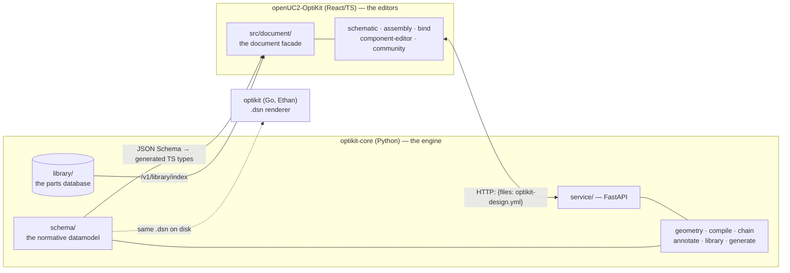

Three sentences that explain almost everything:

1. **There is exactly one document type.** `optikit-design.yml` (a `.dsn`
   directory's root file), parsed into the Pydantic model `DesignDecl`.
   Every engine function is a *pure function over a `DesignDecl`* — no
   database, no server-side state, no file mutation unless you pass `--apply`.
2. **Records are PARTS, designs are ARRANGEMENTS.** `library/` holds versioned
   part records (KiCad's symbol/footprint libraries); a `.dsn` references them
   by `id@semver-range` and says where they sit. Never confuse the two.
3. **The frontend never touches the engine's math.** It sends YAML over HTTP and
   renders what comes back. Everything geometric that matters is computed in
   Python so the CLI, the service, and the tests agree by construction.

### The two editors and what they correspond to

| OptiKit | KiCad | Route | What you manipulate |
|---|---|---|---|
| Schematic | Schematic capture | `/configurator/schematic` | Optical symbols in free mm space; beam paths are nets |
| Assembly | PCB layout | `/configurator/assembly` | The same parts snapped to 50/50/55 mm cubes |
| Component editor | Symbol editor | `/configurator/components` | A part's optics (surfaces, ports) |
| Bind workbench | Footprint editor | `/configurator/components` (mechanics tab) | A part's mechanics (STEP mesh + datums) |

### The three record kinds (the "parts database")

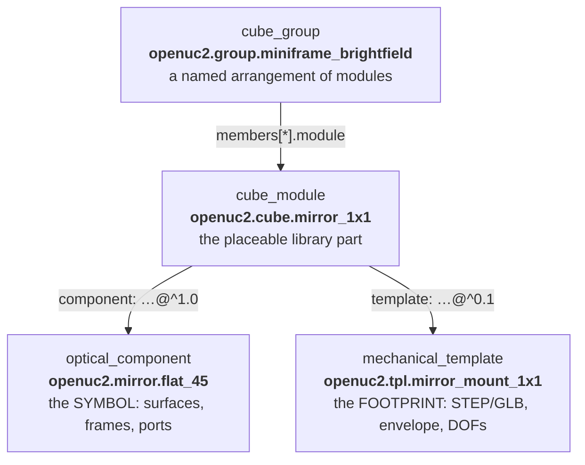

**A carrier is not a fifth kind.** `carrier: true` is a *flag* on
`TemplateRecord` (WP-45) for mechanics that **host** cubes rather than fill a
cell — the FRAME, baseplates, puzzle pieces, sandwich plates. Carriers may
declare named `bays` a group can dock into:

```yaml
kind: mechanical_template
id: openuc2.tpl.frame
class: fixed
carrier: true
bays:
  miniframe: {origin-cell: [1, 1, 0], size: [3, 3, 2], axis: +z}
footprint_grid: [5, 5, 3]
```

On disk, one directory per record, assets beside the YAML:

```
optikit-core/library/
  components/openuc2.mirror.flat_45/component.yml
  templates/openuc2.tpl.mirror_mount_1x1/{template.yml, model.step, model.glb}
  modules/openuc2.cube.mirror_1x1/module.yml
  groups/openuc2.group.miniframe_brightfield/group.yml
  archive/…                ← WP-68: retired records; the loader skips it.
                             `library restore <id>` brings a trio back.
  dist/index.json          ← built by `optikit-core library build`
```

Since WP-68 the live library is a **starter set** (~30 modules): six
hand-authored seeds (`starter_50mm`, `z_motor`, `laser_basic`, `led_basic`,
`camera_basic` + `mirror_45`) at zero-review-flag quality, the reference
exemplars (galvos, the thorlabs zmx import), and the carrier/plate/puzzle/
group records. The 288 WP-43-migrated lookalikes live under `archive/`; a
reference to one fails with `E_ARCHIVED` naming the restore command.

The palette in the editor is *exactly* this library, served by
`GET /v1/library/index` (with `public/optikit-library/index.json` as the offline
fallback).

---

## Part 2 — The user flows

### 2.0 The whole pipeline, one picture

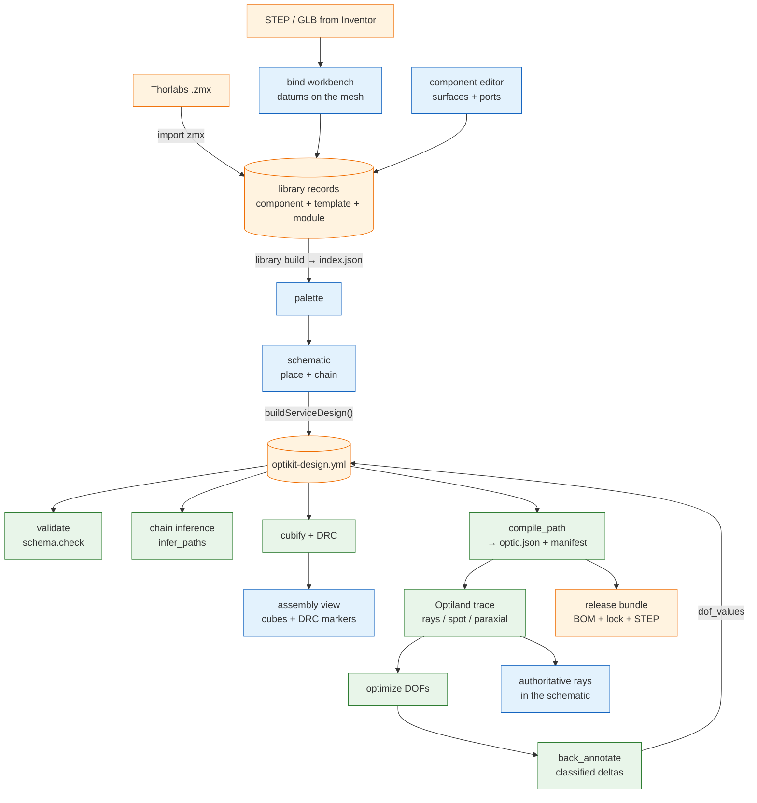

Read it as three loops: **authoring** (top, makes parts), **design**
(middle, makes an arrangement), **analysis + return** (bottom, computes and
feeds results back into the design as `dof_values`).

---

### 2.1 Flow — create a new part (the symbol)

**Route:** `/configurator/components`, "optics" tab.
**You end up with:** a `component.yml` record.

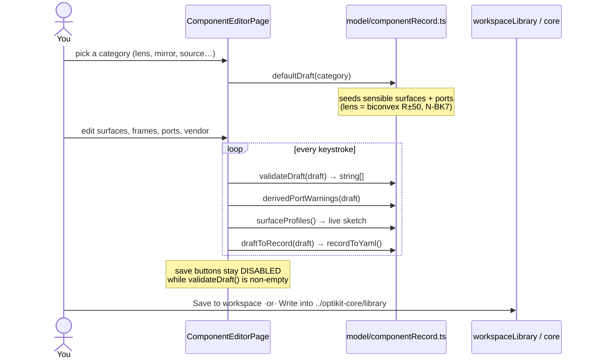

**Key files:** [`ComponentEditorPage.tsx`](../src/components/component-editor/ComponentEditorPage.tsx)
(page + tabs), [`RecordForm.tsx`](../src/components/component-editor/RecordForm.tsx) (the form),
[`SurfacesTable.tsx`](../src/components/component-editor/SurfacesTable.tsx) (the Optiland
fragment, row by row), [`componentRecord.ts`](../src/model/componentRecord.ts)
(**all the logic — pure functions**: `defaultDraft`, `validateDraft`,
`draftToRecord`, `recordToYaml`, `draftFromRecord`, `paraxialEflMm`,
`surfaceProfiles`).

**Rules that bite:**
- The **last surface carries no thickness** — the gap to the next component is
  an air gap owned by the design, not the part.
- `radius: 0` is rejected; a flat surface is `radius: .inf` (written as `.inf`).
- Non-optical categories (`electronics`, `mechanics`) carry **no** surfaces/ports.
- The record must validate in optikit-core too — the committed fixture
  `src/model/__tests__/fixtures/ac254-050-a.component.yml` asserts it.

---

### 2.2 Flow — add an STP file (the footprint)

**Route:** `/configurator/components`, "mechanics" tab (or `/configurator/bind`).
**You end up with:** a `template.yml` + `model.step` + `model.glb`.

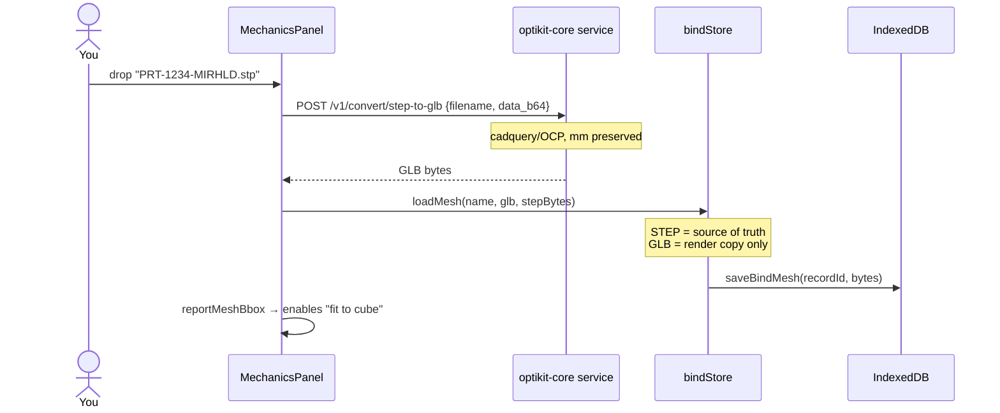

**Key files:** [`MechanicsPanel.tsx`](../src/components/bind/MechanicsPanel.tsx) (the UI),
[`bindStore.ts`](../src/components/bind/bindStore.ts) (all workbench state),
[`BindScene.tsx`](../src/components/bind/BindScene.tsx) (ghost cube + gizmos),
[`bindMeshStore.ts`](../src/model/bindMeshStore.ts) (IndexedDB persistence).

**Two binding modes** — this distinction matters:

| | Insert binding (default) | Whole-module binding (WP-41) |
|---|---|---|
| What the mesh is | Just the insert body | Cube + insert + optic + screws, one export |
| How you place optics | Click surfaces → datums | Drag a **gizmo-placed primitive** onto the visible face |
| Template gets | `mesh-offset` + `optical_ports` | `provenance: whole-module`, placed frames promoted to `template.frames` |
| "fit to cube" button | — | Yes (bbox-centers the mesh) |

---

### 2.3 Flow — annotate the optical primitives (datums)

This is the step that connects *mechanics* to *optics*: you tell the tool
**where inside this lump of CAD the light actually interacts**.

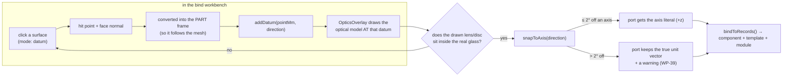

**Key files:** [`bindRecord.ts`](../src/model/bindRecord.ts) (the frame math and the
serializer: `datumToCube`, `snapToAxis`, `bindToRecords`, `recordsToFiles`),
[`OpticsOverlay.tsx`](../src/components/bind/OpticsOverlay.tsx) (draws the optical model
from the *record's own* surfaces — the visual verify-t1).

**The load-bearing idea:** datums live in the **part frame**, not the cube frame.
Move or rotate the mesh and the datums travel with it, because the STEP is the
source of truth. `datumToCube(datum, transform)` maps to the cube frame only at
render/serialize time.

**Verification, in core:** `optikit-core library verify-t1 <module-id>` checks
that the component's optical frame actually lands on the template's declared
insert frame — `E_POSE_MISMATCH`, `E_MIRROR_NO_REFLECTIVE`. A mirror whose disc
misses the reflective face fails.

---

### 2.4 Flow — draw a schematic and chain a beam path

**Route:** `/configurator/schematic`.

```mermaid
sequenceDiagram
  actor U as You
  participant PL as PartLibrary
  participant SP as SchematicPage
  participant DOC as src/document facade
  participant SS as SchematicScene

  U->>PL: drag "mirror 1x1" onto the canvas
  PL->>SP: drop event
  SP->>SP: raycast against the working plane (planeZMm)
  SP->>DOC: addPart(moduleId, [x, y, planeZMm])
  DOC->>DOC: splitWorldPosition() → cell + residual δ
  DOC->>DOC: defaultRotationFor(lib.ports) → Rot24
  Note over DOC: records author optics along ±z;<br/>rotate so the beam runs +x and<br/>the fold arm points -y (WP-29)
  DOC-->>SS: re-render

  U->>SS: click port pin "laser.out"
  SS->>SP: onPinClick(ref) → chainDraft = [ref]
  U->>SS: click "mirror.front"
  U->>SP: press Enter
  SP->>DOC: setPath("path-1", draft)
```

**Key files:** [`SchematicPage.tsx`](../src/components/schematic/SchematicPage.tsx) (shell,
drag-drop, chain draft, shortcuts), [`SchematicScene.tsx`](../src/components/schematic/SchematicScene.tsx)
(the R3F canvas, `SchematicPart`, `PortPin`, `YawRing`, `PathLines`),
[`ports.ts`](../src/components/schematic/ports.ts) (**the one port convention**:
`portsOf`, `beamAxesOf`, `glyphQuatOf`, `resolvePortRef`),
[`glyphs.tsx`](../src/components/schematic/glyphs.tsx) (the symbols).

**Conventions:**
- Glyphs are authored with **+x = optical axis**, fold arm toward **+y**, then
  rotated onto the part's real port axes by `glyphQuatOf`. Mirror plate angles
  come from the reflection law (`plateAngle(foldDeg)`), never hardcoded.
- Pins: **blue = input, amber = output**, pushed 22 mm out along the beam
  direction, with an invisible radius-10 hitbox (the visible dot is a few px).
- The **working plane** is a z-height in mm; the readout `L0 · 0 mm` is
  `round(planeZMm / 55)`. Drops raycast against it.
- Bottom toolbar: snap-grid (50 mm) · snap-yaw (90°) · live 2D rays · lock view
  ("SimCity mode": left button belongs to the parts, right-drag orbits) · legend.

---

### 2.5 Flow — check, DRC, and ray tracing (the service round trip)

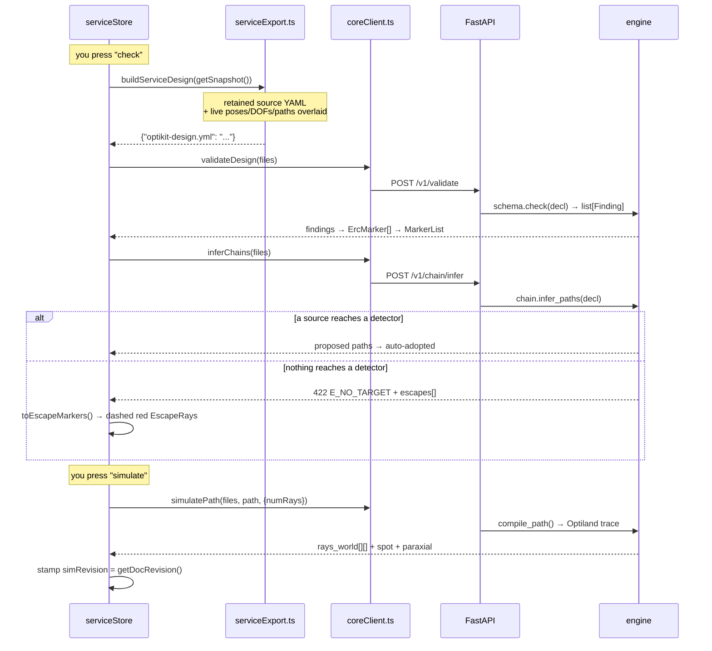

**Key files:** [`serviceStore.ts`](../src/components/schematic/serviceStore.ts) (the whole
round trip + freshness), [`serviceExport.ts`](../src/model/dsn/serviceExport.ts) (what the
service actually receives), [`coreClient.ts`](../src/api/coreClient.ts) (typed, zod-validated),
[`ServicePanel.tsx`](../src/components/schematic/ServicePanel.tsx) (the UI),
[`AuthoritativeRays.tsx`](../src/components/schematic/AuthoritativeRays.tsx) /
[`EscapeRays.tsx`](../src/components/schematic/EscapeRays.tsx) (the overlays).

**Freshness is explicit.** Every sim result is stamped with the document
revision it was computed at (`src/document/revision.ts`). `useSimFreshness()`
returns `none | fresh | stale`; stale rays render grey and the fast approximate
2D preview takes over again. **Nothing silently pretends to be current.**

**Two ray systems, deliberately:**
| | Approximate preview | Authoritative trace |
|---|---|---|
| Where | `useSchematicSim.ts`, in-browser | optikit-core + Optiland |
| Speed | Every frame | On demand (or "live", debounced 500 ms) |
| Physics | 2D, in-plane, paraxial-ish | Real 3D sequential ray trace |
| Shown when | `showRays` on and sim not fresh | Sim fresh |

---

### 2.6 Flow — cubify (schematic → assembly)

This is KiCad's "update PCB from schematic". Continuous mm poses become
**grid cells + residuals**.

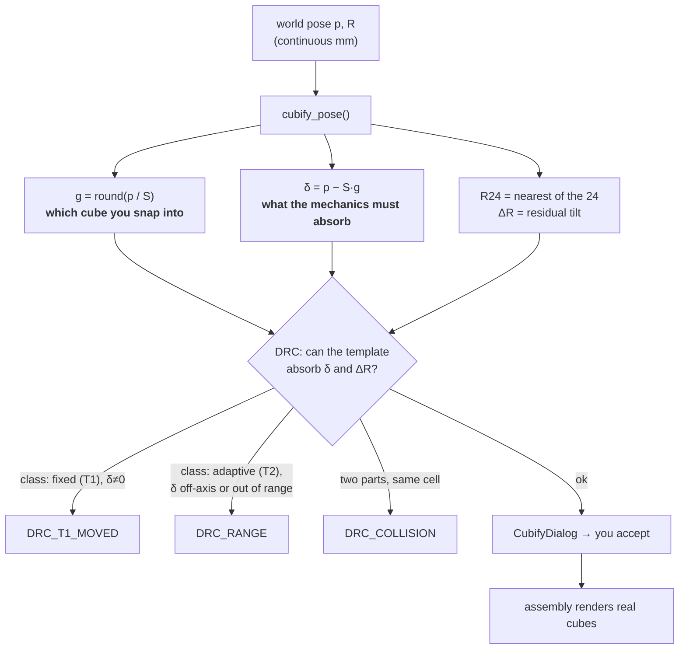

`S = UC2_GRID_MM = (50, 50, 55)` mm. Note the pitch is **50/50/55** — the z
(layer) pitch is 55, not 50.

**Key files:** core [`geometry/cubify.py`](../../optikit-core/src/optikit_core/geometry/cubify.py)
(`cubify_pose`, `cubify`, `drc`), frontend
[`assemblyStore.ts`](../src/components/assembly/assemblyStore.ts) (`runCubify`, `applyCubify`,
`refreshDrc`), [`CubifyDialog.tsx`](../src/components/assembly/CubifyDialog.tsx) (the review
table, with diff mode against the last accepted baseline),
[`AssemblyScene.tsx`](../src/components/assembly/AssemblyScene.tsx).

**Nothing is applied until you accept it.** The dialog shows the decomposition;
the world geometry is unchanged. Once accepted, the chip reads "grid poses:
accepted" and flips to "outdated" as soon as the document changes.

**Reading the assembly view:** the **cube shell is always axis-aligned**
(rot24 only); the **insert glyph inside it carries the full pose** including δ
and ΔR. A tilted insert inside a straight shell is exactly how a residual
becomes visible. No template bound → a translucent `GhostBox` labelled
"no template".

**T-classes** (which mechanism absorbs the residual):
- **T1 `fixed`** — an exported Inventor part. δ must be 0. 🔒
- **T2 `adaptive`** — a parametric insert with declared DOFs; δ is clamped to
  the declared travel and drag handles appear.
- **T3 `generative`** — a CadQuery script regenerates the holder around
  whatever pose you chose.

---

### 2.7 Flow — optimize and back-annotate (the return leg)

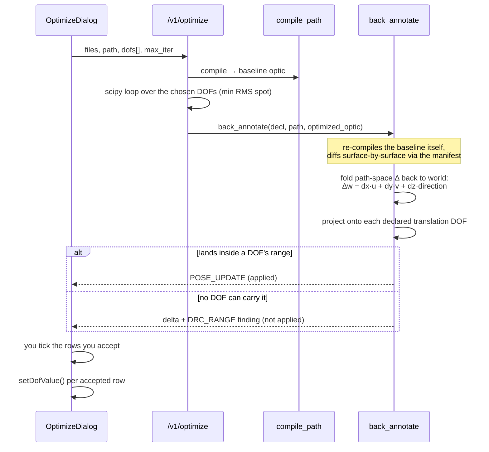

The **manifest** is what makes this possible: for every emitted surface it
records `(surface_index, component_id, port_traversal, fragment_surface_index,
world)`, where `world` is the fold map back to 3D:

```
world = axis_point + cs_x·u + cs_y·v + (z − cs_z)·direction
```

Compile *unfolds* a folded 3D layout onto a straight optical axis; the manifest
is the receipt that lets you fold any result back. The same map turns Optiland's
traced intersections into the world-coordinate ray polylines the 3D view draws.

**Deltas are classified, never merged blindly:** `POSE_UPDATE`, `TILT_UPDATE`,
`PART_PARAM`, `PART_SUBSTITUTION`. Only `instantiation.dof_values` and
`provenance` are ever written back into the document.

---

### 2.8 Flow — groups, carriers, and the miniFRAME (WP-44/45/53)

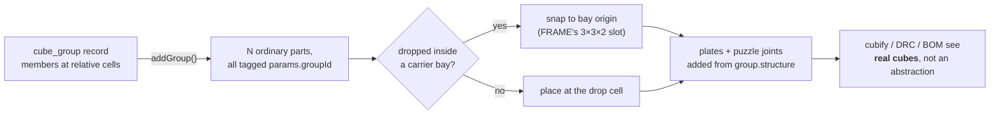

A group is an *editing and library* concept only. It explodes into ordinary
parts so nothing downstream needs to know about groups. The editor drags them
as one rigid unit (`movePartWorld` fans the delta over the group) until you
unlock the instance for member-level editing.

---

### 2.9 Flow — export, share, order

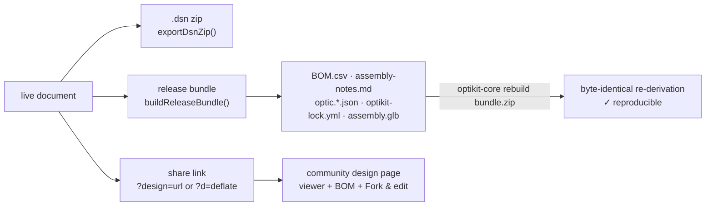

The **lockfile** (`optikit-lock.yml`) sha256-hashes every text file in the
bundle so `optikit-core rebuild` can prove the artifacts were derived from that
exact design.

**STEP assembly export (WP-57):** File → "Export STEP assembly" streams
`POST /v1/export/step` (core `export/step_assembly.py`) — one grouped STEP with
a node per part: the template's own STEP where it exists, optics **lathed from
the prescription** where it doesn't, and the beam path as swept cylinders.
Deterministic across invocations (WP-18), apart from the header timestamp.

---

### 2.10 Flow — free-place an optic, then put it in a cube (WP-60/61/62)

The Part 2i round: the **symbol** (`optical_component`) and the **cube**
(`cube_module`) are different records, and a symbol is placeable on its own.

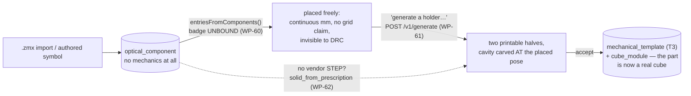

- **WP-60** — any published component NO module binds joins the palette
  (`entriesFromComponents`, group "<category> · unbound", UNBOUND badge). It
  places through the same path as everything else, but with
  `templateClass: null` the residual is unclamped (free mm movement), core
  `drc()` skips it, and the assembly draws a distinct translucent UNBOUND
  ghost (≠ the "no template" ghost, which means *a module whose mesh is
  missing*).
- **WP-61** — `POST /v1/generate` wraps the T3 harness; the assembly panel's
  "generate a holder…" (`GenerateHolderDialog`) posts the live design so
  `pose_params_from_component` carves the cavity where the optic actually
  sits. Accept **materializes** `user.tpl.holder_*` + `user.cube.*_t3`
  (`holderRecord.ts`) through the existing exits (zip / dev-write + index
  bump) and re-points the part's `libraryRef` — one undo step; undo restores
  the unbound placement, the artifacts stay keyed on disk.
- **WP-62** — no vendor CAD needed: `generators/optic_solid.py` revolves the
  record's own surface stack (reusing `sag_at`, now in `library/sag.py`) into
  a solid whose primary job is to be **subtracted** as the holder cavity
  (`part_prescription` as the alternative to `part_step`, schema `oneOf` —
  a `{component: id}` reference is inlined by the harness before keying, so
  the cache key covers the actual surfaces). Guard rail: a negative or
  sub-0.2 mm edge thickness is a typed error (`E_EDGE_THICKNESS`), and
  prescription-derived runs/templates carry a review flag.

---

## Part 3 — optikit-core, file by file

Repo: `/Users/bene/Downloads/OPTIKIT/optikit-core`. Everything is a pure
function over `DesignDecl` unless noted.

### `schema/` — the normative datamodel (source of truth for all three repos)

| File | What it does |
|---|---|
| `schema/common.py` | Shared primitives. The key trick: `TemplatedFloat = float \| int \| TemplateStr` so any numeric leaf may instead be a `{{ ... }}` template string (Ethan's corpus uses them); `is_template()` is the guard every consumer calls before arithmetic. `SchemaModel` fixes `extra="allow"` — unknown keys survive a load→dump round trip losslessly. |
| `schema/design.py` | The root document model. `DesignDecl` → `components: dict[str, CompSpec]`, `variants`, `paths`, `fibers`, `instantiation`, `provenance`. Pose stack (`PoseSpec`/`RotSpec`/`TranslSpec`), optics stack (`OpticsSpec`/`FragmentSpec`/`FrameSpec`/`PortSpec`), mechanics (`TemplateSpec`, `DofSpec`), netlist (`PathSpec`, `FiberSpec`). Also the two parsers `parse_chain_entry()` and `parse_dof_key()`. |
| `schema/checks.py` | Semantic validation, separate from Pydantic's structural validation, so one run reports **every** problem. Returns `list[Finding]`, never raises. `check(decl)` runs component/variant/instantiation/path/fiber checks. |
| `schema/merge.py` | Variant overlay merging, reproducing Go's `cmp.Or` semantics field by field — including the quirk that an overlay cannot reset a value to zero. `instantiate(decl)` is what every stage calls first. |
| `schema/library.py` | The library record kinds: `ComponentRecord`, `TemplateRecord`, `ModuleRecord`, `GroupRecord` (+ `BaySpec`, `PlateSpec`, `GroupStructure`, `GroovesSpec`, `ElectronicsSpec`, `AxisMapEntry`). `load_record()` dispatches on `kind`; `parse_ref()` splits `id@range`. |

**Chain-entry syntax** (parsed by `parse_chain_entry`, `schema/design.py`):
- `"laser.out"` — a terminal stop (source exit or detector entry)
- `"objective.front>back"` — a pass-through traversal (enter `front`, leave `back`)
- The same component may appear twice (double-pass systems), which is why
  `port_traversal` — not `component_id` — is the manifest's identity.

### `geometry/` — poses, rotations, DRC (pure math, no I/O)

| File | What it does |
|---|---|
| `geometry/rotations.py` | The 24 axis-aligned rotations (`ROT24`, keyed by where local +z/+x point) and the **extrinsic-ZXY** Euler convention `R = Rz·Rx·Ry` — pinned bit-for-bit to Go's `mat4.ExtractEulerAngles`. `compose()` gives `R = R24·ΔR`; `decompose()` inverts it (nearest of 24 + minimal residual). `direction_vector()` is the one resolver for a port direction (axis literal *or* unit vector). |
| `geometry/flatten.py` | Resolves the **anchor graph** into absolute world poses. `flatten(components) → dict[str, FlatPose]`. `flat_report()` emits Go-compatible `PrimReport` entries; `flat_design_report()` recurses into subassemblies. Errors: `E_ANCHOR_MISSING`, `E_ANCHOR_CYCLE`, `E_TEMPLATED`, `E_ROT_UNSUPPORTED`. |
| `geometry/cubify.py` | The forward-annotation direction: `p = S·g + δ`, `R = R24·ΔR`, then DRC. `cubify_pose()`, `cubify()`, `drc()`. Findings: `DRC_T1_MOVED`, `DRC_RANGE`, `DRC_COLLISION`. ⚠️ `DRC_APERTURE` is named in the docstring but `_check_aperture` is **a stub returning `[]`** — it needs port-axis geometry that hasn't been wired. |

**The anchor graph:** `pose.translation.anchor` induces a directed graph; an edge
means "my offsets are measured relative to that component". Two properties,
both matching Go deliberately:
1. **Only translations accumulate** — rotations never compose along the chain
   (a component's rotation is always relative to the design frame). Ethan's
   `Flattened → TranslFlattened` rename codifies this.
2. **Grid and mm offsets stay separate** all the way up, folded only in
   `FlatPose.position_mm`. That's what preserves the cells+residual split.
At **subassembly** boundaries the rule flips: there the full 4×4 composes.

### `compile/compiler.py` — the largest module (~666 lines)

Walks one path's `chain` and **unfolds** it into straight arc length, emitting a
native Optiland optic dict + the trace manifest. Two details that are easy to
get wrong:

1. **Reverse traversal** (`objective.back>front`) reverses surface order,
   negates radii, and shifts `material_post`/`thickness` one surface back.
2. **Residuals become `cs`** — a transverse offset is `cs` decenter, a residual
   tilt is `cs` rx/ry. Errors: `E_BAD_PATH`, `E_BAD_PORT`, `E_NO_OPTICS`,
   `E_GEOMETRY`, `E_UNSUPPORTED`, `E_MATERIAL`.

Since WP-63 the compiler is also the **material safety net**: every emitted
`material_post` is normalized onto optiland's class-name registry
(`{type: ideal, name}` → `Material`, `{type: ideal, index}` →
`IdealMaterial`); an unrecognizable shape is `E_MATERIAL` naming the
component + surface, and the service turns an optic optiland still rejects
into a 422 `E_OPTIC_INVALID` — never a 500.

`advance_to()` enforces facing/kink/transverse tolerances between ports;
**`fiber_advance()` (WP-46) deliberately skips all of them** and advances by the
fiber's own `length_m` instead.

### `chain/infer.py` — the netlist proposer

Propagates a chief ray from every source/sample port, snapping to facing ports
within `ANGLE_TOL_DEG = 20°` and inside the clear aperture. Branches at
multi-exit components; prunes dead arms with a warning. Errors:
`E_AMBIGUOUS_CHAIN` (two candidates at the same distance — it refuses to guess),
`E_NO_TARGET`, `E_LOOP`. Since WP-52, `E_NO_TARGET` carries structured
`Escape` records (origin, direction, which port it left from) so the editor can
*draw* the leak. Since WP-46, `_fiber_hops` lets a walk cross a fiber.

### `annotate/`

| File | What it does |
|---|---|
| `annotate/back_annotate.py` | The typed reverse direction. Re-compiles the baseline, guards topology (`E_TOPOLOGY`), classifies every surface delta into `Delta` records, folds path-space deltas back to world via the manifest, and projects onto declared DOFs. `apply_to_document()` writes into a **ruamel** tree so comments survive. |
| `annotate/fx.py` | Unrelated to the above despite the package: turns `dof_values` into `optikit-fx.json` for PyInventor. `decompose_on_lattice()` splits a `dz` into *which groove pair the holder clamps* + a residual δ. The Inventor fx parameter name **is** the dof name. |

### `library/` — the parts database

| File | What it does |
|---|---|
| `library/build.py` | `load_library(root)` walks `library/**/*.yml`; `resolve(library, "id@^1.0")` does semver resolution; `check_references()` finds dangling refs; `build_index()` produces the `index.json` the palette eats (modules with resolved component/template, ports, DOFs, assets, prices, groups — and since WP-60 each `components[]` entry ships its ports/wavelengths/symbol so a bare symbol is placeable straight from the index); `write_index()` persists it. Assets are advertised only when the file is actually on disk (WP-58 fixed the 64 promised-but-404 GLBs). |
| `library/vendor.py` | WP-58 asset hygiene: `vendor_assets()` pulls remote `glb-url` meshes into the record dirs (`library vendor-assets [--dry-run]`), ending the local/remote split brain. |
| `library/symbols.py` | WP-48: locates a component's authored SVG schematic symbol so the index/asset endpoints can serve it. |
| `library/semver.py` | `Version`, `satisfies()` — caret/tilde/exact ranges. |
| `library/verify.py` | `verify_t1(library, module_id)` — the T1 conformance check: does the component's optical frame land on the template's declared insert frame? Emits `E_POSE_MISMATCH`, `E_MIRROR_NO_REFLECTIVE`, state warnings. |
| `library/derive.py` | WP-40 "surfaces are truth": `derive_port_directions(component)` computes port directions from the surface normals via the reflection law; `check_port_directions()` warns when an authored enum disagrees with the geometry. |
| `library/actuation.py` | `check_actuation(library)` — the WP-42 contract: every `axis-map` entry names a real DOF (`E_AXIS_MAP_UNKNOWN_DOF`), surfaces are in range (`E_DOF_SURFACE_RANGE`), actuatable DOFs are bound (`W_ACTUATABLE_UNBOUND`). |
| `library/actuate.py` | WP-26 runtime: `firmware_command(library, module, dof, value)` → a command with both a CANopen SDO view and a UC2-REST view (`/motor_act` for translation, `/galvo_act` for rotation). Validates actuatable + range + binding. |
| `library/sag.py` | WP-62: `sag_at()` (the standard conic sag) + surface-dict helpers, extracted stdlib-only so generator scripts can load it by file path in the `uv run --no-project` interpreter. |
| `library/pocket.py` | `pocket_params(component)` — derives MAS-2000 pocket inputs (sag, depth) from the record's own surfaces; re-exports `sag_at` from `sag.py`. The same sag drives the profile `optic_solid.py` revolves, so the 1D pocket numbers and the 3D solid agree by construction. |

### `generate/` — the T3 CadQuery harness

`generate(template, params_override, out_root, repo_root, force)` resolves the
template's `generator.script`, validates params against the sibling
`<script>.params.json` JSON Schema, and runs it. Artifacts are keyed by the
**sha256 of the canonicalized params** (`canonicalize()` floats everything so
`25` and `25.0` key identically), landing in
`out/<template-id>/<key12>/{params.json, model.step, model.stl, model.glb, meta.json}`.
Same params = cache hit; any change = a new key. CadQuery runs **in-process**
when importable, otherwise the harness shells out via `uv run --with cadquery`.

Generators live in `generators/`: `boolean_holder_1x1.py` (the auto-holder —
insert body minus the part shape at its bound pose, split into two printable
halves with M3 cut-offs; since WP-62 the cut body may be `part_step` OR
`part_prescription` — exactly one, schema `oneOf`), `optic_solid.py` (WP-62:
`solid_from_prescription()` revolves a record's surface stack into a real
solid — the holder's subtraction tool, and a standalone lens STEP/GLB for the
WP-57 assembly export), `round_optic_insert_1x1.py`, `plate_nxm.py` (WP-53
sandwich plates).

Since WP-61 the harness is service-reachable: `POST /v1/generate` (same cache
key, 501 `E_NO_CADQUERY` without the extra), with `pose_params_from_component`
folding a design component's placed δ/ΔR into the generator params.

### `importers/` — the roads into the library

| File | What it does |
|---|---|
| `importers/thorlabs.py` | `zmx_to_component()` — a Thorlabs `.zmx` prescription → a component record, using optiland's own Zemax parser. Materials normalized to canonical names; anything uncertain is **review-flagged, never guessed**. |
| `importers/glb2template.py` | Inventor GLB → template record. Parses the datum-marker naming contract (`PLN_`/`AXIS_`/`PT_` occurrence names) into frames; review-flags a mirror with no `PLN` marker. |
| `importers/csv_palette.py` | WP-43: the legacy CSV palette → 315 record trios under `openuc2.*`, all review-flagged. |
| `importers/layout_json.py` | WP-54: a legacy setup JSON → an `optikit-design.yml`, resolving module ids against the library. |

### `service/app.py` and `cli.py`

The service is a **thin wrapper**: every endpoint takes
`{files: {"optikit-design.yml": "..."}}`, calls one engine function, and returns
derived data. Typed engine errors become HTTP 422 `{code, message, context}`
(plus `escapes` for `E_NO_TARGET`). `cli.py` exposes the same functions as
subcommands (`validate`, `flatten`, `cubify`, `drc`, `chain`, `compile`,
`simulate`, `optimize`, `annotate`, `library …` — incl. `migrate-materials`
(WP-63, one-shot) and `restore` (WP-68) — `generate`, `import …`,
`actuate`, `fx`, `rebuild`, `serve`, `export step`).

Later additions: `/v1/library/index` is mtime-cached with a `?fresh=1` escape
hatch (WP-51, cold 673 ms → warm ~12 ms), `/v1/export/step` streams the WP-57
STEP assembly (`export/step_assembly.py` — deterministic emission, lathed
optics, beam cylinders), and `/v1/generate` runs the T3 harness (WP-61).

`release.py` builds and verifies the manufacturing bundle: `build_bundle_bytes()`
and `rebuild(path)` (which re-derives every artifact and compares sha256s).

---

## Part 4 — openUC2-OptiKit, file by file

Repo: `/Users/bene/Downloads/OPTIKIT/openUC2-OptiKit`.

### The hard rule (from `CLAUDE.md`)

> New editor components must import design-model state **ONLY** from
> `src/document` — never from `stores/appStore` directly.

`src/document/OptikitDocument.ts` is the facade; today it wraps the legacy
appStore, and when the backing model becomes the `.dsn` document the views keep
working unchanged. There is **no lint rule enforcing this** — it's discipline.

Four files legitimately straddle both (catalog bootstrap / notifications only):
`PartLibrary.tsx`, `SchematicPage.tsx`, `AssemblyPage.tsx`, `serviceStore.ts`.

### `src/document/` — the boundary

| File | What it does |
|---|---|
| `index.ts` | The barrel that *is* the boundary. Editors import from here. |
| `OptikitDocument.ts` | The facade: `listParts`/`getPart`/`getSnapshot` project `PlacedModule[]` → `DocPart[]`; commands (`addPart`, `addGroup`, `movePartWorld`, `rotatePart`, `tiltPart`, `setDofValue`, `setPath`, …); undo bracketing (`captureUndo`/`commitUndo`); React hooks (`useDocParts`, `useDocPart`, `useDocPaths`). Also group placement + carrier-bay docking and `constrainOffsetToTemplate` (T1 δ=0, T2 clamp to declared axes, T3 free). |
| `types.ts` | The vocabulary: `Vec3`, `Quat`, `UC2_GRID_MM = [50,50,55]`, `DocCategory`, `DocPart`, `DocPath`, `PortRef`, `makePortRef`/`parsePortRef`. |
| `mapping.ts` | **Read this before touching any coordinate code.** Three frames and the exact transforms between them (see below). |
| `rot24.ts` | The 24 orientations as TS: `ROT24_TABLE`, `rot24Matrix`, `decomposeRot24`. |
| `libraryPalette.ts` | Registry index → palette entries; `defaultRotationFor(ports)`; `LibraryPaletteEntry` carries everything the legacy `ModuleDefinition` can't (ports, T-class, DOFs, states, bays, prices). Three builders: `entriesFromIndex` (modules), `entriesFromWorkspace` (local drafts), `entriesFromComponents` (WP-60: published symbols NO module binds — `unbound: true`, group "<category> · unbound"). |
| `bom.ts` | WP-50: the live BOM as ONE pure generator — placed parts grouped by library id with their grid cells, joined to registry prices/T-class/review. Renders in `BomDialog` and writes the release bundle's `BOM.csv`. |
| `portCatalog.ts` | Fallback record-style ports for non-registry modules, so pins/glyphs/routing have one code path. |
| `pathsStore.ts` | The netlist: named `PortRef[]` chains, persisted. |
| `fibersStore.ts` | WP-46 patch cords: port→port with no geometric constraint, persisted. |
| `groupStore.ts` | Which group instances are unlocked for member editing. |
| `layers.ts` + `layerStore.ts` | WP-65: `layerOf(part)`, interface classification ({layer, interface: true} — plates/joints belong to the interface above their layer), and the persisted visibility store (visible/dimmed per layer, solo, "plates & joints" sub-toggle). One precedence rule both editors share; the active working-plane layer is always visible (the placement guard). |
| `swap.ts` | WP-66: `swapPartModule(partId, newModuleId)` — the whole in-place module-swap semantic (pose kept, chains dropped only on port-name mismatch, DOFs re-clamped/removed, one undo step). |
| `sourceDesignStore.ts` | Parks the last imported `.dsn` YAML verbatim + the partId↔key map, so blocks the store can't represent (optics, templates, locations) survive a round trip. |
| `revision.ts` | Monotonic counter bumped only on real edits (selection isn't an edit) — the freshness signal. |

**The three frames** (`mapping.ts`):

```
document frame   mm, right-handed, z UP          ← the .dsn schema frame
  doc x =  three.x  =  store grid x   (east)
  doc y = -three.z  = -store grid y   (north — note the sign flip!)
  doc z =  three.y  =  layer axis     (up)

store frame      integer cells, y grows SOUTH, layer at 55 mm,
                 three 90°-step euler fields (rotation/tiltRotation/topRotation)

three.js frame   y-up, z-south
```

- `worldPoseOf(m)` → `[x·50 + δx, −y·50 + δy, layer·55 + δz]`
- `splitWorldPosition(p)` is cubify's `p = S·g + δ` in TS (`_round_half_up`
  semantics match Python's, so both agree)
- `docYawFromStoreYaw(deg) = normalizeDeg(-deg)` — **document yaw is the
  negated store yaw**
- `offsetDeg` is the schema's `rotation.offset-deg`: the residual ΔR in
  `R = R24·ΔR`, as **extrinsic ZXY degrees in the part's local frame**

### `src/model/` — records, `.dsn` I/O, service contract

| File | What it does |
|---|---|
| `componentRecord.ts` | The component editor's whole model as pure functions (see [2.1](#21-flow--create-a-new-part-the-symbol)). |
| `bindRecord.ts` | The bind workbench's model: part-frame datums, `datumToCube`, `snapToAxis` (±2° → axis literal, beyond → true vector), `bindToRecords` → component+template+module, `recordsToFiles`. |
| `libraryIndex.ts` | Typed client + hook for `/v1/library/index`, with the bundled snapshot as offline fallback and `bumpLibraryIndex()` for live refresh. Since WP-60 `IndexComponent` also carries ports/wavelengths/symbol. |
| `holderRecord.ts` | WP-61: the records materialized when a generated holder is accepted — a generative `mechanical_template` (generator + the run's canonical params → regenerate is a cache hit; prescription-derived → review-flagged) and the `cube_module` binding it. Pure functions + the library-PR file map. |
| `communityRepos.ts` | WP-58: mount a community library repo from GitHub — fetches its committed `library-index.json`, merges with precedence builtin < mounted < local drafts (a fork can ADD parts but never override a curated `openuc2.*` id; clashes are reported in the palette). |
| `workspaceLibrary.ts` | Browser-local `user.*` drafts. |
| `bindMeshStore.ts` | IndexedDB for STP/GLB bytes, keyed by record id. |
| `actuation.ts` | WP-26 frontend mirror of core's `actuate.py`: `firmwareCommand()` + `sendActuation()` to a configurable device URL. |
| `shareLink.ts` | WP-54: `?design=<url>` hosted, `?d=<deflate-raw base64url>` inline. |
| `materials.ts` | Generated optiland glass names for the material autocomplete. |
| `paletteConfig.ts` | The legacy-CSV feature flag (off by default since WP-43). |
| `dsn/convert.ts` | Pure `DocSnapshot ⇄ DesignDecl`: `snapshotToDesign` (+ `paletteOpticsOf`, `poseSpecOf`) and `designToParts` (resolves anchor chains on import). |
| `dsn/io.ts` | YAML parse/stringify + zip pack/unpack (`designFromFiles`, `zipDsn`, `unzipDsn`). |
| `dsn/session.ts` | Store-facing: `importDsnFiles` (clears + replaces the document), `exportDsnZip`. |
| `dsn/serviceExport.ts` | **What the service actually receives**: retained source YAML with live poses/DOFs/paths overlaid, so optics/template/location blocks the store can't hold survive. Also `listPartMechanics`, `backAnnotateSource`. |
| `dsn/releaseBundle.ts` | WP-18: BOM.csv, assembly-notes.md, compiled optics, merged GLB, and the sha256 lockfile. |
| `dsn/generated/*.ts` | **Generated** from core's JSON Schema (`npm run gen:schema`). Do not hand-edit. |

### `src/api/coreClient.ts`

Typed, zod-validated client. Every function takes an optional `AbortSignal`.

| Function | Endpoint |
|---|---|
| `validateDesign` | `POST /v1/validate` |
| `inferChains` | `POST /v1/chain/infer` |
| `simulatePath` | `POST /v1/simulate` |
| `cubifyDesign` | `POST /v1/cubify` |
| `compileDesign` | `POST /v1/compile` |
| `runDrc` | `POST /v1/drc` |
| `optimizeDesign` | `POST /v1/optimize` |
| `convertStepToGlb` | `POST /v1/convert/step-to-glb` (returns raw GLB bytes) |
| `saveLibraryRecords` | `POST /v1/library/save` (dev-only write into the repo library) |
| `exportStepAssembly` | `POST /v1/export/step` (WP-57, streams the grouped STEP) |
| `generateTemplate` | `POST /v1/generate` (WP-61, T3 harness; base64 artifacts) |

`CoreServiceError` carries the stable `code` (never match on `message`),
`context`, `status`, and `escapes[]`. ±Infinity is wire-encoded as `±1e999`
because zod/JSON reject `Infinity` — hence the custom `anyNumber` schema.

### `src/components/` — the editors

Full per-file detail is long; the shape is:

- **`schematic/`** — the primary editor. `SchematicPage` (shell, drag-drop,
  chain draft), `SchematicScene` (R3F canvas), `ports.ts` (the one port
  convention), `glyphs.tsx` (incl. WP-64's `InterfaceGlyph`: plates, puzzle
  joints and baseplates draw as distinct flat symbols via `interfaceKindOf`),
  `serviceStore.ts` (the round trip), `ServicePanel`,
  `AuthoritativeRays`, `EscapeRays`, `SchematicPropertyPanel`, `OptimizeDialog`,
  `useSchematicSim.ts` (the fast approximate preview), `MarkerList`, `colors.ts`,
  `GlyphThumb.tsx`, `SchematicLegend`, `AuthoredSymbol.tsx` + `symbolAsset.ts`
  (WP-48: an authored SVG symbol outranks the derived glyph),
  `LayerChips.tsx` (WP-65: the shared layer-visibility chip row),
  `ModulesPanel.tsx` (WP-66: per-part list + swap + the WP-50 aggregate,
  behind Design | Modules drawer tabs).
- **`assembly/`** — `AssemblyPage` (incl. the WP-51 module-composition card and
  the WP-60 unbound-part card), `AssemblyScene` (GLB cubes, ghost boxes — the
  UNBOUND ghost is distinct from "no template" — DRC billboards, T2 insert
  handles), `CubifyDialog`, `GenerateHolderDialog` (WP-61: generate → preview
  the two halves → accept materializes + re-points, one undo step),
  `assemblyStore.ts`.
- **`bom/`** — `BomDialog` (WP-50): sortable live BOM, per-row deep links,
  cell chips that cross-probe into the scene, CSV download. Mounted from both
  the schematic toolbar and the assembly panel.
- **`library/`** — `AddCommunityRepoDialog` (WP-58: "Add library from GitHub").
- **`bind/`** — `MechanicsPanel` (the UI, mounted as the component editor's
  mechanics tab), `BindScene` (ghost cube + gizmos + 2×2 ortho views),
  `OpticsOverlay` (the optical model drawn at the datum), `bindStore.ts`.
  `BindPage.tsx` is a 12-line shim onto the component editor.
- **`component-editor/`** — `ComponentEditorPage` (two tabs over one draft),
  `RecordForm`, `SurfacesTable`, `LibraryBrowser` (published index + local
  drafts), `GlyphPreview`, `RaySketch`.
- **`community/`** — `HomePage`, `ExplorePage`, `DesignDetailPage`,
  `designData.ts` (gallery + live BOM against registry prices),
  `communityTheme.ts`.
- **`sync/`** — `syncStore.ts` fingerprints schematic-owned vs assembly-owned
  fields separately; `SyncChip` offers the two explicit sync actions. Nothing
  auto-applies.
- **`guides/`** — `GUIDES` data + `GuidesDialog`.
- **`frameWizard/`** — the FRAME product configurator (separate surface, own store).
- **Shell:** `AppShell` (the one ThemeProvider + Toolbar), `Toolbar`,
  `BrandLogo`, `NotificationDisplay`, `StartupDialog`.
- **LEGACY — mostly GONE (WP-69):** the Konva 2D grid builder, its panels,
  overlays, the module wizard, the intro.js tour, the dead `three/` view and
  the CSV plumbing were deleted in one sweep (47 files, 10.6 kLOC; konva /
  react-konva / intro.js uninstalled; `/configurator/grid` redirects to the
  schematic). What remains of the era: `SetupBrowser` + `CollectionView`
  (the legacy JSON setup corpus — its CSV is setup metadata, not modules)
  and the trimmed `appStore` (983 lines) behind the document facade.

### Routes (`src/App.tsx`)

| Route | Component |
|---|---|
| `/`, `/configurator`, `/configurator/home` | `HomePage` (community landing) |
| `/configurator/explore` | `ExplorePage` |
| `/configurator/design/:id` | `DesignDetailPage` |
| `/configurator/schematic` | `SchematicPage` |
| `/configurator/components` | `ComponentEditorPage` |
| `/configurator/bind` | `BindPage` → component editor, mechanics tab |
| `/configurator/assembly` | `AssemblyPage` |
| `/configurator/grid` | → redirects to `/configurator/schematic` (WP-69, one-time retire notice) |
| `/configurator/frame` | `FrameWizardPage` |
| `/configurator/setups`, `/setups` | `SetupBrowser` (legacy JSON corpus) |
| `/configurator/3d` | → redirects to `/configurator/assembly?from=3d` (WP-37) |

---

## Part 5 — Debugging map

### The runnable tour: `optikit-core/main.py`

`main.py` is a **narrated, step-by-step harness** over the real public API — not
the product entry point (that's `cli.py`), but the same functions, in one linear
script with commentary. Run the whole thing, or one stage:

```bash
cd optikit-core
uv run python main.py                 # the full tour
uv run python main.py --list          # every step with its number
uv run python main.py --only 5        # just the compiler
uv run python main.py --only compile  # same, by name
uv run python main.py --act library   # a whole act
uv run python -m pdb main.py          # step through it
```

Each step prints what went in and what came out, and names the module it's
exercising so you can set a breakpoint there.

### Where to put a breakpoint, by symptom

| Symptom | Breakpoint | Why |
|---|---|---|
| Part lands in the wrong place | `document/mapping.ts:splitWorldPosition` then `geometry/flatten.py:flatten` | The frontend↔document transform, then the engine's own |
| Part faces the wrong way | `libraryPalette.ts:defaultRotationFor` | Records author along ±z; this rotates onto the document plane |
| `E_NO_TARGET` on a design that looks right | `chain/infer.py:walk` → `find_next` | Usually a detector facing the wrong way after a fold; check the `escapes[]` |
| `E_GEOMETRY` on compile | `compile/compiler.py:advance_to` | Facing / kink / transverse tolerance |
| Beam path is wrong after import | `dsn/convert.ts:designToParts` | Anchor-chain flattening |
| DRC fires on a part that should be fine | `geometry/cubify.py:drc` | Check the template class and declared DOFs |
| Optimizer result doesn't stick | `annotate/back_annotate.py:_classify_pose` | The delta may have no DOF to carry it |
| Palette is empty / stale | `model/libraryIndex.ts:fetchLibraryIndex` | Registry vs bundled fallback |
| An imported symbol isn't placeable | `libraryPalette.ts:entriesFromComponents` | It only offers components NO module binds; a module-bound one comes through its module |
| "generate a holder" carves at the cube centre | `generate/harness.py:pose_params_from_component` | The placed δ/ΔR must reach the generator params |
| Service says `E_UNREACHABLE` | `api/coreClient.ts:post` | Not running, CORS, or crashed mid-request — the message distinguishes them |

### Running the pair

```bash
# terminal 1 — the engine
cd optikit-core && uv run optikit-core serve      # :8000

# terminal 2 — the editors
cd openUC2-OptiKit && npm run dev                 # :5173
```

Gates before committing:
```bash
cd optikit-core     && uv run pytest -q && uv run ruff check src/ tests/
cd openUC2-OptiKit  && npx tsc --noEmit && npx vitest run && npm run lint
```

Since WP-69, `npm run lint` is at **zero findings** — any new warning is a
real one, and CI can enforce it.

---

## Part 6 — Conventions that will bite you

1. **Grid pitch is 50/50/55 mm**, not 50³. The z (layer) pitch is 55.
2. **Document yaw = −store yaw.** Every sign bug in this codebase has been this.
3. **Records author optics along ±z**; the document plane wants the beam along
   **+x** and fold arms toward **−y**. `defaultRotationFor` bridges them at
   placement so the record travels verbatim.
4. **The last surface of a fragment carries no thickness** — gaps belong to the
   design, not the part.
5. **Rotations do not compose along anchor chains** (only translations do) —
   except at subassembly boundaries, where the full transform composes.
6. **`extra="allow"` everywhere in the schema** — unknown keys survive a round
   trip. That's a feature (forward compatibility with the Go side), not sloppiness.
7. **±Infinity crosses the wire as `±1e999`.** `JSON.parse` overflows it back.
8. **Error codes are API.** Match on `code`, never on `message`.
9. **Nothing auto-applies.** Cubify, optimize, and sync all show you a review
   first. The one exception is auto-chaining when a design declares no paths.
10. **The service is stateless.** Every request carries the whole design.

---

## Part 7 — Known gaps and rough edges

Real things found while writing this, worth knowing before you trip over them.

| Where | What |
|---|---|
| `geometry/cubify.py:_check_aperture` | **A stub returning `[]`.** `DRC_APERTURE` is named in the `DrcFinding` docstring but is never emitted — it needs port-axis geometry from the compiler that was never wired. Beam-vs-clear-aperture is currently unchecked. |
| `library/pocket.py` | `pocket_params` is still CLI/endpoint-less, but the module gained its first real consumer in WP-62: `generators/optic_solid.py` imports `sag_at` for the revolved profile. |
| `chain/infer.py` → `compile/compiler.py` | `infer.py` imports the **private** `_port_frame` and `_angle_between` from the compiler. The shared port geometry effectively lives in `compile/`; a refactor should hoist it. |
| `ANGLE_TOL_DEG = 20.0` | Defined **twice** independently (`compile/compiler.py`, `chain/infer.py`). They agree today but nothing links them. |
| `cli.py` `library build` | Calls `write_index()` then `build_index()` again just to read `index["count"]` — the index is built twice per invocation. |
| `generate/harness.py` | `out_root` is resolved relative to the **process cwd** while `repo_root` comes from `library_root.parent`. Running the CLI from a subdirectory puts artifacts somewhere surprising. |
| `document boundary` | Documentation-only. There is **no** `no-restricted-imports` ESLint rule enforcing it. |
| `dsn/session.ts` | Its header claims "never appStore directly"; the *mutations* obey that, but it reads `useAppStore` for `modules` / `setupMetadata`. |
| Local dev hacks (uncommitted) | `service/app.py` in this working tree carries two local edits that are **deliberately never committed**: `DEFAULT_CORS_ORIGINS = "*"` and an `os.environ.setdefault("OPTIKIT_ALLOW_LIBRARY_WRITE", "1")` that lands *before* the env var is read — which makes `/v1/library/save` writable regardless of the guard. Fine on a laptop, **must not ship**. Check `git diff src/optikit_core/service/app.py` before any deploy. |
