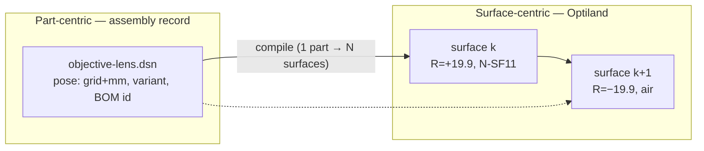
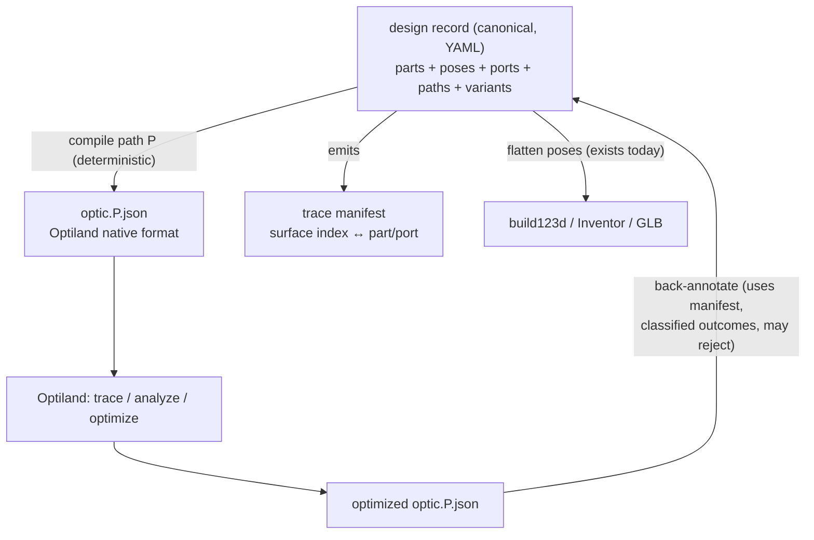
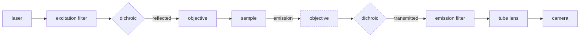

# Unifying the Optikit datamodel with Optiland — analysis

**Status:** discussion draft · 2026-07-08
**Question:** can we avoid a separate `.dsn` format and instead reuse the Optiland
format as the single carrier for grid position, pose, parts and simulation — and if
not, what is the most uniform architecture that still feels like *one* system rather
than a pile of adapters?

**Short answer:** the two models describe different things (a *bill of assembled
parts in 3D space* vs. *an ordered traversal of optical surfaces*), and one cannot
absorb the other without abuse. But we can get the uniformity we want a different
way: **one canonical part-centric model that embeds Optiland's own surface
vocabulary verbatim as the optical description of each primitive, plus an explicit
`paths` (chain) section — and Optiland files become compiled build artifacts, never
a second source of truth.** The adapters stop being fragile sync tools and become a
deterministic compiler (forward) and a constrained, manifest-driven back-annotator
(reverse), each with an enumerated, checkable set of failure modes.

---

## 1. What the Optiland format actually is

Optiland's native file (`save_optiland_file` → `to_dict()` JSON) is a serialized
`Optic`:

```json
{
  "version": 1.0,
  "aperture":    { "type": "EPD", "value": 25.4 },
  "fields":      { "field_definition": {}, "fields": [] },
  "wavelengths": { "wavelengths": [], "polarization": "ignore" },
  "surface_group": {
    "surfaces": [
      {
        "type": "standard",
        "geometry": { "type": "StandardGeometry", "radius": 19.93, "conic": 0.0, "cs": {} },
        "material_post": { "type": "Material", "name": "N-SF11" },
        "interaction_model": { "type": "refractive_reflective", "is_reflective": false },
        "is_stop": true
      }
    ]
  }
}
```

Properties that matter for this discussion:

- **Surface-centric.** There is no "lens" object. A singlet is two consecutive
  surfaces plus `material_post` on the first. A mirror is one reflective surface.
  Nothing in the file says which surfaces belong to the same physical part.
- **Sequential and order-load-bearing.** `surface_group.surfaces` is an ordered
  chain; the ray tracer visits surfaces in list order. The order *is* the optical
  path. In the Python API positions are entered as `thickness` (distance to the
  next surface along the local axis); in the serialized form each surface carries a
  coordinate system (`geometry.cs`, position + tilt/decenter).
- **Simulation context is global.** `aperture`, `fields`, `wavelengths` belong to
  the whole system, not to any part.
- **No mechanical, electronic, firmware, documentation or commercial content**, and
  no stable part identity that survives an optimizer run.
- **Upstream-owned schema.** The dict is produced/consumed by Optiland's factory
  classes; unknown keys have no factories, so foreign data does not survive a
  load→save round-trip.

Notably, Optiland's own `ARCHITECTURE.md` §11 ("Integrating a 50 mm Grid") proposes
component placement as a **separate `OpticalGrid` model with a `to_optic()`
conversion layer** — i.e. even upstream treats "components on a grid" as a layer
*above* the surface list, not as an extension of it.

## 2. What an assembly record needs that a surface list cannot hold

| Assembly concern | Natural home in Optiland JSON? |
|---|---|
| Part identity & BOM (this lens = LENS-D40-F50 rev 4) | none — surfaces are anonymous |
| Composition/hierarchy (cube = skeleton + insert + lens) | none |
| Variants & parameters (mirror at +z vs −z; motorized `dz`) | none |
| Grid pose (`offset-grid` + `offset-mm` + 24-rotation + residual tilt) | partially abusable via `geometry.cs`, but per *surface*, not per *part* |
| Non-optical parts (skeleton, ESP32 board, stage, enclosure) | none — they have no surfaces |
| Multiple optical paths (excitation vs emission) | none — one file is one sequence |
| Mechanical realizability (insert adjustment range, apertures) | none |
| Immutable versioning & traceability | none — the optimizer mutates the file freely |
| Firmware/ImSwitch bindings (axis variable ↔ motor) | none |

Conversely, everything Optiland *does* hold (radii, conics, materials, coatings,
stops, fields, wavelengths) is exactly what our primitives need as their optical
description. So the overlap is real — it is just at the **fragment level (per
primitive)**, not at the **document level (per system)**.

## 3. The four impedance mismatches, precisely

### 3.1 Part vs. surface granularity

One part ↔ N surfaces, and the grouping is meaningful to us but meaningless to the
tracer:



The reverse mapping (which surfaces form a part?) is **not recoverable from the
Optiland file alone** — it must be carried in a sidecar manifest (§6).

### 3.2 Sequence vs. graph

An assembly is an *unordered set of parts in 3D*. A sequential trace is an *ordered
traversal*. These differ in kind, not just in shape:

- A **beamsplitter** branches the path → the traversal is a tree, a surface list is
  a line. One assembly ⇒ *several* Optiland files (one per root-to-leaf path).
- A **fluorescence microscope** has excitation and emission paths that share the
  objective and dichroic → the same physical part appears in two different
  sequences, in different directions.
- A **double-pass / interferometer arm** traverses the same lens twice → the same
  physical surface appears **twice** in one sequence. No document that stores "the
  surface" once, with one set of surface-level fields, can also be the sequence.

The sequence is therefore a *derived traversal of* the assembly — never a property
you can merge into it. This alone rules out "one file for both worlds".

### 3.3 Implicit vs. explicit coordinates

Optiland positions live along a (conceptually unfolded) optical axis; the assembly
lives in world coordinates where mirrors physically fold the axis. The conversion
is well-defined per path — cumulative arc length along the chain ↔ world poses —
but it is a computation (unfold/refold), not a re-labeling. This is exactly the
`OpticsChainer` / `Gridifyer` pair from our ecosystem diagram, made precise.

### 3.4 Lifetime and mutation discipline

The design record must be immutable-per-version (traceability, reproduction of
delivered instruments — see DN 10 "separation of metadata by lifetime"). The
Optiland file is a *working buffer for an optimizer* whose whole purpose is to
mutate values. Making the mutable optimizer buffer the system of record inverts
the trust relationship.

## 4. Why "extend the Optiland JSON with grid fields" fails anyway

For completeness, the direct version of the proposal — add `grid`, `part_id`,
`insert`, … keys into the Optiland file — breaks on four independent points:

1. **Round-trip loss.** Optiland's `from_dict` factories reconstruct objects and
   ignore unknown keys; a load→optimize→save cycle silently strips our data.
2. **Schema ownership.** We would be versioning our system of record against an
   upstream MIT project's internal serialization (already at `"version": 1.0` with
   no extension mechanism).
3. **One file = one sequence.** Multi-path systems (§3.2) cannot be represented at
   all; our MVP (fluorescence scope) is multi-path on day one.
4. **Most parts have no surfaces.** Skeletons, electronics, enclosures, stages —
   the majority of the BOM — would need fake carrier surfaces or a second list,
   i.e. a new format hiding inside a borrowed one.

## 5. The unifying move: one canonical model, Optiland vocabulary embedded

The legitimate criticism behind "this feels tinkered" is not that there are two
representations — KiCad also keeps schematic ≠ board — it is that we currently have
**two independently authored representations connected by ad-hoc, silently-failing
adapters**. The fix is to make one of them canonical and the other one *compiled*:

- **Canonical:** the part-centric design record (the current `.dsn` decl, freely
  changed as needed — it is not set in stone). YAML, Git-versioned, hierarchical.
- **Embedded, not invented:** each optical primitive's description is a **verbatim
  Optiland surface fragment** — Optiland's schema, Optiland's field names, stored
  inline or as a referenced file. Optikit defines *zero* optical vocabulary of its
  own. Vendor normalization (Thorlabs etc.) happens once, at library ingestion,
  into this fragment.
- **Derived:** `optic.json` files per path are **build artifacts** — regenerated,
  never hand-edited, gitignored or stored only for provenance. There is nothing to
  drift, because one side is always produced from the other by a deterministic
  compiler.



With this shape, "reuse the Optiland format" is satisfied where it is actually
sound — the per-primitive optical fragments and the compiled outputs are 100%
Optiland-schema — while assembly identity, pose, and multi-path structure live in
the one place that can hold them.

### 5.1 What a primitive looks like

```yaml
# lens.dsn/optikit-design.yml  (component excerpt)
components:
  mounted-lens:
    type: primitive
    primitive:
      type: step
      model: "SUB - 0023 - LEND40F50 - V04 - virt ass.stp"
    optics:
      # verbatim Optiland surface schema — no invented optical fields
      fragment:
        surfaces:
          - type: standard
            geometry: { type: StandardGeometry, radius: 25.8, conic: 0.0 }
            material_post: { type: Material, name: N-BK7 }
          - type: standard
            geometry: { type: StandardGeometry, radius: -25.8, conic: 0.0 }
      frames:
        optical: { z-mm: 0.0 }     # first vertex, on the port axis
        mount:   { z-mm: 2.6 }     # edge shoulder plane
      ports:
        front: { frame: optical, direction: -z }
        back:  { frame: optical, direction: +z, after-surface: 1 }
    pose:
      rotation: { type: grid }
```

### 5.2 The chain, first-class: ports and paths

Optiland gives us no optical path — the surface order *is* the path, which is
exactly the information an unordered assembly lacks. So the chain must be authored
(or inferred) in the canonical model as a first-class object: **the netlist of the
optics world.**

- Every optical primitive declares **ports** (`front`, `back`, `reflected`,
  `transmitted`, `out`, `sensor`, …) — named entry/exit frames with directions.
- A **path** is an ordered list of port traversals, plus its own simulation context
  (`aperture`, `fields`, `wavelengths` — these belong to the path, not to any part,
  which resolves where Optiland's global sections come from).
- Beamsplitters make paths branch; a compiled Optiland file is always one
  root-to-leaf walk. Double-pass = the same part appearing twice in one path
  (legal here; the compiler simply emits its surfaces twice).

```yaml
# fluorescence microscope (excerpt)
paths:
  excitation:
    simulation:
      wavelengths: { wavelengths: [{ value: 0.488, is_primary: true }] }
      aperture: { type: EPD, value: 10.0 }
    chain:
      - laser.out
      - excitation-filter.front>back
      - dichroic.front>reflected
      - objective-lens.back>front
      - sample.plane
  emission:
    simulation:
      wavelengths: { wavelengths: [{ value: 0.520, is_primary: true }] }
    chain:
      - sample.plane
      - objective-lens.front>back
      - dichroic.front>transmitted      # same parts, other branch
      - emission-filter.front>back
      - tube-lens.front>back
      - camera.sensor
```



*(dashed = the same physical parts, traversed a second time by the emission path)*

**Auto-chaining:** for simple systems the chain can be inferred — start at a source
port, propagate the chief ray geometrically through the flattened world poses, snap
to the nearest facing port within its clear aperture, repeat; stop at a sensor.
Ambiguity (two candidate ports, nothing within aperture, closed loop) is a hard,
named error that asks for a manual `paths:` entry — inference is a convenience,
never a silent guess. The existing (currently empty) `relations:` block in the
example designs is the natural syntactic home.

## 6. The two adapters, with defined failure modes

The user-visible worry — "from-optiland and to-optiland adapters may fail" — is
addressed by making failure *typed and expected*, like a compiler's error list, and
by making the reverse direction operate only through the manifest.

### 6.1 Forward: `compile` (design → optic.json per path)

Passes: instantiate variant/params → flatten poses (exists today as `Flattened()` +
`TransfMat`) → walk the chain → for each traversal, emit the primitive's fragment
transformed into path coordinates (unfold: gap between consecutive port frames →
`thickness` / `cs`; pose residual → `cs` tilt/decenter) → prepend the path's
simulation context → write `optic.json` **plus the trace manifest**:

```yaml
# optic.emission.manifest.yml — the identity map the reverse direction needs
- surface: 1
  part: objective-lens/mounted-lens
  port: front>back
  fragment-surface: 0
- surface: 2
  part: objective-lens/mounted-lens
  port: front>back
  fragment-surface: 1
```

| Failure | Class | Handling |
|---|---|---|
| Part in chain has no `optics.fragment` | `E_NO_OPTICS` | error (or explicit `passthrough: true` for windows/apertures) |
| Chain references missing port | `E_BAD_PORT` | error |
| Consecutive ports not mutually facing within tolerance | `E_GEOMETRY` | error with the two world frames printed |
| Auto-chain ambiguous | `E_AMBIGUOUS_CHAIN` | error, demand manual path |
| Fragment uses surface type unsupported by target | `E_UNSUPPORTED` | error listing the surface |

### 6.2 Reverse: `back-annotate` (optimized optic.json + manifest → design deltas)

Every diff between compiled and optimized file is classified; nothing is merged
blindly:

| Optimizer changed… | Classification | Effect on design record |
|---|---|---|
| gap between parts (`thickness` / `cs` position) | `POSE_UPDATE` | δ into `offset-mm` (re-cubify if insert range exceeded → DRC error) |
| surface tilt/decenter within a part | `TILT_UPDATE` | residual rotation → `rotation.offset-deg` / insert params |
| radius/conic/material of a fragment surface | `PART_PARAM` | if primitive is parametric: update parameter; else `PART_SUBSTITUTION`: library re-lookup, propose closest catalog part |
| number/order of surfaces | `E_TOPOLOGY` | **reject** — topology belongs to the design, not the optimizer |
| a foreign optic.json with no manifest | import mode | build a free-floating layout (parts unknown), then part-matching + cubify as a separate, human-confirmed step |

This is the KiCad discipline transplanted: forward annotation is cheap and total;
back-annotation is narrow, typed, and allowed to say no.

## 7. What this means for the openuc2/optikit repo, concretely

Treating the repo as freely changeable, the delta is additive and moderate:

1. **Keep** the pose model (`offset-grid`/`offset-mm`, 24-rotation) unchanged; add
   `rotation.offset-deg` for residual tilt (already needed independently).
2. **Add to `CompSpec`:** an `optics:` block (`fragment` in verbatim Optiland
   surface schema, inline or file ref; `frames`; `ports`). This *replaces* the
   current `primitive.type: optiland` file pointer with something structured.
3. **Add a top-level `paths:` section** (or populate the existing empty
   `relations:` stub): named chains of port traversals + per-path simulation
   context. Continuous input variables (already planned in DN 10 `InstSpec`) bind
   into both pose offsets and fragment parameters.
4. **New subcommands:** `optikit dsn optics compile [--path NAME]`,
   `optikit dsn optics back-annotate <optimized.json>`, `optikit dsn optics chain
   --infer`. The existing `dsn geom` family is untouched; `internal/clients/`
   gains an `optiland` client exactly parallel to the existing `build123d` one.
5. **One clarification to land first:** `UC2GridSpacings` units (50/50/55 mm vs the
   current `5/5/5.5` commented as cm).

Nothing is thrown away: `Flattened()`/`TransfMat`/`PrimReport` become the middle
passes of the compiler; the `.dsn` files stay YAML and Git-friendly per DN 10; the
web builder edits the canonical model and can render both the assembly (poses) and
the schematic (paths) views from the same file.

## 8. Decision summary

| Option | One format? | Multi-path | Traceability | Non-optical parts | Adapter risk | Verdict |
|---|---|---|---|---|---|---|
| A. Extend Optiland JSON with grid/part fields | superficially | ✗ | ✗ (optimizer mutates record) | ✗ | hidden (silent key loss) | reject |
| B. Two hand-authored formats + sync adapters (status quo drift) | ✗ | ✓ | ~ | ✓ | high, silent | reject |
| **C. Canonical part model, embedded Optiland fragments, compiled optic.json + manifest, typed back-annotation** | one *authored* format | ✓ | ✓ | ✓ | explicit, typed, testable | **adopt** |

The uniformity we were missing never required one file format — it required one
*direction of truth*. Optiland's format is reused exactly where it is
authoritative (surface physics, per primitive; simulation I/O, per path), and the
assembly record owns exactly what Optiland structurally cannot: identity,
composition, pose, ports, and the chain.
