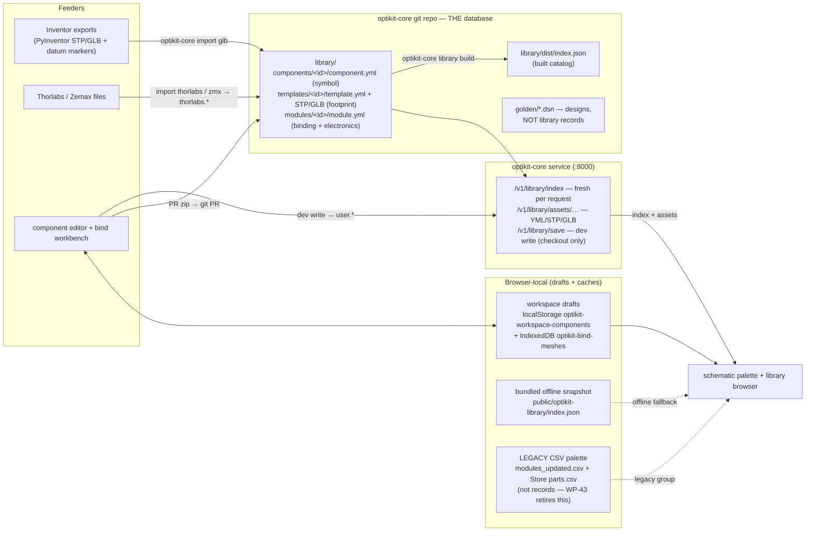

# KiCad for Optics — Execution Plan v1 (Go-independent track)

**Status:** adopted · 2026-07-12 · supersedes the WP numbering in
[kicad-for-optics-workplan.md](kicad-for-optics-workplan.md) (strategy there still applies)
**Mode:** we **dictate the standard** (Pydantic → JSON Schema + golden corpus) and
negotiate with the Go repo later. Nothing below waits on Ethan.

## Decision record (M0 decisions, resolved 2026-07-12)

| # | Decision | Resolution |
|---|---|---|
| 1 | Grid pitch | **50 / 50 / 55 mm** (x/y/z), constant `UC2_GRID_MM = (50.0, 50.0, 55.0)` |
| 2 | Fragment storage | verbatim Optiland surface schema, opaque except surface count/order |
| 3 | Glass catalog | **Optiland's material names are canonical** (refractiveindex.info-backed); vendor imports normalize at ingestion |
| 4 | Library home | `library/` folder inside the new **`optikit-core`** Python repo; split out later |
| 5 | Engine home | **Python FastAPI service in `optikit-core`** — owns compile / chain / cubify / DRC / back-annotate and runs Optiland natively. **Absorbs `optikit_exporter`** (`/Users/bene/Downloads/OPTIKIT/optikit_exporter`): `beam_router.py` → chain inference, `vendor_catalog.py` → Thorlabs importer, `builders.py` + `optikit_to_optiland.py` → compiler |
| 6 | Normative schema source | **Pydantic v2 models** in `optikit-core` → exported JSON Schema → generated TS types. Ethan's Go conforms to JSON Schema + golden corpus |
| 7 | 2.5D canvas tech | evolve the existing three.js scene in this repo; no new engine |
| 8 | UI start | UI work starts **now** on the current `PlacedModule` store, behind a document-interface boundary (WP-11); backing model swaps to `.dsn` later without canvas changes |

## Repo topology

```
optikit-core/            NEW — Python. The standard + the engine.
  src/optikit_core/
    schema/              Pydantic v2 models  (= WS-A1..A3, dictated)
    geometry/            flatten, 24-rotations, cubify, DRC
    compile/             design → optic.json + manifest   (from optikit_exporter)
    chain/               inference                        (from beam_router)
    annotate/            back-annotation classifier
    service/             FastAPI app
    importers/           glb2template, thorlabs/zmx
  library/               components/ templates/ modules/  (records + CI)
  schema/dist/           generated JSON Schema (the negotiation artifact)
  golden/                example .dsn corpus incl. Ethan's examples/designs/**
openUC2-OptiKit/         THIS repo — React/TS editor pair (schematic + assembly)
optikit (Ethan, Go)      conforms to schema/dist later — see ETHAN TODOS
openuc2-cadquery         T3 generators, called by optikit-core CI
pyinventor               parked (WP-C5 of the old plan)
```

**Parallel start:** WP-1 (core schema) and WP-11 + WP-13 (UI) can begin **today,
independently**. Everything else keys off WP-1's schema or WP-11's boundary.

Dependency order:

```
core:      WP-1 → WP-2 → WP-3 → WP-4 → WP-5 → WP-6
                        ↘ WP-7 → WP-8, WP-9, WP-10
frontend:  WP-11 → WP-13 (today)         WP-12 (after WP-1)
           WP-12 → WP-14 → WP-15 → WP-16 → WP-17 → WP-18
```

## Status ledger (2026-07-14)

| WP | Deliverable | Status |
|---|---|---|
| WP-1…6 | schema v0, geometry, compiler, chain inference, back-annotation, FastAPI service | ✅ done (optikit-core `a6923d5`…`6dc677d`) |
| WP-7 | library records + semver index + CI governance | ✅ done (`fac85b5`) |
| WP-8 | glb2template Inventor ingestion | ✅ done (`3f032c4`; naming contract in `DOCS/inventor-naming-contract.md`) |
| WP-9 | Thorlabs/Zemax importer (`import zmx` / `import thorlabs`) | ✅ done (`3738142`) — ⚠ fixture shelf has 5 real .zmx files; drop more into `tests/fixtures/zmx/` to hit the ≥10 acceptance bar |
| WP-10 | CadQuery T3 harness (`generate`, keyed artifacts, CI job) | ✅ done (`c4bc01e`) |
| WP-11…13 | document boundary, generated TS types + .dsn zip, 2.5D schematic | ✅ done (this repo `c0fbdaf`→`86e5662`) |
| WP-14 | component ("symbol") editor `/configurator/components` | ✅ done (`5dd9908`) — AC254-050-A acceptance validated against optikit-core |
| WP-15 | service round trip in the UI (check / simulate / optimize) | ✅ done (`33f15f1` + core `611e332`) — acceptance verified live: fluo-scope imports, 127-ray fans, focus-DOF optimize with delta review |
| WP-16 | assembly ("board") editor: cubify review, GLB scene, DRC markers, T2 insert drag | ✅ done (`10094e4`) — acceptance verified live (cubify table, clamp at +7.5, undo bracket, export) |
| WP-17 | cross-probing + sync chip (fingerprint states, re-cubify diff, back-annotate to source) | ✅ done (`5107ee7`) — acceptance verified live |
| WP-18 | manufacturing export (release bundle: BOM/notes/lock/optics) + `optikit-core rebuild` | ✅ done (`e91729b` + core `5d1824d`) — a real browser export verified REPRODUCIBLE, both paths bit-identical |
| WP-19 | part-binding workbench (`/configurator/bind`): STEP→GLB conversion, ghost-cube placement, datum authoring → bound records; placeholder laser/mirror/camera parts; env-gated dev writes | ✅ done (`6f41ccb` + core `b5bf95d`) — laser emission datum verified to drive chain inference from the authored point |
| WP-21 | boolean auto-holder T3 generator (per-half artifacts, M3 cut-off fastening) | ✅ done (core `ce9a0e7`) — AC254-050-A holder verified: cavity clears, halves fit, keys regenerate |
| WP-23 | editor UX round 1: locked 2.5D camera + unlock toggle, affordance legend, flat selection ring, boundary-aligned grid (snap = cube center = optical axis), glyph-thumbnail palette + bind route, assembly T-rule (axis-aligned shells, residuals on insert only) | ✅ done (`858f745`) — schematic verified visually in the browser; assembly T-rule verified structurally (GPU context loss blocked the screenshot) |
| WP-24 | design-system unification on the openUC2 brand guide: tokens (`src/theme/tokens.ts`), one AppShell (theme + toolbar) for every route incl. legacy grid + FRAME + setups, brand logo slots (`public/brand/`, white variant derived per guide p.2), Stolzl @font-face slots, visual-regression set (`npm run vr` → `DOCS/visual-regression/`) | ✅ done (`76aa1a8`) — all routes verified in the browser on the unified shell |
| WP-25 | cloud deployment: compose.prod.yaml + Caddyfile (auto-HTTPS) + DEPLOY.md, same-origin frontend profile (`--profile with-frontend`), https-origin service-URL default | ✅ done (core `77e5f1b` + `0c4aa2f`) — compose config validates; prod frontend build passes |
| WP-28 | full orientation: offset-deg {x,y,z} residual triple in the document layer (R = R24·ΔR, local frame), exact tipped-part residuals, Pitch/Roll/Yaw panel, .dsn round trip, undo-bracketed panel edits | ✅ done (`9697341`) — verified live: export/import/simulate see the tilt, DRC_T1_MOVED fires on a tilted T1 dichroic, legacy freeYawDeg migrates |
| WP-29 | one optical convention: palette parts derive pins/glyph/routing from record-style catalog ports (`src/document/portCatalog.ts`); fold angles are data (`beamAxesOf`), mirror/splitter plates follow the reflection law; `openuc2.mirror.flat_0` record; 2D preview fires along the true axis (drawing offsets no longer leak — that WAS the rotated torch fan) | ✅ done (`67aab73` + core `83e4b2c`) — verified live: Mirror 45° at yaw 0 draws a 45° plate, beam + sim ray fold 90° into the detector; torch fan tracks every yaw |
| WP-31 | bind workbench round 2: PART-frame datums (follow the part), numeric x/y/z + direction editing, category-driven datum kinds, linked 2×2 ortho views (flippable), bind-to-existing-component, assets in PR zip + dev write, thumbnails in the components view | ✅ done (`bffd516` + core `00854e2`) — verified live incl. dev write with NO env var (default-on in a checkout; prod compose pins 0) |
| WP-30 | component editor round 2: true element profiles (conic sag arcs + glass fill — radii reshape the DRAWN lens), non-optical categories electronics/mechanics first-class (no optics block; editor hides the sections; core validates), real UC2 electronics records | ✅ done (`5a26501` + core `7136e7a`) — verified live: R 50→15 mm bulges the sketch, EFL 49→22.8 |
| WP-22 | library registry: the service serves `/v1/library/index` (fresh per request) + `/v1/library/assets/…`; frontend defaults to the registry with the bundled snapshot as automatic offline fallback; contribution flow in `optikit-core/DOCS/LIBRARY.md` | ✅ done (core `564b388` + `25d926c`) — verified live incl. the fallback banner |
| WP-20 | Inventor datum contract v2 + PyInventor | 🔶 in progress (Bene, async — batch_iam_to_stp_glb.py + stamp_datums.py exist in PyInventor) |
| — | feedback round 3 triaged (2026-07-16, Part 2d): WP-32 auto-chaining, WP-33 bind bug + one authoring flow, WP-34 palette⇄registry + T-class badges, WP-35 T1/T2/T3 strategies, WP-36 Ethan subassemblies sync, WP-37 light polish + View-3D retirement | 📋 |
| WP-32 | auto-chaining: palette parts export catalog optics (`bareComponentSpec`); check/simulate auto-run `/v1/chain/infer` with no declared paths and adopt the result; afocal paraxial (null/∞) handled | ✅ done (`84de350`) — verified live: laser→mirror→camera with zero wiring checks clean, path auto-adopted, 127 rays traced through the fold |
| — | done with round-3 triage: light brand theme is the app default; `inventor-naming-contract.md` → v2.1 (PyInventor pipeline, marker geometries) | ✅ |
| WP-33 | bind drag bug fixed (drei `TransformControls` now gets `object={groupRef}` — was attaching to its own internal group, so drags were visual-only) + bind merged into the component editor as its **mechanics** tab (one record pair per part; `/configurator/bind` deep-links) | ✅ done — verified live: +20 mm drag → store `[20,0,0]`, survives datum-mode switch, sidebar shows the dragged placement; optics⇄mechanics tab round-trip keeps mesh/transform/datums; pair file map = component + template + module + STEP/GLB |
| WP-34 | palette ⇄ registry: "Library" palette group from the index + workspace (auto-refresh on save/dev-write via `bumpLibraryIndex`); index carries class/states/dof/assets/ports (core `d851ffd`); placement derives a grid rotation from the record's own ports (entry → +x, fold arm → -y); T1/T2/T3 badges everywhere; T1 δ-lock + cube outline + state switcher; T2 DOF-axis clamp + travel chips | ✅ done — verified live: registry tiles badged, workspace save appears without reload (110→111 tiles), T1 nudge snaps to the cell, T2 δ clamps to dz ∈ ±7.5 along world x, panel greys T1 tilts |
| WP-36 | Ethan `origin/subassemblies` sync: **E1 CLOSED** (his `3bf6508` fixes cm→mm; pitches agree); conformance note in `optikit-core/DOCS/GO_INTEGRATION.md`; anchor chains stay translation-only (his `Flattened`→`TranslFlattened` rename codifies our contract); subassembly boundaries compose FULL transforms — ported as `flat_design_report()` + `design_dir_loader()`; goldens re-synced + symlinks; 26 prim-report fixtures regenerated FROM the branch (verified reproducible via `go run`); nested simple-3d.dsn is the new conformance case (15 prims, 2 levels, exact match) | ✅ done — divergences filed for E2: Go's new `rotation.type: quaternion` vs our `offset-deg` (E2 ask #7); `static-models` vs `model`; his glTF nested-render FIXME is his to change |
| WP-35 | T1/T2/T3 encoded: `library verify-t1 <module>` (fragment ↔ template insert frame, E_POSE_MISMATCH/E_MIRROR_NO_REFLECTIVE; states warned per WP-35 amendment); glb2template ingests PLN/AXIS/PT markers → frames + review-flags a mirror without its PLN marker; T2 `optikit-core fx` → `optikit-fx.json` (fx name == dof name; groove lattice `TemplateRecord.grooves` decomposes dz → pair + δ), `/v1/optimize` returns the changeset + dialog download; PyInventor `apply_fx_params.py` (params + states + `--export` re-run); `pocket_params()` derives MAS-2000 pocket inputs from record surfaces; T3 `generate --design --component` regenerates the cavity at the placed pose | ✅ done — acceptance: bad mirror fails verify-t1 (exit 1); fx JSON verified with groove decomposition (3.2 → pair [0,1] + δ 0.7); holder regenerated with cavity at x=3.0 (new artifact key `3e8d5106bb2c`); 322 core tests, 105 frontend tests |
| — | feedback round 4 triaged (2026-07-17, Part 2e): WP-38 library browser round 2 (index records openable + mesh follows the record), WP-39 anchors drive the beam (frame-offset launch + continuous directions, E2 ask #8), WP-40 surfaces-as-truth (optics overlay in mechanics, derived port directions, galvo groundwork); ports VERDICT: keep as named beam endpoints, demote as geometry — surfaces/frames are the truth | 📋 |
| WP-38 | library browser round 2: index cards fetch the full record via the assets endpoint and open as an editable copy (banner); tabs renamed "library · published" / "drafts · this browser" + helper text; the mechanics tab FOLLOWS the record — IndexedDB draft mesh → registry template assets → honest "no STP bound" message; drafts' meshes persist per record id | ✅ done — verified live: laser_488 opens with the emit z=+20 form filled AND its published GLB+STEP auto-loaded; achromat (no bound mesh) says "no STP bound" |
| WP-39 | anchors drive the beam: `partToElement` launches from the entry/emit port's datum frame (`anchorFrameMm`); `SourcePort.direction` accepts unit vectors end-to-end (`dirVecOf`); bind keeps continuous directions beyond the 2° snap (records get `direction: [x,y,z]`); core `PortSpec` accepts enum OR unit vector via one resolver (`geometry.rotations.direction_vector`) used by compile/chain/checks; `W_PORT_DIRECTION_VECTOR` until ratified; **E2 ask #8** filed | ✅ done — verified live: laser_488 at [100,150] launches its 2D rays at x=120 (the +20 mm emit datum rotated onto the beam axis); vector-direction design validates+compiles+chains (core tests) |
| WP-40 | surfaces as truth: `OpticsOverlay` in the bind scene (lens lathe from the surface stack, mirror disc, sensor plane, beam arrows, frame axes; "show optics" toggle, on by default); galvo groundwork — bindStore `galvoTiltDeg` slider swings the reflected arrow by 2θ AND a template rotation-DOF value swings the schematic arm (`beamAxesOf`); directions derived not restated — core `library/derive.py` (`derive_port_directions` + `check_port_directions`, reflection law from frame-rotation quaternions) wired into `library validate` WARNs, frontend `derivedPortWarnings` cross-checks the mount angle in the editor | ✅ done — mismatched enum (mount 30° vs '-x') warns in both editor and `library validate`; galvo θ=15° swings the arm 30° (unit-verified); 344 core + 115 frontend tests |
| — | feedback round 5 triaged (2026-07-18, Part 2f): WP-41 whole-module STEP binding (grabbable optics overlay, multi-primitive), WP-42 variable surfaces ↔ firmware (DofSpec pivot-frame/surface + axis-map contract, E2 ask #9), WP-43 CSV palette → library migration (ONE database); database concept + T-class facets answer written up in Part 2f | 📋 |
| — | next: WP-41 → WP-42 → WP-43 (round 5), then WP-37 (light polish + View-3D retirement); WP-27 (tutorials) after; WP-26 (motor/firmware actuation) folds into WP-42's contract; FRAME UX rework still needs a spec conversation | ⬜ |

Nothing pushed to any remote yet — all of the above are local commits.

---

# Part 1 · optikit-core (Python) — work packages with Claude Code prompts

### WP-1 — Repo scaffold + schema v0 (this *is* WS-A1–A3, dictated)

The normative datamodel. A superset of Ethan's `.dsn` (`DesignDecl` in
`optikit-ethan/exp/designs/designs-decl.go`) so his examples remain valid, plus
the agreed extensions. Target YAML shape:

```yaml
# optikit-design.yml — schema v0
design: {name: fluo-scope, version: 0.1.0}
components:
  objective:
    type: primitive                      # design | primitive | location
    primitive: {type: step, model: "SUB - 0023 - LEND40F50.stp"}
    optics:                              # NEW (§7 unification doc)
      fragment:                          # verbatim Optiland surface schema
        surfaces:
          - {type: standard, geometry: {type: StandardGeometry, radius: 25.8, conic: 0.0},
             material_post: {type: Material, name: N-BK7}}
          - {type: standard, geometry: {type: StandardGeometry, radius: -25.8, conic: 0.0}}
      frames:                            # named datum frames, mm offsets in local coords
        optical: {z-mm: 0.0}
        mount:   {z-mm: 2.6}
      ports:
        front: {frame: optical, direction: -z}
        back:  {frame: optical, direction: +z, after-surface: 1}
    template:                            # NEW — T1/T2/T3 as DOF classes
      class: adaptive                    # fixed | adaptive | generative
      envelope: {x-mm: 50, y-mm: 50, z-mm: 50}
      # generator: {script: generators/lens_mount.py, params: {...}}   # T3 only
    dof:                                 # NEW — the load-bearing block
      - {name: dz, kind: translation, axis: z, range: [-7.5, 7.5],
         resolution: 0.05, unit: mm, actuatable: false}
    pose:
      translation: {anchor: cube1, offset-grid: [1, 0, 0], offset-mm: [0, 0, 1.85]}
      rotation: {type: grid, grid: {z: +x, x: +y}, offset-deg: [0, 0, 0]}   # offset-deg NEW
paths:                                   # NEW — the netlist
  emission:
    simulation:                          # verbatim Optiland global sections
      wavelengths: {wavelengths: [{value: 0.52, is_primary: true}]}
      aperture: {type: EPD, value: 10.0}
    chain: [sample.plane, objective.front>back, dichroic.front>transmitted,
            tube-lens.front>back, camera.sensor]
variants: {}                             # keep Ethan's overlay-merge semantics
instantiation:
  dof_values: {objective.dz: +1.85}      # instance data only, never library data
provenance: {optimized_by: null, run: null, merit: {}}
```

Rules encoded in validators: grid pitch 50/50/55 mm; `rotation.grid` = 24
axis-aligned rotations (z/x axis naming, right-hand y), `offset-deg` = extrinsic
ZXY residual; T1 must have empty `dof`; T2 `dof` ranges must fit `envelope`;
T3 requires `generator`; `dof_values` keys must resolve to declared DOFs;
`chain` entries must resolve to declared ports.

```
PROMPT (repo: create /Users/bene/Downloads/OPTIKIT/optikit-core)

Create a new Python repo "optikit-core" at /Users/bene/Downloads/OPTIKIT/optikit-core:
uv-managed, src layout (src/optikit_core), pytest, ruff, pydantic v2, pyyaml, FastAPI
pinned but unused for now. MIT or Apache-2.0 license matching openUC2 conventions.

Implement src/optikit_core/schema/: Pydantic v2 models for the "schema v0" YAML
format specified in DOCS/kicad-for-optics-execution.md §WP-1 of
/Users/bene/Downloads/OPTIKIT/openUC2-OptiKit (read that section first — it is the
spec, including the validator rules list). The format is a superset of the Go
DesignDecl in /Users/bene/Downloads/optikit-ethan/exp/designs/designs-decl.go —
read that file and keep every existing field/semantic (type design|primitive|location,
translation anchors with offset-grid/offset-mm, rotation type uc2|grid, variants,
instantiation) so all designs under /Users/bene/Downloads/optikit-ethan/examples/designs/**
still validate. Optiland fragments and per-path simulation sections are opaque
passthrough (dict[str, Any]) except: surfaces must be a non-empty list and surface
order is preserved byte-for-byte on round-trip.

Add: (a) yaml load/dump with stable key order and lossless round-trip;
(b) a CLI `optikit-core validate <design-dir>`; (c) scripts/export_schema.py that
writes JSON Schema for every top-level model to schema/dist/*.schema.json;
(d) a golden/ directory: copy Ethan's example designs plus author the
fluorescence-scope example from the spec as golden/fluo-scope.dsn/optikit-design.yml;
(e) pytest: every golden design round-trips losslessly, every validator rule in the
spec has one passing and one failing fixture (grid pitch constant, 24-rotation
enumeration, T1-no-DOF, T2-range-in-envelope, T3-needs-generator, dof_values
resolution, chain port resolution).

Constants: UC2_GRID_MM = (50.0, 50.0, 55.0) with a comment that the Go repo
currently has {5,5,5.5} mislabeled as centimeters and must migrate.
```

### WP-2 — Geometry engine: flatten, cubify, DRC

```
PROMPT (repo: optikit-core, after WP-1)

In optikit-core, implement src/optikit_core/geometry/:

1. rotations.py — the 24 axis-aligned rotation matrices addressed by (z-axis,
   x-axis) names as in the schema's rotation.grid; compose with offset-deg
   (extrinsic ZXY, degrees) to a full rotation matrix; and the inverse:
   decompose an arbitrary rotation matrix R into (nearest of the 24, residual
   ΔR as extrinsic-ZXY offset-deg). Property-based test: for random rotations,
   compose(decompose(R)) == R within 1e-9, and residual angles are minimal.

2. flatten.py — resolve the translation anchor digraph to absolute world poses
   in mm (grid offsets × UC2_GRID_MM + offset-mm), mirroring the semantics of
   Flattened() in /Users/bene/Downloads/optikit-ethan/exp/designs/ (read
   geometry.go + designs-.go for reference, but our 50/50/55 constant is
   normative). Detect cycles and missing anchors as typed errors. Output a
   FlatReport: per primitive component, world position mm + rotation matrix +
   extrinsic-ZXY euler (this is the analogue of Go's PrimReport — keep field
   names compatible where possible).

3. cubify.py — the inverse: given world poses (e.g. from a schematic layout),
   decompose p = S·g + δ with g = round(p/S) → offset-grid, δ → offset-mm; and
   R = R24·ΔR → rotation.grid + offset-deg. Then DRC checks, each returning a
   typed finding with component id and axis: DRC_RANGE (δ or a dof_value outside
   the template's declared dof range / envelope), DRC_T1_MOVED (nonzero δ or ΔR
   on a class:fixed component beyond tolerance), DRC_COLLISION (two cubes at the
   same grid cell), DRC_APERTURE (stub for now).

Table-driven tests: a lens 1.85mm off-grid lands in offset-mm; 30mm off-grid on
a T2 with range ±7.5 → DRC_RANGE naming the component and axis; golden designs
flatten to the same poses before and after a cubify→flatten round trip.
```

### WP-3 — Compiler: design → optic.json + trace manifest

```
PROMPT (repo: optikit-core, after WP-2)

Port the Optiland export pipeline from
/Users/bene/Downloads/OPTIKIT/optikit_exporter (read README.md, src/optikit_exporter/
builders.py, optikit_to_optiland.py, layout_loader.py first) into
optikit-core/src/optikit_core/compile/, replacing its ad-hoc layout JSON input
with the schema-v0 design record:

compile(design_dir, path_name) → (optic_dict, manifest):
- instantiate variant + dof_values, flatten poses (geometry engine from WP-2)
- walk paths.<name>.chain; for each port traversal emit the component's
  optics.fragment surfaces transformed into path coordinates: gap between
  consecutive port frames → thickness/cs, pose residual (offset-deg, off-axis δ)
  → cs tilt/decenter; a part may appear twice (double-pass) — emit twice
- prepend the path's simulation section (aperture/fields/wavelengths verbatim)
- manifest: list of {surface_index, component_id, port_traversal,
  fragment_surface_index} covering every emitted surface

Typed errors as exceptions with stable codes: E_NO_OPTICS (chain component
without optics.fragment, unless passthrough: true), E_BAD_PORT, E_GEOMETRY
(consecutive ports not mutually facing within tolerance — print both world
frames), E_UNSUPPORTED (surface type Optiland lacks). Write optic.<path>.json +
optic.<path>.manifest.yml via a CLI subcommand `optikit-core compile`.

Acceptance test (pytest, optiland as dev dependency): compiling
golden/fluo-scope.dsn path "emission" produces a dict that
optiland Optic.from_dict() loads and traces without error; the manifest covers
all surfaces; each E_* code has a failing fixture design. Keep the exporter's
summary.json paraxial report as an optional --summary flag.
```

### WP-4 — Chain inference

```
PROMPT (repo: optikit-core, after WP-3)

Port and generalize the beam router from
/Users/bene/Downloads/OPTIKIT/optikit_exporter/src/optikit_exporter/beam_router.py
(currently 2D, grid-cell hopping) into optikit-core/src/optikit_core/chain/:
full-3D chief-ray propagation over flattened world poses. Algorithm: start at
each source-category component's exit port; propagate the ray; among ports whose
frame faces the ray within angular tolerance and whose clear aperture (from
fragment semi-apertures, fallback envelope) contains the intersection, snap to
the nearest; mirrors/dichroics redirect via their port definitions
(front>reflected vs front>transmitted creates a branch point); stop at
detector-category ports.

Output: a paths: block proposal (one path per root-to-leaf walk).
Hard, named errors — never guess: E_AMBIGUOUS_CHAIN (two candidates within
tolerance: name both), E_NO_TARGET (ray escapes), E_LOOP. Branching at a
beamsplitter is NOT an error — emit both branches; ambiguity means two
candidates for the SAME branch.

CLI: `optikit-core chain --infer <design-dir> [--write]`.
Tests: fluo-scope infers its two paths correctly; an ambiguous two-lens fixture
raises E_AMBIGUOUS_CHAIN listing both ports; a mirror ring raises E_LOOP.
```

### WP-5 — Back-annotation

```
PROMPT (repo: optikit-core, after WP-3)

Implement optikit-core/src/optikit_core/annotate/: back_annotate(design_dir,
path_name, optimized_optic_json) using the trace manifest from WP-3. Diff every
surface of optimized vs freshly-compiled optic.json and classify per
DOCS/datamodel-unification.md §6.2 of the openUC2-OptiKit repo (read it):

- POSE_UPDATE: thickness/cs position delta between parts → candidate offset-mm
  change; run cubify DRC (WP-2); out-of-range → the delta is reported with a
  DRC_RANGE finding instead of applied
- TILT_UPDATE: tilt/decenter within a part → rotation.offset-deg or a declared
  rotation-kind dof
- PART_PARAM: radius/conic/material change → if the surface's component has a
  matching parameter-kind dof, propose a dof_values update; else classify
  PART_SUBSTITUTION (report only; library matching comes later)
- E_TOPOLOGY: surface count/order changed → reject the whole file

Two modes: --dry-run prints a classified delta table (component, dof, old,
new, classification); --apply writes accepted deltas into
instantiation.dof_values and stamps provenance {optimized_by, run, merit}.
Never write library-level fields. Table-driven tests: one fixture per
classification built by mutating the compiled fluo-scope optic.json.
```

### WP-6 — FastAPI service + Docker

```
PROMPT (repo: optikit-core, after WP-2..5; WP-4/5 endpoints may 501 until merged)

Implement optikit-core/src/optikit_core/service/: FastAPI app exposing the
engine over HTTP for the React editor. Designs travel in request bodies as a
JSON tree {path: file-content} of the .dsn directory (stateless; no server-side
project storage yet).

POST /v1/validate | /v1/flatten | /v1/cubify | /v1/drc | /v1/chain/infer |
/v1/compile (returns optic.json + manifest) | /v1/back-annotate |
POST /v1/simulate {design, path, actions:[trace|spot|paraxial]} → runs Optiland
in-process, returns ray fan polylines in WORLD coordinates (re-folded through
the manifest + flatten so the frontend can overlay them in 3D), spot diagram
points, paraxial summary | POST /v1/optimize {design, path} → free variables =
declared dof entries with their ranges as bounds, scipy/optiland optimizer,
returns optimized optic.json + the classified back-annotation delta (dry-run).

Typed engine errors → HTTP 422 with {code, message, context}. CORS for
http://localhost:5173. GET /v1/schema serves schema/dist/. Dockerfile +
compose; README curl walkthrough covering validate→chain→compile→simulate→
optimize→back-annotate on golden/fluo-scope.dsn. httpx-based API tests.
```

### WP-7 — Library folder + CI + index

```
PROMPT (repo: optikit-core, after WP-1)

Add the library to optikit-core: library/{components,templates,modules}/ holding
YAML records per DOCS/kicad-for-optics-workplan.md WS-C1 (openUC2-OptiKit repo).
Define the three record kinds as Pydantic models in the schema package:
optical component (id, version semver, category lens|mirror|filter|beamsplitter|
source|detector|stage, optics fragment/frames/ports, vendor {name,mpn}, docs),
mechanical template (id, version, class T1/T2/T3, envelope, dof, source refs:
inventor urn / glb file / cadquery generator, optical_ports), cube module
(id, version, component ref with semver range, template ref, optional
electronics {pcb, firmware_contract, axis_map}, footprint_grid).

Seed with: the schema-v0 example lens, a plain 45° mirror, a laser source, a
camera detector, and a T2 lens insert template. Build step
`optikit-core library build` → library/dist/index.json (flat list with resolved
latest versions, thumbnails paths, categories) consumed by the frontend.
CI (GitHub Actions): validate all records, enforce semver bump when a record
file changes, build index. Namespace ids openuc2.* / thorlabs.* / user.*.
```

### WP-8 — glb2template (Inventor ingestion)

```
PROMPT (repo: optikit-core, after WP-7)

Implement src/optikit_core/importers/glb2template.py + CLI
`optikit-core import glb <file.glb>`. Input: openUC2 Inventor GLB exports whose
node names follow the verified convention (sample:
/Users/bene/Downloads/ASS_-_2028_-_CUBLEND12.7F40_-_V04.glb — parse it in tests):
'ASS - <num> - <name> - <rev>' assembly root; 'SUB - <num> - <name> - virt ass'
sub-assembly (MASINS* = master insert = the DOF carrier); 'PRT - <num> - <name>'
printed parts (CUBHLF* cube halves, MASLCK lock); 'BUY - <descr>' purchased
optics where <descr> encodes the prescription, e.g.
'Lens - f40 D12.7 sI2.8 R25 pl-cx' → focal 40mm, diameter 12.7mm, center/edge
thickness 2.8mm, radius 25mm, plano-convex; 'TP <descr>' trade parts (screws);
'__mm_scale__' unit-scaling node (honor its transform).

Output (into library/): a mechanical template record — class T1 if no MASINS
sub-assembly else T2 (envelope from bbox rounded to grid cells; a dof stub
{name: dz, axis: z, range: null} flagged needs-review); an optical component
stub with fragment pre-filled from the parsed BUY prescription (pl-cx → one
curved + one plano surface, material stub N-BK7 flagged needs-review; frames:
optical at the BUY node's origin in cube coordinates); a module record binding
both; a thumbnail PNG (render with trimesh/pyrender or scene-bbox fallback).
Anything unparseable → explicit needs-review list on stderr and a
`review:` block in the record — never guess silently. Use trimesh or pygltflib.

Tests against the sample GLB: template class T2 detected via
'SUB - 0032 - MASINSLEND12.7F40', BUY prescription parsed to the values above,
records validate, envelope = 1x1x1 grid cell. Also write
DOCS/inventor-naming-contract.md documenting the convention as the contract
for future exports.
```

### WP-9 — Thorlabs / Zemax importer

```
PROMPT (repo: optikit-core, after WP-7)

Extend the vendor catalog approach from
/Users/bene/Downloads/OPTIKIT/optikit_exporter/src/optikit_exporter/vendor_catalog.py
(read it; it has a seeded Thorlabs index) into
src/optikit_core/importers/thorlabs.py + CLI `optikit-core import zmx <file>`
and `optikit-core import thorlabs <MPN>...`:

- .zmx → component record: use optiland's own Zemax file reader (check the
  installed optiland package for its zemax loader; do not hand-parse ZMX beyond
  what optiland lacks), extract the surface list into optics.fragment verbatim,
  materials normalized to names optiland's material database resolves
  (canonical per decision record; unknown glass → needs-review, no guessing),
  set vendor {name: Thorlabs, mpn}, effective focal length from paraxial calc.
- Every imported component gets datum frames: optical at first vertex, mount at
  the edge/shoulder plane derived from center thickness + diameter, ports
  front/back.
- Batch mode: given MPNs, look up local .zmx files in a --zmx-dir (downloading
  from thorlabs.com is out of scope; document where users get the files).

Acceptance: import ≥10 real Thorlabs singlet/achromat .zmx files (ask the user
to drop them in a fixtures dir if not present; AC254-050-A must be one of
them), records validate, and a pytest compiles a trivial design using
AC254-050-A and asserts EFL ≈ 50mm within 1% via optiland paraxial.
```

### WP-10 — CadQuery T3 harness

```
PROMPT (repos: openuc2-cadquery + optikit-core, after WP-7)

Formalize https://github.com/openUC2/openuc2-cadquery (clone it; read its
existing experiments) into versioned T3 generators callable from optikit-core:
a generator contract generators/<name>.py exposing
build(params: dict) -> cadquery.Workplane, plus a params JSON Schema per
generator. First generator: round-optic 1x1 insert
(clear_aperture_mm, optic_diameter_mm, edge_thickness_mm) fitting the UC2 cube
envelope (50mm, insert interface dimensions taken from the MASINS geometry —
measure from the WP-8 sample GLB).

In optikit-core: `optikit-core generate <template-id> --params ...` resolves a
class:generative template's generator ref, runs it headless, writes STEP+STL+GLB
into an out/ keyed by sha256 of canonicalized params, and a CI job regenerates
artifacts for all T3 templates in library/ when generators or params change.
Acceptance: changing clear_aperture_mm regenerates artifacts; GLB loads in
three.js (verify by file structure, no browser needed); generated insert bbox
fits inside the 50mm envelope.
```

---

# Part 2 · openUC2-OptiKit (React/TS) — work packages with Claude Code prompts

### WP-11 — Document interface boundary (**start today**)

```
PROMPT (repo: /Users/bene/Downloads/OPTIKIT/openUC2-OptiKit)

Introduce a document-interface boundary so the UI can be rebuilt now and the
backing model swapped to the .dsn schema later without touching components.

Read src/stores/appStore.ts and src/types/index.ts (PlacedModule et al.) first.
Create src/document/: an OptikitDocument facade with (a) read selectors —
listParts(): DocPart[] {id, ref, category, worldPose {positionMm:[x,y,z],
rotation: quaternion or matrix}, gridPose {cell:[x,y,z], rot24, offsetMm},
libraryRef, dofs: DocDof[] {name, range, unit, value}}, listPaths(): DocPath[]
{name, chain: portRef[]} (empty for now); (b) commands — addPart, movePartWorld
(mm), movePartGrid, rotatePart, setDofValue, removePart, renamePart; (c)
subscribe for React (implement over zustand). Back it with the CURRENT appStore
state (PlacedModule[] is the flattened form: grid x/y + layer → cell, three 90°
rotations → rot24 subset; document this mapping in the file header). Convert
mm→grid with UC2_GRID_MM = [50, 50, 55].

Hard rule to enforce from now on (add to CLAUDE.md): new editor components may
import only from src/document, never appStore directly. Do not migrate existing
components yet. Add unit tests for the pose mapping both directions.
```

### WP-12 — Generated TS types + .dsn import/export (after WP-1)

```
PROMPT (repo: openUC2-OptiKit, requires optikit-core WP-1 output)

Wire the dictated schema into the frontend. Add an npm script "gen:schema" that
reads JSON Schema files from ../optikit-core/schema/dist/ (path configurable via
env) and generates TypeScript types into src/model/dsn/generated/ using
json-schema-to-typescript; commit the generated output. Hand-write thin wrapper
types + a yaml (npm 'yaml') loader/serializer for the .dsn directory format
(optikit-design.yml + sidecars) with lossless round-trip.

Implement src/model/dsn/convert.ts: OptikitDocument snapshot ↔ DesignDecl.
Export: every DocPart becomes a component with pose.translation
{anchor: origin, offset-grid, offset-mm} and rotation {type: grid, grid, offset-deg},
dof values into instantiation.dof_values. Import: flatten (grid × [50,50,55] +
offsets) into worldPose — reuse the WP-11 mapping helpers.

Tests: golden fixtures copied from ../optikit-core/golden/** round-trip
import→export semantically identically (deep-equal on parsed YAML, ignoring key
order); a current demo setup exports to .dsn and re-imports to an identical
document snapshot. Add File menu actions: "Export .dsn (zip)" and "Import .dsn".
Keep the legacy JSON format working as a converter.
```

### WP-13 — 2.5D schematic canvas (**start today**, on WP-11)

```
PROMPT (repo: openUC2-OptiKit, after WP-11; do NOT wait for WP-12)

Build the schematic ("optical layout") view — the 3DOptix-like editor — as a new
page alongside the existing ones. Read src/components/Editor3DPage.tsx and
src/three/ first and reuse the scene/camera/gizmo infrastructure; read
DOCS/kicad-for-optics-workplan.md WP-D3 for intent.

Requirements:
- Talks ONLY to src/document (OptikitDocument).
- Parts render as schematic glyphs, not cubes: lens = biconvex disc, mirror =
  angled plate, source = cone + axis arrow, detector = plane; category from
  DocPart.category; fallback = labeled box. Optical axis (+z of part frame)
  always drawn as an arrow.
- 2.5D interaction: default drag moves in the XY working plane (mm,
  continuous — grid snap is a toggle, default OFF in this view); a
  layer/height control moves the working plane in z; Shift-drag moves along z.
  Rotation gizmo allows free yaw plus 90° snapping toggle.
- Ports: render as small directional pins at part frames (until WP-12 supplies
  real port data, derive front/back pins from the part's axis). Click a pin,
  then subsequent pins, to build a chain; store it via a new
  document command setPath(name, chain). Render active paths as polylines
  through the pins.
- Property panel (reuse PropertyPanel patterns): numeric world pose mm fields,
  rotation, dof sliders clamped to range.
- Keep the existing RayOpticsAdapter 2D preview working: render its in-plane
  rays as an overlay toggle in this view (read src/simulation/RayOpticsAdapter.ts
  and adapt input from the document selectors).

No backend calls in this WP. Acceptance: build a laser → lens → mirror →
camera layout by dragging from the existing PartLibrary sidebar, chain it by
clicking pins, see the 2D ray overlay react while dragging the lens.
```

### WP-14 — Component ("symbol") editor (after WP-12, WP-7)

```
PROMPT (repo: openUC2-OptiKit, requires WP-12 types + optikit-core WP-7 index)

Build the component editor page: create/edit optical component records
(the "symbol editor"). Read the component record Pydantic models via the
generated TS types (src/model/dsn/generated) and the library index format from
../optikit-core/library/dist/index.json.

Per-category forms (lens, mirror, filter, beamsplitter, source, detector):
a surfaces table editing the verbatim Optiland fragment (radius, thickness,
material name with autocomplete from a bundled list of optiland material names,
semi-aperture, conic), category-specific fields (mirror: reflective flag +
angle; source: wavelengths/divergence; detector: sensor size/pixel pitch),
datum frames (optical/mount z-offsets), and ports (name, frame, direction,
after-surface). Live schematic glyph preview + a 2D single-element ray sketch
(reuse RayOpticsAdapter with a synthetic collimated beam; label it
"approximate — authoritative sim comes from the service").

Actions: "Download record YAML" (library-PR-ready file with semver field) and
"Save to workspace library" (local persistence, merged into the PartLibrary
sidebar under user.*). Load the built library index from a configurable URL and
render components with category filters and vendor/MPN badges.
Acceptance: recreate Thorlabs AC254-050-A from its datasheet values in the form,
download the YAML, and `optikit-core validate` passes on it.
```

### WP-15 — Service round trip in the UI (after WP-13 + core WP-6)

```
PROMPT (repo: openUC2-OptiKit, requires the optikit-core service running locally)

Wire the schematic view to the optikit-core FastAPI service
(http://localhost:8000, configurable). Read its OpenAPI (/docs) and
DOCS/kicad-for-optics-workplan.md WP-D4 first. Add src/api/coreClient.ts (typed
fetch wrappers, zod-validated responses, typed E_*/DRC_* error surface).

Features, all operating on the current document exported via WP-12 convert:
1. "Check" button = /v1/validate + /v1/chain/infer dry-run: ERC-style marker
   list panel (KiCad-like), each finding clickable → selects/zooms the part.
2. Authoritative simulation: /v1/simulate returns world-coordinate ray
   polylines → render as three.js lines over the schematic (distinct from the
   approximate 2D overlay; the approximate one auto-hides when authoritative
   rays are fresh, reappears as "stale" greyed when the document changes).
   Spot diagram + paraxial summary in a results panel per path.
3. Optimize dialog: lists declared DOFs with ranges (from the document),
   checkboxes to include, runs /v1/optimize, then shows the classified
   back-annotation delta table (component, dof, old→new, classification) with
   Accept/Reject per row; accepted rows apply via document setDofValue and
   stamp provenance on export. Rejected rows do nothing. Never auto-apply.

Debounce simulate on document changes (500ms) behind a "live" toggle.
Acceptance: with the service running, the fluo-scope golden design imports,
simulates with visible ray fans, and a focus-DOF optimization round-trips with
the delta review step.
```

### WP-16 — Assembly ("board") editor (after WP-15, core WP-2/WP-8)

```
PROMPT (repo: openUC2-OptiKit)

Build the assembly view — the "PCB editor" — as the second linked document view.
Read DOCS/kicad-for-optics-workplan.md WP-E1/E2 and the existing
Editor3DPage/gizmo code first.

1. "Cubify" action: POST /v1/cubify with the schematic document → returns grid
   poses + module bindings + DRC findings; show a review dialog (per-part table:
   world pose → cell/rot24/offset-mm, chosen module, findings) before applying
   to the document's gridPose fields.
2. Scene: render cube modules from library GLBs (honor the __mm_scale__ node;
   loader in src/three/), skeleton context, grid 50/50/55mm. Parts without a
   module render as ghost boxes with a "no template" DRC badge.
3. Insert manipulation: a part's T2 dof renders as a constrained drag axis on
   the insert sub-mesh — dragging is clamped to the dof range and writes
   setDofValue; T1 parts' inserts are locked with a lock cursor. offset-deg
   shown numerically in the property panel, not draggable.
4. DRC: /v1/drc on demand + after every cubify; findings render as in-scene
   markers (billboard icons at the offending part) plus the marker list panel
   shared with WP-15's ERC.

Acceptance: cubify the fluo-scope schematic, see cubes on the grid, drag the
objective insert to +8mm → clamped at +7.5 with a DRC_RANGE marker appearing,
undo restores, save/export .dsn reflects dof_values.
```

### WP-17 — Cross-probing + sync discipline (after WP-16)

```
PROMPT (repo: openUC2-OptiKit)

KiCad ergonomics between the schematic and assembly views (both read the same
OptikitDocument, so this is view-state plumbing, not data sync):

1. Cross-probing: selection is document-level; selecting a part in either view
   highlights and optionally zooms it in the other (split-view layout: both
   views side by side with a divider, or tab-switch preserving selection).
2. Sync chip: content-hash the schematic-owned fields (world poses, paths,
   optics) and assembly-owned fields (grid poses, dof_values, module bindings)
   separately; chip states in the toolbar: in-sync / schematic ahead /
   assembly ahead, based on the last cubify/back-annotate stamps stored in the
   document.
3. Explicit sync actions with review dialogs (never automatic): "Update
   assembly from schematic" = re-cubify diff (only changed parts listed);
   "Back-annotate to schematic" = the WP-15 delta table reused.

Acceptance: move a lens 5mm in the schematic → chip flips to "schematic ahead"
→ update dialog lists exactly that one part → apply → chip in-sync → the
assembly view shows the insert offset changed.
```

### WP-18 — Manufacturing export (after WP-16)

```
PROMPT (repo: openUC2-OptiKit + optikit-core)

One "Export release bundle" action producing a zip: (a) the .dsn directory with
a lockfile section pinning exact library record versions + content hashes;
(b) BOM.csv — extend src/components/BOMPanel.tsx logic: printed parts (PRT),
purchased optics (BUY) with vendor/MPN from component records, trade parts (TP)
aggregated with counts; (c) merged GLB of the assembly (three.js export of the
scene, mm scale); (d) assembly-notes.md listing every T2 insert's target
dof_value ("set objective insert to +1.85 mm") and every T3 template's
generator params + artifact hash; (e) optic.<path>.json + manifests fetched
from /v1/compile for provenance.

In optikit-core add `optikit-core rebuild <bundle.zip>` verifying a bundle:
re-resolve the lockfile against library/, recompile all paths, byte-compare
optic.json outputs — CI-runnable reproducibility check.
Acceptance: export the fluo-scope demo, rebuild verifies bit-identical, BOM
lists the Thorlabs lens with MPN.
```

---

# Part 2b · Feedback round 1 (2026-07-14) — new work packages

Bene's field-test findings after WP-1…16, triaged. Bugs fixed immediately are
in the "quick fixes" list at the end; everything needing design or real scope
became a WP below. Ordering: **WP-28 (full rotations) and WP-23 (editor UX)
first, then WP-19 (part binding), then WP-17/18** — orientation correctness
and editor ergonomics are what make everything downstream testable.

### WP-19 — Part-binding workbench (mechanical ↔ optical registration)

```
PROMPT (repo: openUC2-OptiKit + optikit-core)

The missing tool between "we have an STP of a laser housing" and "every design
component points at a real ModuleRecord": an interactive registration page.

1. optikit-core: POST /v1/convert/step-to-glb — accept an uploaded STEP,
   import via cadquery/OCP (the WP-10 stack), export GLB (mm), return it.
   GLB stays a render-only exchange format; the STEP is the mechanical source
   of truth referenced by the record (this is now stated normatively in
   ARCHITECTURE.md).
2. Frontend page /configurator/bind: load an STP (via 1) or GLB; render it
   against a toggleable ghost 50 mm cube centered at (0,0,0); free
   place/rotate the mesh w.r.t. the cube origin (gizmo with snap toggles).
3. Datum authoring: click surface points to place optical datums — each is a
   point + direction (+ optional circular area): source plane, sensor plane,
   reflective plane, front/back ports. Render each as pin + arrow + disc.
   These become optics.frames (z along the datum axis) + ports.direction in
   the record; the placement transform becomes the template's mesh offset.
4. Output: a bound ModuleRecord (+ component/template records as needed) —
   "Save to workspace" and "Download records for library PR"; developer mode
   writes into ../optikit-core/library/ directly.
5. Placeholder part set: dsn-consistent placeholder STP/GLB + records for a
   laser pointer, flat mirror, camera — so every fluo-scope component can
   point at a real ModuleRecord out of the box.

Acceptance: bind the WP-8 sample GLB and one raw STP; the laser placeholder's
source datum round-trips into a design whose chain inference starts at the
authored emission point/direction instead of the node origin.
```

### WP-20 — Inventor datum contract v2 + PyInventor authoring helper

```
PROMPT (repo: optikit-core + openUC2-OptiKit DOCS + github.com/openUC2/PyInventor)

Named datums in Inventor instead of node-origin defaults:

1. Extend DOCS/inventor-naming-contract.md: work-plane/axis/point naming
   (e.g. "PLN - SRC - out", "PLN - SNS - sensor", "AXIS - OPT",
   "PT - FOCUS") with the exact semantics each maps to
   (frames z-offset, ports.direction, clear-aperture disc).
2. glb2template: parse those named nodes from the GLB export into
   optics.frames/ports (they export as empty nodes with the datum transform);
   review-flag any component that still falls back to node origin.
3. PyInventor reference script for the mechanical engineer: stamp/validate
   the named datums on an open Inventor document, list violations
   (runs on the Windows/Inventor machine).
4. Write the ME guide (DOCS/mechanical-engineering-guide.md): the two
   authoring paths — (a) Inventor-first: model the holder, add named datums,
   export GLB+STP; (b) optikit-first: export the optical part's STP from the
   part-binding workbench, import into Inventor, model the holder around it;
   (c) T3: no CAD at all, cadquery generates the holder (WP-21).

Note: live Inventor exploration through PyInventor on Bene's second machine is
available — connect it when this WP starts.
```

### WP-21 — Auto-holder generator (T3 boolean insert around an arbitrary optic)

```
PROMPT (repo: optikit-core, extends the WP-10 harness)

generators/boolean_holder_1x1.py: given an optical part mesh (STP) and its
bound pose from WP-19, generate a printable holder:

1. Start from the 50 mm cube insert envelope; boolean-subtract the part shape
   at its bound pose with a configurable clearance (default 0.15 mm).
2. Split the result into two printable halves along a configurable plane
   through the optical axis.
3. Add M3 screw bosses from both sides (through-hole one half, cut-off thread
   pocket in the other) at the four corners.
4. Params JSON Schema: clearance_mm, split_axis, screw count/positions;
   artifacts (STEP+STL+GLB per half) through the WP-10 keyed harness.

Acceptance: generate a holder for the AC254-050-A placeholder; halves'
bounding boxes fit the envelope, boolean cavity matches the part with
clearance, artifacts regenerate on param change.
```

### WP-22 — Library registry + contribution flow ("where is the database of parts?")

```
PROMPT (repo: optikit-core + openUC2-OptiKit)

One canonical place: optikit-core's library/ is the git-of-record for
openUC2-provided AND community parts.

1. Publish library/dist/index.json + record files + GLB/STP assets via CI
   (GitHub Pages or the deployed service serving /v1/library/*).
2. Frontend default index URL points at the published index (dev snapshot
   stays as fallback); record assets (thumbnails, GLBs) load from the same
   base URL.
3. Contribution flow, documented end-to-end: user authors in the component
   editor / binding workbench → workspace (user.*) → "Download records" →
   PR against optikit-core library/ → CI validates (library validate +
   semver gate) → merged → appears in everyone's index.
4. Developer mode: a local-path setting that writes records straight into a
   checkout of optikit-core (the "we are the developers" fast path).

Acceptance: a record authored in the browser lands in the published index via
PR and shows up in a fresh browser session with no manual copying.
```

### WP-23 — Editor UX round 1 (schematic + assembly)

```
PROMPT (repo: openUC2-OptiKit)

Field-test friction from the first real use of the schematic/assembly pair:

1. Camera vs part manipulation: locked 2.5D default (SimCity-style) — LMB
   selects/drags parts, orbit only via middle mouse / right mouse / modifier
   key; an "unlock view" toggle for free orbit. Today part-drag and orbit
   fight each other.
2. Affordance legend: first-run overlay (and a "?" toggle) explaining the
   port pins (colored dots = beam entry/exit used for chaining), the yaw
   ring, and the selection sphere; rename/restyle where clearer. The
   wireframe hover sphere reads as "mystery geometry" — replace with a
   subtler highlight.
3. Snap-to-grid semantics: snapping must center the optical axis in the cube
   — z snaps to layer·55 + axis height, x/y to cell centers; the grid
   overlay should draw at optical-axis height, not the cube floor.
4. Part palette in the schematic shows optical glyph thumbnails (lens,
   mirror, laser…) instead of the cube GLB renders; palette also offers
   "load STP/GLB…" which routes through the WP-19 binding flow.
5. Assembly T-rule rendering: cube shells always draw at the R24 grid pose
   on the grid; the residual yaw / offset-deg applies only to the INSERT
   content inside the shell (a beamsplitter rotated 39.6° renders as an
   axis-aligned cube with a rotated insert plate). DRC flags residuals on
   T1 shells as today.
6. Navigation: /configurator defaults to the schematic; the legacy 2D grid
   builder moves to /configurator/grid and gets a nav entry so it stays
   reachable. [quick-fixed 2026-07-14, keep as regression scope]

Acceptance: place three parts, chain them, and cubify without once fighting
the camera; a first-time user can explain pins/ring/sphere from the legend.
```

### WP-24 — Design-system unification

```
PROMPT (repo: openUC2-OptiKit)

Every page currently has its own visual impression (legacy light 2D builder,
dark schematic, dark assembly, MUI-default component editor). Unify:

1. Decision (recorded): stay on MUI — the entire app is MUI; migrating to
   shadcn/Tailwind is a rewrite with no user-visible payoff. Achieve the
   shadcn-like look via a single design-token theme (spacing, radii, dark
   palette, typography) in src/theme/, applied app-wide (including the
   legacy grid builder + FRAME wizard shells).
2. One shared AppShell (toolbar, nav, drawers) used by every route.
3. Brand: adopt the provided logo PNG (asset still to be delivered — wire a
   placeholder slot in the shell header).
4. FRAME configurator gets restyled within the shell (its UX rework is a
   separate later item).

Acceptance: switching between grid/schematic/assembly/components feels like
one product; a visual-regression screenshot set is committed.
```

### WP-25 — Cloud deployment (AWS · docker + caddy + SSL)

```
PROMPT (repo: optikit-core) [files delivered 2026-07-14 — see deploy/]

compose.prod.yaml (service + caddy), Caddyfile with automatic HTTPS for a
configurable domain, CORS origins via OPTIKIT_CORS_ORIGINS env, DEPLOY.md
(EC2 + DNS + docker compose up). Later: publish the frontend build to the
same origin so CORS disappears entirely.
```

### WP-26 — Actuation bridge (dof → firmware via imswitch)

```
PROMPT (repo: openUC2-OptiKit + optikit-core, after WP-17)

The DOF value that back-annotation writes should be able to MOVE the real
insert. All transports (UC2-REST serial, CANopen, …) are hidden behind
imswitch/newswitchunified — the frontend only ever talks to imswitch's REST
API.

1. ModuleRecord.electronics.axis-map already binds dof → can-object; add an
   imswitch endpoint mapping (positioner name / axis).
2. Assembly view: an "apply to hardware" button on an actuatable insert posts
   the dof value to a configurable imswitch URL; live position readback
   renders as a second ghost handle.
3. Document the mapping contract with one real example (the WP-7
   openuc2.cube.lens_z axis-map).

Acceptance: dragging the objective insert with hardware connected moves the
motor via imswitch; without hardware the button degrades to a clear error.
```

### WP-27 — Tutorials & guides

```
PROMPT (repo: openUC2-OptiKit DOCS + optikit-core DOCS)

1. "Add a new component" tutorial: the three roads (component-editor form,
   zmx import, GLB/STP import + binding) with screenshots, ending in a
   library PR.
2. "Create a .dsn diagram" tutorial: place parts, chain ports, check,
   simulate, optimize, export — fluo-scope rebuilt from scratch.
3. Mechanical-engineering guide (WP-20 deliverable, cross-linked).
4. API how-to: the {files: {"optikit-design.yml": "<yaml>"}} envelope, curl
   examples per endpoint, the ±1e999/Infinity contract, typed error codes.
   [seed version added to WORKING_WITH_FRONTEND.md 2026-07-14]
```

### WP-28 — Full orientation: pitch/roll/yaw residuals (HIGH — with WP-23)

```
PROMPT (repo: openUC2-OptiKit)

The schematic edits only yaw; mirrors/dichroics need fine tilts about all
three axes. The schema already carries them (pose.rotation.offset-deg is an
extrinsic-ZXY x/y/z residual on top of the 24-rotation) — the STORE is the
bottleneck (rot24 + a single free yaw).

1. Document layer: replace DOC_PARAMS freeYawDeg with an offsetDeg triple
   {x,y,z} (extrinsic ZXY, exactly the schema/cubify convention
   R = R24 · Rz(z)·Rx(x)·Ry(y)); mapping.ts worldPoseOf composes it,
   splitDocYaw generalizes, rotatePart keeps its yaw-only API and a new
   tiltPart(partId, {x?,y?}) joins it. Migrate persisted layouts
   (freeYawDeg → offsetDeg.z).
2. convert.ts: export writes the full offset-deg triple; import STOPS
   dropping x/y tilts (delete the "not representable — dropped" warning and
   its test); round-trip test with a tilted mirror.
3. Property panel: Yaw becomes Pitch(x) / Roll(y) / Yaw(z) number fields
   with the same grid-residual display; the yaw ring stays, tilt stays
   numeric (a 3D tilt gizmo is follow-up, not this WP).
4. Back-annotation TILT_UPDATE deltas (rotation-kind DOFs) become appliable
   in the WP-15 dialog once the store can hold them.
5. Cubify/DRC already handle ΔR — verify DRC_T1_MOVED fires on a tilted T1
   part end-to-end.

Acceptance: tilt a mirror 2° about x in the panel → export shows
offset-deg {x: 2}; re-import reproduces the tilt; the service round trip
(check/simulate) sees the tilted pose; undo works.
```

### Quick fixes landed with this triage (2026-07-14)

- **Stale-venv crash** (`ModuleNotFoundError: anyio._backends`): the server
  was still running from the old Python 3.14 venv after uv re-created it on
  3.12 — restart the server. `.python-version` now pins 3.12 and the gotcha
  is documented.
- **CORS**: allowed origins configurable via `OPTIKIT_CORS_ORIGINS`
  (comma-separated), so LAN/Tailscale-served frontends (e.g.
  http://100.100.43.118:5173) work.
- **Misleading E_UNREACHABLE**: the client now distinguishes "connection
  refused" from "response blocked (CORS or server crash — check the service
  log)".
- **main.py tour**: gained a Thorlabs zmx-import step and an in-process
  CadQuery T3 generation step (no subprocess when cadquery is installed:
  `uv sync --extra generate`).
- **Deployment files**: `deploy/` with compose.prod.yaml + Caddyfile +
  DEPLOY.md (WP-25 seed).
- **Default route**: `/configurator` → schematic; legacy grid builder at
  `/configurator/grid` with a nav button.
- **Wrong part orientation in the schematic** (imported designs rendered
  every glyph/pin on the +x palette convention — the vertical fluo-scope
  emission stack showed sideways lenses): pins and glyph orientation now
  derive from the retained source design's real `optics.ports` + datum
  frames (`sourcePortsOf` in the document layer); `opticalAxisOf` rotates
  each glyph onto its true beam axis; path polylines anchor traversal refs
  (`front>back`) at the entry port. Palette parts keep the old convention.

Open items parked (need input): logo PNG (not attached yet — resend), FRAME
configurator UX rework (needs a spec conversation).

---

# Part 2c · Feedback round 2 (2026-07-15) — triage + new work packages

Bene's second field-test round (component editor, bind workbench, schematic
conventions). Root causes verified in code before triage. WP-20 is in progress
on Bene's side (Inventor/PyInventor, async). Ordering: **WP-28 + WP-29 first**
(orientation/convention correctness — same reasoning as round 1), then
**WP-31** (bind workbench, actively in use), then WP-30, WP-22 (amended),
WP-27 (amended).

| Finding | Root cause (verified) | Lands in |
|---|---|---|
| Mirror at yaw 0° folds like 45° | Round-1 quick fix derives glyph/pins from real record ports **only for imported designs** — palette placements still use the hardcoded +x convention, while `openuc2.mirror.flat_45` (the only mirror record) folds 90° by construction | WP-29 |
| Torch glyph/ray fan rotated wrongly | Same convention split: palette part axes not derived from record ports | WP-29 |
| Lens ray sketch ignores radii for the drawn element | Component editor sketches a fixed lens outline; only the traced rays respond to surface data | WP-30 |
| UC2 electronics are bare placeholders with no optics | No first-class "non-optical part" story — every record is assumed to carry an optics block | WP-30 |
| Should authored lenses live in the backend? Should index.json? | Yes — that is WP-22's registry; the static `/configurator/optikit-library/index.json` is a dev snapshot that should become the offline fallback only | WP-22 (amended) |
| "How do I define such a model, step by step?" + user walkthrough docs | Docs gap | WP-27 (amended) |
| Bind: datums don't follow the part when it moves | Datums are authored and stored in the **cube frame** (`bindStore.ts` header comment states it); the part transform never re-parents them | WP-31 |
| Bind: click-placed datums not editable numerically | Datum rows render values read-only | WP-31 |
| Bind: category should constrain datum kinds | No coupling between record category and datum-kind dropdown | WP-31 |
| Bind: placing the part in the cube is hard in one perspective view | Single-viewport workbench | WP-31 |
| Bind: dev write fails with E_WRITE_DISABLED by default | `OPTIKIT_ALLOW_LIBRARY_WRITE=1` opt-in even for the local dev service | WP-31 |
| Bind: PR zip lacks the STP/GLB | `recordsToFiles()` emits only the three YAMLs — no asset bytes at all | WP-31 |
| Bind: how to link the STP to an existing lens record? | Bind always generates a fresh stub component; there is no "associate with existing optical component" (the KiCad symbol↔footprint link) | WP-31 |
| Bound part's glyph is generic, not the provided geometry | Palette/components view render the category glyph; the record's GLB/thumbnail is unused there | WP-31 |

### WP-29 — Optical-convention concordance round 2 (mirror, torch, palette parts)

```
PROMPT (repo: openUC2-OptiKit, possibly small optikit-core library additions)

Round 1 fixed imported designs (glyph/pins derive from the retained source
design's real optics.ports); palette-placed parts still use the legacy +x
convention. That split is the bug factory: a palette mirror at yaw 0° routes
and renders like the 45° record, the torch's ray fan ignores its port axis.

1. One convention, no second path: palette placement binds the part to a real
   component record at placement time (the palette already maps to module
   ids); glyph orientation, pin positions/directions, and beam routing ALL
   derive from that record's optics.ports + frames via the same
   sourcePortsOf/opticalAxisOf code path used for imports. Delete the
   palette-only +x fallback.
2. Mirror semantics: the fold angle IS the angle between entry and exit port
   directions in the record — never hardcoded. Draw the mirror glyph plate
   perpendicular to the port-direction bisector so the symbol shows its true
   mounting angle (flat_45 renders as a 45° plate that folds 90°). Add a
   normal-incidence mirror record (openuc2.mirror.flat_0, reflect-back) so
   both behaviors exist as data, and label the palette entries accordingly
   ("Mirror 45°", "Mirror (normal)").
3. Torch/LED/laser sources: glyph mesh and ray-fan preview align to the
   record's emit port direction (all 24 yaw/rot cases), in the schematic AND
   as the assembly insert glyph.
4. Regression tests: for every palette entry, opticalAxisOf(placed part)
   equals the record's exit-port direction rotated by the part pose; a
   fold-angle unit test pins flat_45 → 90° and flat_0 → 180°.

Acceptance: place Mirror 45° at yaw 0° — the glyph shows a 45° plate and the
chained beam turns 90° exactly as the compiled optic does; the torch's fan
tracks its beam axis at every yaw; no palette part renders with an axis that
disagrees with its record.
```

### WP-30 — Component editor round 2 (true lens profiles + non-optical parts)

```
PROMPT (repo: openUC2-OptiKit + optikit-core)

1. Ray sketch draws the real element geometry: surface arcs from radius
   (sag circle, conic-aware approximation is fine), spaced by thickness,
   clipped at semi-aperture; element outline closes between first/last
   surfaces. Editing a radius/thickness/semi-ap visibly reshapes the drawn
   lens, not just the traced rays. Keep the "approximate — authoritative sim
   comes from the service" caveat.
2. Non-optical parts become first-class: categories electronics | mechanics
   validate WITHOUT an optics block (no surfaces, no ports) in both the
   editor and optikit-core's library validate; chain inference and
   optics-DRC skip them; BOM still lists them. Replace the bare UC2
   electronics placeholders with real records (ESP32 cube, LED driver, …)
   carrying vendor/MPN + electronics.axis-map where applicable.
3. Editor UX for (2): choosing a non-optical category hides the
   surface/frame/port sections instead of failing validation with "lens
   records need at least one surface".

Acceptance: dragging radius 50→25 mm visibly bends the sketched lens; an
electronics record with no optics validates in optikit-core, appears in the
palette, and cannot be chained into a beam path; the fluo-scope BOM lists it.
```

### WP-31 — Part-binding workbench round 2 (datums follow the part, record linking, assets)

```
PROMPT (repo: openUC2-OptiKit + optikit-core)

1. Datums live in the PART frame. Store each datum's point/direction relative
   to the loaded mesh; world pose = part placement ∘ part-frame datum. Moving
   or rotating the part carries every datum with it (this is the mechanical
   intuition and matches "the STEP is the source of truth"). Click-placement
   converts the hit into part frame at creation.
2. Numeric editing after placement: each datum row gets editable x/y/z (mm,
   part frame), a direction control (axis dropdown + optional tilt degrees),
   and ⌀ mm — the gizmo pin updates live; click-placement just seeds these
   fields.
3. Category-driven datum kinds: the record category constrains the datum-kind
   dropdown (lens → front/back port + optical axis; source → emit;
   detector → sensor plane; mirror → reflective plane), with the warning
   pipeline (axis-snap, missing-kind) adjusted per category.
4. Linked orthographic views: 2×2 layout — perspective + top/front/side,
   each ortho view toggleable to its opposite (bottom/back/left); selection,
   gizmo drags and datum clicks stay synchronized across views. Single-view
   mode remains the default toggle for small screens.
5. Bind to an EXISTING optical component (the KiCad symbol↔footprint link):
   a picker listing index + workspace components; when chosen, the emitted
   template/module reference THAT component id (its optics drive the ports)
   and no stub component is generated. Only unbound categories fall back to
   generating a fresh user.* component.
6. Assets ship with the records: recordsToFiles() gains binary support —
   include the original STP bytes as model.step and the converted GLB as
   model.glb under the component folder in the PR zip AND in the dev write
   (/v1/library/save already accepts assets). A record without its mesh is
   not reviewable.
7. Dev writes on by default in dev: `optikit-core serve` running from a git
   checkout enables library writes unless OPTIKIT_ALLOW_LIBRARY_WRITE=0
   (prod compose pins it to 0 explicitly). Update the error text + docs.
8. Show the real geometry: components view and schematic palette tiles use
   the record's GLB thumbnail (WP-8 SVG-thumb path or a small three.js
   snapshot) for bound parts instead of the generic category glyph; the
   schematic in-scene glyph may stay symbolic, but the tile must show the
   part you bound.

Acceptance: rotate the bound AC050-008 STP by 90° — all three datums follow;
edit datum z from 2.7 → 5.0 mm numerically — the pin moves; bind the STP to
the existing thorlabs.lens.ac254-050-a component — the module resolves in the
index, the PR zip contains component.yml + template.yml + module.yml +
model.step + model.glb; the palette tile shows the collimator housing, not a
generic lens glyph.
```

### Amendments to existing WPs (2026-07-15)

- **WP-22 (library registry)** — sharpened by round 2: the service serves the
  registry (`/v1/library/index` + `/v1/library/assets/<record>/<file>`); the
  frontend's default index URL points at the service and the static
  `/configurator/optikit-library/index.json` becomes the offline fallback
  only. Decision recorded: browser workspace stays browser-local (drafts);
  publishing = dev write (WP-31.7) or the PR flow — there is no third path.
- **WP-27 (tutorials)** — leading tutorial is now "define an optical model in
  the database, step by step": record anatomy (id/category → Optiland
  fragment surfaces → datum frames → ports → glyph preview → template/module
  binding → validate → publish), written against the collimator example from
  this round's testing; then the existing items (three roads, .dsn diagram,
  ME guide, API how-to).
- **WP-20** — in progress on Bene's side (Inventor + PyInventor, async);
  connect the live Inventor instance when the glb2template parsing half
  starts here.

---

# Part 2d · Feedback round 3 (2026-07-16) — triage + new work packages

Bene's third field-test round, plus his T1/T2/T3 strategy note. Root causes
verified in code where possible. Each WP carries a **For humans** paragraph —
what will visibly change and how it gets done. Ordering: **WP-32 first**
(auto-chaining + palette↔registry are the same root problem and block everyday
use), then WP-33 (bind bug is data-corrupting), WP-36 (Ethan sync — his branch
fixes E1), then WP-34/35/37.

Done immediately with this triage (not WPs): the light brand theme is now the
app-wide default (canvases stay dark drawing surfaces); v2.1 of
`DOCS/inventor-naming-contract.md` documents the real PyInventor pipeline
(`stamp_datums.py` workflow, `batch_iam_to_stp_glb.py`, marker geometries).

| Finding | Root cause (verified) | Lands in |
|---|---|---|
| `E_BAD_PORT at laser-405nm.out: component declares no port 'out'` | Palette parts export as **bare components** — the WP-29 port catalog exists only frontend-side; the .dsn sent to the service has no `optics`, so chain/compile can't see any ports | WP-32 |
| `E_NO_PATHS: no optical paths declared — chain ports first` — "should work out of the box" | Chaining is opt-in in the UI even though `/v1/chain/infer` exists and the 2D preview already traces the beam | WP-32 |
| "routing of the parts is still odd … we should not wire the beampath" | Same as above: manual wiring is the only path today | WP-32 |
| Bind: part jumps back to origin when switching to datum mode | **Confirmed bug:** drei `TransformControls` without an `object` prop attaches to its own internal group — our group (which `commitTransform` reads) never moves, so gizmo drags are visual-only and revert when the gizmo unmounts | WP-33 |
| Upload-STP + annotate parameters should be ONE flow with the components view | Bind and the component editor are separate pages that both author halves of the same record pair | WP-33 |
| Library-saved part doesn't appear in the schematic sidebar | The palette reads the legacy CSV module catalog, not the registry index/workspace — the bridge was deferred in WP-31.8 | WP-34 |
| T1 parts should be position-locked in the cube (+ show the cube bbox); sidebar parts need T1/T2/T3 badges | The palette/schematic have no template-class awareness at all | WP-34 |
| T1/T2/T3 strategy (Bene's note) needs to live in the platform | No property-matching (T1), no optikit→Inventor pipeline (T2), T3 wrap exists but isn't wired to placement | WP-35 |
| Sync with Ethan `origin/subassemblies` | 7 commits: **E1 (cm→mm) fixed**, recursive subassembly transform chaining for reports & STEP | WP-36 |
| Does View 3D still have meaning? Associate primitives with cubes | View 3D predates the schematic/assembly pair; the assembly already renders shells + insert glyphs | WP-37 |
| Light theme + brand colours | ✅ done with this triage (default flipped); floating scene overlays + sync chip still assume dark chrome | WP-37 (polish) |

### WP-32 — Auto-chaining: the beam path works out of the box

```
PROMPT (repo: openUC2-OptiKit + optikit-core)

Two halves of one problem: palette parts export without optics (E_BAD_PORT),
and paths must be wired by hand (E_NO_PATHS).

1. Palette parts export their record identity: serviceExport enriches every
   bare component with `optics.frames/ports` derived from the SAME catalog
   the schematic renders (src/document/portCatalog.ts) plus a minimal
   fragment where the palette declares one (lens focal length → thin-lens
   fragment; mirror → reflective flat). One convention end to end: what you
   see chained in the browser is what the service compiles. Parts placed
   from library modules (WP-34) carry their real record optics instead.
2. Auto-chain by default: when a design reaches check/simulate/cubify with
   NO paths, the frontend calls /v1/chain/infer first and adopts the result
   (with a toast naming the inferred paths); the manual pin-to-pin wiring
   stays as an override for ambiguous topologies. E_NO_PATHS disappears
   from the happy path; E_AMBIGUOUS_CHAIN surfaces the pin-wiring UI.
3. The inferred chains render exactly like hand-wired ones (same path
   store), and the sync chip treats an inference like a chain edit.

Acceptance: place laser-405nm → mirror 45° → camera from the palette, press
check with zero manual wiring — validation passes, the inferred path shows,
simulate traces it; E_BAD_PORT is impossible for palette parts.
```

**For humans:** placing parts and pressing *check* will just work — no more
clicking pin-to-pin before the service accepts the design, and no more
`E_BAD_PORT`/`E_NO_PATHS`. Under the hood the browser sends the same port
information it already draws (the WP-29 catalog) along with the design, and
asks the backend's existing chain-inference to discover the beam path the
same way the visible ray preview already does. Manual wiring remains as the
escape hatch when a topology is genuinely ambiguous (e.g. two cameras).

### WP-33 — Bind workbench round 3: the drag bug + one authoring flow

```
PROMPT (repo: openUC2-OptiKit)

1. Fix the jump-back bug (VERIFIED root cause): drei TransformControls
   without an `object` prop attaches to its own internal group, so
   commitTransform reads our never-moved group and the store keeps the old
   transform — the part snaps back when the gizmo unmounts (and the
   template's mesh-offset silently records the stale pose). Pass the
   content group explicitly (object={groupRef}) or read the transform off
   the controls' attached object; add a regression test on the store
   transform after a simulated drag; audit AssemblyScene for the same
   pattern.
2. One authoring flow: merge the bind workbench into the component editor
   as its "mechanics" half — upload STP → place vs ghost cube → datums on
   one tab, surfaces/frames/ports on the other, both writing ONE record
   pair (component + template + module) with the association made at
   creation. /configurator/bind stays as a route that deep-links to the
   mechanics tab. The record panel (ns/name/category/T-class/existing-
   component picker) is shared, not duplicated.

Acceptance: drag the part 20 mm, switch to datum mode — it stays put and
the sidebar placement shows the dragged value; author surfaces AND datums
for one part without switching pages; the saved pair resolves in the index.
```

**For humans:** two things get fixed. First, the bug where a moved STP part
snaps back to the origin when you switch to datum mode — the 3D gizmo was
moving a throwaway wrapper object instead of the real part, so the movement
was never saved; it will now write through to the stored placement. Second,
uploading an STP and setting its optical parameters become one page instead
of two: the component editor gains a "mechanics" tab holding today's bind
workbench, so the symbol (optics) and footprint (mechanics) of a part are
authored together and saved as one linked record set.

### WP-34 — Palette ⇄ registry: library parts in the schematic sidebar, with T-classes

```
PROMPT (repo: openUC2-OptiKit + optikit-core)

1. The schematic palette gains a "Library" group fed from the registry
   (useLibraryIndex modules + workspace records), auto-refreshing after a
   dev write / workspace save (the missing reload Bene hit). Placing a
   library module creates a part whose libraryRef is the MODULE id; its
   record optics drive ports/glyph (WP-29 path) and its GLB/thumbnail
   renders on the tile (WP-31 thumbs) and in the assembly.
2. T-class becomes visible and BINDING in the editors: every tile shows a
   T1/T2/T3 badge (template.class via the module ref). In the schematic,
   a T1 part's intra-cube offset is LOCKED (it drags cell-to-cell but δ
   snaps to the record's fixed pose; the property panel greys the offset
   fields) and its cube bounding box renders as a ghost outline; T2 shows
   its DOF axis; T3 places freely inside the cube (the generator will wrap
   it). CSV palette entries get a best-effort class from their records
   where one exists; unclassified stays unbadged.
3. Index entries carry what the palette needs: the registry index gains
   template class + thumbnail/GLB asset URLs per module
   (/v1/library/assets/...), so the palette needs no extra requests.

Acceptance: save a bound part → it appears in the sidebar without a manual
reload and places with its real geometry; a T1 module refuses intra-cube
nudges in the schematic and draws its cube outline; every library tile
shows its T-class badge.
```

**For humans:** parts you create (via bind or the component editor) will
show up in the schematic's part palette immediately, alongside the built-in
ones — today they only land in the library and the palette never looks
there. Each palette tile will also carry a small T1/T2/T3 badge so you know
whether a part is fixed, adjustable, or generated, and the editor will
enforce it: a T1 part can't be nudged inside its cube (you see its cube
outline instead), while a T3 part can be placed freely for the generator to
wrap.

*Amended 2026-07-17:* T1 lock refined per the mechanical-templates document —
a T1 part with declared `states:` shows a state SWITCHER (e.g. mirror plane
XY ⇄ YZ) instead of nothing; T2 intra-cube dragging snaps to the groove
lattice with the continuous δ_lens remaining inside the pocket bounds.

### WP-35 — The T1/T2/T3 strategies, encoded (Bene's note → platform behavior)

```
PROMPT (repo: optikit-core + openUC2-OptiKit + PyInventor)

T1 · fixed: MATCH properties between the optiland model and the exported
   STP. The record's optics.fragment surfaces get correlated with the
   mechanics: the reflective surface of a mirror record maps to the datum
   marker (PLN - OPT) pose in the STP/GLB, verified at ingest —
   glb2template cross-checks fragment surface count/type against the
   markers and review-flags mismatches ("record says reflective flat, no
   PLN marker on the mirror face"). Add a `library verify-t1 <module>`
   check that compiles the fragment and asserts the datum pose sits on the
   fixed insert pose declared by the template.
T2 · adaptive: the optikit → Inventor pipeline. After /v1/optimize writes
   dof_values, a new exporter emits an "fx parameter" changeset
   (optikit-fx.json: {template-id, parameter, value-mm}) per T2 part; a new
   PyInventor script (apply_fx_params.py) reads it on the Windows machine,
   sets the Inventor user parameters (fx list) on the master-insert part,
   and re-runs batch_iam_to_stp_glb.py for the touched assemblies. Document
   the parameter naming (fx name == dof name, e.g. `dz`). The motor/
   firmware alternative stays WP-26 (same dof value, different actuator).
T3 · generative: wire placement to generation — a T3 part placed in the
   schematic (WP-34) carries its intra-cube pose into the generator params
   (boolean_holder_1x1: part_position_mm/part_rotation_deg), so "cubify"
   on a T3 part regenerates the holder around the primitive at its ACTUAL
   pose. The release bundle records the generator params + artifact hash
   (already in the lockfile) so the printed part matches the optics.

Acceptance: a T1 mirror module fails verify-t1 when its marker pose and
fragment disagree; optimizing a T2 focus dz produces optikit-fx.json and
(on the Inventor machine) an updated STP whose insert sits at the new dz;
moving a T3 lens 3 mm off-center regenerates a holder whose cavity is 3 mm
off-center.
```

**For humans:** this turns your T1/T2/T3 note into concrete machinery. For
fixed parts (T1) the system will actually check that the optical model and
the CAD file agree — e.g. that the mirror's reflecting surface in the
simulation sits exactly where the datum marker says the physical mirror is.
For adjustable parts (T2), an optimization result in optikit will export a
small parameter file that a new PyInventor script applies to Inventor's fx
parameter list, so the CAD updates itself and re-exports STP/GLB — closing
the optiland → Inventor loop. For generated parts (T3), wherever you place
the optic inside the cube is where the auto-generated holder will put its
cavity.

**Amended 2026-07-17 from `DOCS/mechanical-templates/` (Bene's document,
reviewed incl. images):**

1. **T1 states.** T1 is not "zero knobs": a fixed design may offer a finite
   set of named configurations, realized as Inventor *positional
   representations* (the 45° mirror's `[Primary]` vs `mirror rotated 90°`,
   i.e. normal in the XY vs YZ plane). Schema: `TemplateRecord.states:`
   (name → optical plane/pose + Inventor representation name); the placed
   component gets a state-enum DOF; the property panel shows a state
   switcher instead of pose fields; the T1 fx changeset selects the
   representation before export. Model flat_45/flat_0 as two states of one
   module and verify-t1 per state.
2. **T2 groove lattice.** Cube grooves sit at `g_n = g_0 + n·d_g`
   (n = −3…3, pitch from Inventor — confirm the sketch's `d_g` formula);
   a holder clamps a groove pair (n1, n2) with its origin at the pair
   midpoint `((g_n1+g_n2)/2, 0, 0)`, and the lens carries a bounded
   continuous offset δ_lens inside the pocket. Schema:
   `TemplateRecord.grooves {pitch-mm, count, center-mm}`; the T2 dz DOF
   decomposes to groove-pair (discrete) + δ_lens (continuous); cubify/DRC
   snap and validate against the lattice; /v1/optimize results decompose
   into nearest groove pair + residual for the fx changeset.
3. **T2 pocket generation.** The MAS-2000 lens-holder pocket generator is
   the reference (edge thickness + lens ⌀ + axis hole → "Generate Cut" →
   MAS-2000-CUSTOM.stp): T2 = lattice-placed master insert with a
   prescription-driven pocket — the pocket parameters derive from the
   component record's surfaces (edge thickness from sag at ⌀, center
   thickness, diameter), so binding a lens record to a T2 template can
   generate the pocket without hand input. T3 stays the free-form cavity.
4. **ME-guide warning:** always copy an existing Inventor design before
   editing — parts/assemblies are cross-linked between designs.

### WP-36 — Sync with Ethan's `origin/subassemblies`

```
PROMPT (repo: optikit-core + /Users/bene/Downloads/optikit-ethan)

Ethan's branch (7 commits ahead) fixes E1 (UC2 grid spacings cm→mm) and
adds recursive transformation chaining for subassemblies in reports & STEP
generation.

1. Review the branch diff (git -C optikit-ethan diff main...origin/
   subassemblies); write a short conformance note: what changed in
   DesignDecl/PrimReport semantics, especially nested-subassembly pose
   composition vs our flatten.py ("rotations don't compose along anchor
   chains" — does his recursive chaining change that contract?).
2. Regenerate the cross-impl fixtures: his Go repo emits the
   tests/fixtures/prim-reports/ goldens — rerun them from the branch and
   diff against ours; adapt flatten.py where his semantics are the agreed
   contract, PR back where they diverge from the 07-07 decisions.
3. Close E1 in the ledger (his fix) and check golden/ethan/ examples
   still round-trip; add one nested-subassembly design to golden/ as the
   new conformance case.

Acceptance: optikit-core's flatten matches the branch's PrimReports on a
nested-subassembly fixture, or a written divergence note exists with the
PR/issue link where it's his to change.
```

**For humans:** Ethan has been working in parallel on the Go reference
implementation — his branch fixes the long-standing units bug we flagged
(E1) and adds proper handling of assemblies nested inside assemblies. This
task compares his implementation against our Python engine on shared test
fixtures, adopts his semantics where they're the agreed contract, and files
issues where the two disagree — so the two implementations can't silently
drift apart.

### WP-37 — Light-theme polish + retire View 3D into the assembly

```
PROMPT (repo: openUC2-OptiKit)

1. Light-theme polish (the flip landed with this triage): the floating
   scene overlays (working-plane toolbar, bind mode bar, lock/help chips)
   and the sync chip hardcode dark rgba backgrounds — theme them
   (theme.palette.background.paper + elevation) so they read on light
   chrome; sweep GLYPH label outline colors for the light canvas; the
   visual-regression set is regenerated as the new reference.
2. Retire View 3D: its two jobs are now better served elsewhere — GLB cube
   rendering lives in the assembly, glyph placement in the schematic. Turn
   /configurator/3d into a redirect to the assembly and fold its one
   unique feature (module GLB browsing with light/dark scene toggle) into
   the assembly's view options. The assembly becomes THE place where
   optical primitives associate with cubes: selecting an insert highlights
   its component record (id + T-class + link to the component editor) in
   the side panel.

Acceptance: no hardcoded dark chips on light chrome anywhere; /configurator/
3d lands in the assembly with a deprecation toast; clicking an assembly
insert shows which optical component + template it realizes.
```

**For humans:** the app is now light by default (your preference — the
brand's light grey and white with the blue header), but a few floating
buttons still carry their old dark backgrounds and will be restyled. The
separate "View 3D" page will retire: the assembly view already renders the
cubes in 3D and is the natural home for "which optical part lives in which
cube" — clicking a cube's insert will name its optical component and
template class, linking straight to the component editor.

---

# Part 2e · Feedback round 4 (2026-07-17) — component/bind testing + the ports question

Bene's testing findings on the unified component editor, plus a conceptual
question: is "ports" the right abstraction for linking the optical model to
the STP part? Root causes first, then the analysis, then the work packages.

## Root causes

| Symptom | Root cause | WP |
|---|---|---|
| user-authored parts land under "index" and can't be opened/edited there (workspace ones can) | The index tab renders `IndexComponent` **summary metadata only** (id/vendor/EFL — the registry index carries no optics block), and its cards have no `onClick`. The full `component.yml` sits in the library tree and IS servable via `/v1/library/assets/components/<id>/component.yml` — nobody fetches it. "index" = the published registry (`../optikit-core/library`, served by the service); "workspace" = browser-local drafts. The naming explains nothing of that | WP-38 |
| opening a record never loads its STP in the mechanics tab | The bind store is only fed by the explicit "load STP/GLB" button. Registry records with a bound template DO have their mesh published (WP-34 asset URLs: `templates/<tpl>/model.step/.glb` via the module that references the component) — the editor just never follows the link. Workspace-only records genuinely have no mesh (only a thumbnail is persisted) | WP-38 |
| annotating a source's anchor (xyz + direction) doesn't move the beam in the schematic — it always launches from the part center | Two consumers, one gap: the pins/glyph path (`portsOf`) DOES use the datum-frame offset, but the 2D preview's `partToElement` places the sim element at `worldPose.positionMm` — the port frame offset is dropped, so rays launch from the center. (The authoritative service sim uses the frames correctly via compile.) | WP-39 |
| only discrete port directions (+x/−y/…), no rotational degrees | Schema-v0 `PortSpec.direction` is an axis enum; the bind workbench even snaps authored datum directions to the nearest axis (warning above 2°) and defers the residual to the placed part's `offset-deg`. That covers *placement* residuals but cannot express *record-internal* continuous geometry (galvo mirror at 30°, off-axis parabola) | WP-39 + E2 ask #8 |
| the optical model is invisible in the mechanics view — no way to SEE whether the ray model sits where the glass is | The bind scene renders the STP mesh + datum markers, but nothing of the optics: no surface profiles, no beam axes, no frames. The match STP ↔ optics is only checked numerically (verify-t1), never shown | WP-40 |

## The ports question — analysis and judgment

**What ports do today, across the stack.** (1) *Netlist topology*: paths are
ordered port traversals (`laser.out → mirror.front>reflected → cam.sensor`) —
chain inference, DRC and the whole KiCad-netlist analogy hang off named beam
endpoints. (2) *Compile geometry*: `after-surface` + the port's frame tell the
compiler where to cut/unfold the fragment along a path. (3) *Editor UI*: pins,
glyph orientation, beam routing. (4) *Cross-impl contract*: schema v0 + the Go
repo speak the same `ports:` block.

**The conflation Bene spotted.** A port is currently doing two jobs: naming a
beam ENDPOINT (graph role — good) and *stating geometry* (an axis-enum
direction + a frame). But the geometry truth already lives elsewhere: the
fragment's surfaces (a mirror's normal IS its reflective surface; a lens's
shape IS its radii/thickness; a camera's sensor IS its image plane; a galvo is
a mirror surface plus a rotation DOF about a pivot frame). Stating direction a
second time on the port — quantized to 6 axes — creates redundancy where they
agree and bugs where they disagree.

**Judgment: keep ports, demote them.** Do NOT ditch ports — losing named beam
endpoints would break paths/netlists, chain inference, cross-probing and the
Go contract, and "front>reflected" traversals have no surface-only equivalent.
Instead, re-ground them: **surfaces + datum frames are the geometric truth;
ports are thin, named handles into that truth** (`port = name + frame +
surface binding`). Where a fragment exists, the port's beam direction is
*derived* from the referenced surface's orientation (and validated against the
authored enum — same MATCH philosophy as verify-t1); the axis enum stays as
authoring shorthand and as the fallback for fragment-less records. Continuous
record-internal geometry (galvo angle) then lives where it belongs — on the
surface/frame, with a schema extension (E2 ask #8: optional continuous frame
orientation, e.g. `frames.<name>.normal` or Euler triple) rather than on the
port. And the missing feedback loop is visual: the mechanics view overlays the
optical model (surface profiles, beam axes, frames) at their declared poses
inside the STP — you SEE the match, not just trust it.

## Work packages

### WP-38 — Library browser round 2: open anything, load the mesh

```
PROMPT (repo: openUC2-OptiKit + optikit-core)

1. Index records open too: clicking an index card fetches the full record
   (`/v1/library/assets/components/<id>/component.yml`), parses it with the
   existing YAML→draft path, and opens it in the editor. Published records
   open as an editable COPY headed for the workspace (banner: "editing a
   copy of openuc2.lens.x@1.0.0 — save lands in your workspace / dev-write
   updates the library"). Add `recordFromYaml` round-trip coverage.
2. Rename the tabs to say what they are: "library (published)" and
   "drafts (this browser)" (keep the counts); one-line helper text under
   the tab bar explaining where each lives.
3. The mechanics tab follows the record's mesh: on open, resolve the
   record's module (index modules carry `component.ref`) → template assets
   → fetch STP+GLB from the asset URLs into the bind store, showing a
   loading chip. A record with no bound template shows "no STP bound to
   this record yet — load one or bind it in the workbench" instead of a
   silently empty scene. Workspace drafts keep their mesh across the
   session: persist the bind store's mesh bytes in IndexedDB keyed by
   record id (localStorage is too small for STEP).

Acceptance: click openuc2.lens.achromat_25mm_f50 in the index → the optics
form fills AND the mechanics tab shows its insert mesh; click a workspace
draft bound earlier → its mesh reappears; a never-bound record says "no
STP bound", not an empty scene.
```

**For humans:** the two sidebar tabs become "library (published)" — records
that live in the shared optikit-core library — and "drafts (this browser)"
for your local work, and BOTH open in the editor (published ones open as an
editable copy). When a record has a bound STP in the library, opening it now
actually loads that mesh into the mechanics view; when it doesn't, the editor
says so instead of showing an empty scene.

### WP-39 — Anchors drive the beam: frame offsets + continuous directions

```
PROMPT (repo: openUC2-OptiKit + optikit-core)

1. The 2D preview launches from the datum frame, not the part center:
   `partToElement` offsets the sim element by the emitting/entry port's
   frame position (rotated by the part pose), so a source whose `out`
   frame sits at z=+20 launches its rays 20 mm along the beam axis —
   matching where the pin already is and what the service traces.
   Sim-vs-pins concordance test.
2. Continuous port directions, frontend side: `SourcePort.direction`
   accepts a unit vector alongside the '+x' enum; `portsOf`/`beamAxesOf`/
   `glyphQuatOf` consume vectors natively (the enum path becomes a vector
   lookup). The bind workbench stops FORCING the axis snap: within 2° it
   snaps (as today), beyond it the true direction is kept, exported to the
   record as `direction: [x, y, z]`, and flagged "needs schema-v0.1" while
   `library validate` still warns.
3. Schema side (optikit-core): accept `direction` as EITHER the axis enum
   or a 3-vector in PortSpec (validated unit-length); compile resolves
   vectors exactly like enums (fold maps already work on vectors
   internally). Add E2 ask #8 in GO_INTEGRATION.md: continuous directions
   as the successor to the enum, aligned with however the quaternion
   question (ask #7) resolves.

Acceptance: setting a source record's `out` frame to z=+20 moves the 2D
launch point 20 mm; a bind datum at 30° off-axis round-trips through the
record and back into the editor at 30°, and the schematic glyph tilts
accordingly; optikit-core validates and compiles the vector-direction
record.
```

**For humans:** the anchor you annotate on a part (where the light actually
exits, which way a tilted mirror faces) will now really steer the picture:
rays start at the anchor instead of the part's center, and directions are no
longer limited to the six cube axes — a 30° galvo mirror stays 30°, in the
record and on screen.

### WP-40 — Surfaces as truth: the optics overlay in the mechanics view

```
PROMPT (repo: openUC2-OptiKit + optikit-core)

1. Overlay the optical model in the bind/mechanics 3D scene: at each datum
   frame's pose render (a) the surface profile from the record — lens
   cross-section from radii/thickness/⌀ (reuse `surfaceProfiles`/`sagAt`),
   mirror plane disc at the reflective surface, sensor rectangle for
   detectors; (b) beam entry/exit arrows from the ports; (c) frame axes.
   Toggle in the mode toolbar ("show optics"), on by default when a record
   with a fragment is open. THIS is the visual verify-t1: the lens outline
   should sit inside the glass of the STP.
2. Derive, don't restate: where a record has a fragment, `recordPortsOf`
   (frontend) and a new `derive_port_directions` (core, used by `library
   validate`) compute each port's beam direction from its bound surface
   (mirror normal → reflected arm via the reflection law; refractive chain
   → transmitted axis) and WARN when the authored enum disagrees by >2° —
   the same MATCH philosophy as verify-t1, now for directions.
3. Galvo groundwork: a rotation-DOF on a mirror record (kind: rotation,
   axis + pivot frame) tilts the derived reflected direction live in the
   overlay and the schematic — the first record-internal continuous DOF
   consumer (pairs with WP-39's vector directions; WP-26 will actuate it).

Acceptance: opening the AC254 record with its STP shows the lens
cross-section sitting inside the mesh at the optical frame; authoring a
mirror record whose enum says `-y` while the marker normal points 30° off
produces the direction-mismatch warning; sweeping a galvo's rotation DOF
visibly swings the reflected beam arrow.
```

**For humans:** the mechanics view will draw the *idea* of the optic on top
of the *metal and glass*: the lens profile, mirror plane or sensor area
appears exactly where the record claims it is inside the STP — so a mismatch
is something you see immediately, not something a checker tells you about
later. Port directions stop being hand-typed where they can be computed from
the surfaces themselves, and a galvo's tilting mirror becomes expressible.

---

# Part 2f · Feedback round 5 (2026-07-18) — whole-module binding, firmware axes, ONE database

Bene's collected points: T1 modules arrive as ONE Inventor STEP (cube + insert
+ optic + screws) and need their optical primitive(s) placed against the real
geometry; galvos need per-surface rotation axes bound to firmware commands;
and everything — including the legacy CSV palette — should live in one
extensible, viewable database. Answers first, then the work packages
(to be implemented later).

## The database, as it exists today

There is already exactly ONE normative database: the **record library in the
`optikit-core` git repo** (`library/`), served live by the service as "the
registry". Everything else is either a feeder into it or a local cache of it:



Key clarifications for the questions asked:

- **Records ≠ designs.** The library stores the three RECORD kinds per part
  (component = the optical symbol, template = the mechanical footprint,
  module = the binding + electronics contract), one directory per record,
  YAML + mesh assets. `.dsn` files are *designs* — arrangements of parts —
  and live elsewhere (`golden/`, your own setup folders). "A large folder of
  individual files you can author manually or through the editor" is exactly
  what `optikit-core/library/` already is — just with per-kind YAML files
  instead of one `.dsn` per part, because one part is three linked facts.
- **Where it's stored:** in git, next to the engine. The service is a thin
  live view of that folder. Deployments ship the same folder read-only.
- **How to extend it manually:** create `library/components/<ns>.<cat>.<name>/
  component.yml` (+ template/module dirs), run `optikit-core library
  validate` (now also warns on direction↔surface mismatches), commit.
  Namespaces: `openuc2.*` (curated), `thorlabs.*` (imported vendor),
  `user.*` (yours).
- **How to extend/view it from the editor:** the library browser's
  "library · published" tab lists and (since WP-38) OPENS every record; "Write
  into ../optikit-core/library" is the dev fast path; "Download record pair
  (PR zip)" is the contribution road. The schematic palette's Library group
  is the same index. What is NOT yet in the database is the legacy CSV
  palette — that migration is WP-43.

## Do we need more T-classes, or subtypes?

**No new classes — new FACETS.** T1/T2/T3 answer one question: *where does
the mechanical geometry come from* (fixed export / parametric master insert /
generated). The new requirements are orthogonal axes that any class can have,
and the schema already carries most of them:

| Facet | Question it answers | Where it lives (today / WP) |
|---|---|---|
| **States** | finite named configurations? | `TemplateRecord.states` (WP-35) — T1 mirror XY⇄YZ |
| **DOFs** | continuous knobs? | `TemplateRecord.dof` — kind translation/rotation, range, resolution |
| **Actuation** | is a DOF motorized? | `DofSpec.actuatable` + the module's `electronics.axis-map` (dof → firmware object) — a galvo IS a T2 whose rotation dofs are actuatable; a motorized z-stage IS a T2 whose `dz` is actuatable. Same record shape, different actuator (WP-26) |
| **Optic multiplicity** | how many optical primitives in one cube? | the gap — module binds ONE component today; a dual-axis galvo needs two mirror surfaces with their own pivots (WP-41/42 + E2 ask #9) |
| **Surface binding** | which surface does a DOF move? | the gap — `DofSpec` has axis but no pivot frame / surface ref (WP-42 + E2 ask #9) |

Inventing "T1m/T2g" subtypes would multiply names for combinations the facets
express better; DRC, the palette badges and cubify all key off the three
classes and stay untouched.

## Work packages

### WP-41 — Whole-module binding: place the optical primitive against the STEP

```
PROMPT (repo: openUC2-OptiKit + optikit-core)

1. The mechanics tab accepts a WHOLE cube-module STEP (cube + insert +
   optic + screws, one Inventor export): the ghost cube auto-snaps the
   mesh to the 50 mm envelope (bbox-fit button), and the record pair for
   this flow marks the template `provenance: whole-module` so its mesh IS
   the module (no separate insert body expected).
2. Place the PRIMITIVE, not just datums: the WP-40 optics overlay becomes
   grabbable — a gizmo on the overlay group moves/rotates the optical
   model (lens profile, mirror disc) against the frozen mesh, writing the
   result into the record's frames (position + rotation quaternion, the
   WP-39 continuous form). Editing `mirror size`/radii in the optics tab
   resizes the overlay live. The 'front' datum stays derived from the
   overlay pose (one truth), and verify-t1 passes when the disc sits on
   the physical mirror face.
3. Multi-primitive groundwork: the overlay supports N primitive instances
   (add/select in a small list — e.g. galvo mirror-x + mirror-y), each an
   independent frame + surface binding in ONE component record (fragment
   surface index ↔ frame name mapping). Module records stay 1-component;
   the N-optic case lives inside the component's fragment (E2 ask #9
   documents the alternative of multi-component modules).

Acceptance: load the mirror-cube STEP, drag the mirror disc onto the
visible reflective face at 45°, save — the record's optical frame carries
the placed pose (with rotation), verify-t1 is green, and the schematic
part folds the beam accordingly; a second disc can be added and placed
independently.
```

**For humans:** you'll be able to load the complete Inventor module — cube,
holder, optic, screws, one STEP — tell the editor "this is a mirror", and
then *drag the mirror's optical plane onto the real reflective surface you
can see in 3D*, resizing it with the mirror's parameters. The saved record
remembers exactly where the optics sit inside that module, checkably. And
one module can carry several optical surfaces (a dual-axis galvo's two
mirrors), each placed on its own face.

### WP-42 — Variable surfaces ↔ firmware: the actuation contract

```
PROMPT (repo: optikit-core + openUC2-OptiKit)

1. Schema (E2 ask #9): `DofSpec` gains `pivot-frame` (the frame the DOF
   rotates/translates about) and `surface` (fragment surface index it
   moves); regenerate dist. A dual-axis galvo record = one component, two
   reflective surfaces, template dofs tilt_x/tilt_y each with kind:
   rotation, its own pivot-frame, surface binding, range and
   actuatable: true.
2. Firmware linkage: the module's `electronics.axis-map` (WP-7) binds
   each actuatable dof to its firmware object — document the galvo and
   motorized-z-stage contracts in DOCS/LIBRARY.md (dof name == fx name ==
   axis-map dof, one name everywhere: WP-35's naming rule extended to
   firmware). `library validate` errors when an axis-map references an
   unknown dof and warns when an actuatable dof has no axis-map entry.
3. Editors consume the binding: the WP-40 galvo slider stops being a
   demo — it reads the record's rotation dofs (per surface, about the
   REAL pivot frame) in the overlay; the schematic property panel shows
   actuatable dofs with a ⚡ chip (firmware-bound) and sliders within
   range; sweeping tilt_x swings the overlay arrow about the x pivot and
   the schematic arm (beamAxesOf already consumes rotation dofs).

Acceptance: the galvo record validates with both dofs bound; sweeping
tilt_x in the editor swings only mirror-x's reflected arrow about its own
pivot; an actuatable dof without an axis-map entry gets flagged; the
motorized z-stage record reuses the same shape with a translation dof.
```

**For humans:** this makes "this surface moves, and firmware moves it"
part of a part's record. A galvo's two mirrors each get their own rotation
axis with limits, and each axis is linked by name to the firmware command
that drives it — the same wiring a motorized focus stage uses for its
lens travel. The editors then show these as live sliders: sweep the x-axis
and watch exactly that mirror's beam swing.

### WP-43 — One database: retire the CSV palette into the library

```
PROMPT (repo: openUC2-OptiKit + optikit-core)

1. Migrate: a script (scripts/csv2records.py or a core importer) converts
   every modules_updated.csv row (+ Store parts.csv) into record trios
   under `openuc2.*` — category from the WP-29 port catalog, sim params
   (focal length, wavelength) into the component, GLB refs into the
   template, footprint/price/docs links preserved as record fields; rows
   with nothing optical become `mechanics`/`electronics` records (WP-30
   categories). Review-flag everything auto-converted.
2. The palette reads ONE source: the schematic palette drops the CSV path
   once the migrated records serve from the index (keep the CSV loader
   behind a fallback flag for one release); palette groups become
   category + namespace driven; "Create Custom Module" routes into the
   component editor instead of the legacy wizard.
3. Document the database contract (DOCS/LIBRARY.md + frontend README):
   where the library lives, the three record kinds, namespaces, manual
   authoring, editor round-trip (browse → open → edit → dev-write/PR),
   and the records-vs-designs distinction — the answer to "where is the
   database and how do I extend it" as one page.

Acceptance: the schematic palette renders entirely from the registry
index (CSV flag off) with every previously-available part present and
placeable; `library validate` passes on the migrated corpus; a new part
authored ONLY through the editor appears alongside the migrated ones.
```

**For humans:** today the parts you see in the schematic sidebar come from
an old spreadsheet, while newly authored parts live in the real library —
two worlds. This migrates the spreadsheet into the library once (flagged
for review, nothing lost), so there is exactly one database of parts:
browsable in the sidebar, openable in the editor, extendable by you, and
versioned in git.

---

# Part 3 · TODOs for Ethan (Go repo `github.com/openUC2/optikit`)

Framed as: the schema is being dictated from `optikit-core` (Pydantic → JSON
Schema in `schema/dist/` + golden corpus in `golden/`); deltas are negotiated as
PRs against those files, not as divergent implementations. His examples are in
the golden corpus, so conformance is symmetric — we can't break him silently
either.

**E1 — Fix `UC2GridSpacings` units** (independent, do first).
`exp/designs/geometry.go` has `{5,5,5.5}` commented "centimeters" but consumed
as mm; physical pitch is 50/50/55 mm. Rename to a unit-suffixed constant, fix
values, add a regression test pinning flattened positions of
`examples/designs/**`. This is E-blocking for any pose interop.

**E2 — Review + ratify schema v0** (1–2h reading, then a call).
Read `optikit-core/schema/dist/*.schema.json` + `golden/fluo-scope.dsn` +
the WP-1 section above. The extensions over his `DesignDecl`, previously ranked
in the 07-07 meeting, are: `rotation.offset-deg` (extrinsic ZXY residual);
`optics:` block (verbatim Optiland fragment + `frames` + `ports`) replacing
`primitive.type: optiland`; top-level `paths:`; `template:` (class/envelope/
generator); `dof:` list + `instantiation.dof_values`. Deliverable: PR review on
optikit-core with objections, or a 👍. Field-name bikeshedding is welcome *now*
— after M2 the schema is frozen at v1.

**E3 — Implement schema v0 in Go** (after E2).
Extend `DesignDecl`/`CompSpec` with the ratified fields. Fragments and
simulation sections stay opaque (`yaml.Node`/`map[string]any`) — Go never
interprets radii. `Check()` gains the validator rules from the WP-1 list.
Acceptance: a Go conformance test that parses every design in
`optikit-core/golden/**`, re-emits it, and matches the Pydantic round-trip
output (add the corpus as a git submodule or CI checkout).

**E4 — Named-frame anchors** (his ask #3 from the meeting, unblocks nicer
hierarchies). Allow `translation.anchor: <comp>/<frame>` referencing a
sub-design's named datum frame; extend the translation digraph resolution.
Mirror the semantics into optikit-core's `flatten.py` afterwards (coordinate —
small joint spec note first).

**E5 — Decide the Go engine's role** (his call, no deadline).
Options: (a) Go stays the offline/CLI record tool and CI validator, Python
service owns geometry+optics at runtime (current course); (b) port cubify/DRC
to Go later for a single static binary. The typed error codes (E_*, DRC_*) and
the JSON wire shapes in optikit-core's OpenAPI are the contract either way.

**E6 — Align `PrimReport` with the service's `FlatReport`** (small).
Same fields, same names, same Euler convention (extrinsic ZXY, degrees), so
downstream consumers (build123d client, frontend) accept either producer.

---

# Part 4 · What starts today, concretely

| Now (parallel) | Next | Then |
|---|---|---|
| **WP-1** optikit-core scaffold + schema (Claude Code, ~1 session) | WP-2 → WP-3 (engine, compiler) | WP-4/5/6 (chain, annotate, service) |
| **WP-11** document boundary (Claude Code, ~1 session) | WP-13 2.5D canvas (1–2 sessions) | WP-12 after WP-1 lands |
| **E1** for Ethan (tiny PR) | E2 ratification call once WP-1 lands | E3 Go conformance |
| — | WP-7 library + WP-8 glb2template | WP-9 Thorlabs, WP-10 CadQuery |

The demo sequence stays: **M1** headless round trip (needs WP-1…6) → **M2**
library seeded (WP-7…9) → **M3** schematic MVP (WP-11…15) → **M4** assembly +
cubify (WP-16…18).
