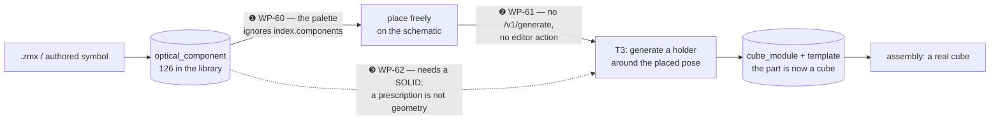

# Part 2i · Feedback round 8 (2026-07-26) — free-placing optical primitives

Continues `kicad-for-optics-part2h.md` (round 7). One architectural question
this round, and it's the load-bearing one:

> Can we place arbitrary optical components that are **not yet bound to cube
> modules** — put them anywhere on the schematic, and only then put them into a
> cube? Right now most if not all components are T1. Is there a distinction
> between the optical primitive and the module, and where are they stored? A
> Thorlabs import corresponds to the symbol with values. We can prepackage, but
> the inner primitives should also be placeable using T3.

WP numbering continues at **WP-60**.

---

## The answer: the datamodel already allows it; three wiring links are missing

### The distinction is real, named, and already in the schema

| Record kind | What it is | On disk |
|---|---|---|
| `optical_component` | the **symbol** — surfaces, frames, ports, vendor, EFL. **No mechanics at all.** | `library/components/<id>/component.yml` |
| `mechanical_template` | the **footprint** — STEP/GLB, envelope, DOFs, T-class | `library/templates/<id>/template.yml` |
| `cube_module` | the **binding** — `component@range` + `template@range` | `library/modules/<id>/module.yml` |

A Thorlabs `.zmx` import lands as an `optical_component` and nothing else —
exactly "the symbol with values". That is the correct destination.

### Measured state of the library (2026-07-26)

| | count |
|---|---|
| modules, template class `fixed` (T1) | **117** |
| modules, `adaptive` (T2) | 2 |
| modules, `generative` (T3) | 3 |
| component symbols published | 126 |
| **components no module binds** | **4** — incl. `thorlabs.lens.ac254-050-a` |

So the observation is quantitatively right: in practice everything is a
pre-exported Inventor part, because the only road into the palette so far has
been "ME exports an assembly → module record". The zmx road stops one step
short of placeability: the record exists and is unplaceable.

### Two facts that make this much cheaper than it looks

**1. The engine already tolerates template-less parts.** `geometry/cubify.py`'s
`drc()`:

```python
tpl = comp.template
if tpl is None:
    # Free primitive without a mechanical binding: nothing to check yet.
    continue
```

and the frontend's `constrainOffsetToTemplate` returns the offset unclamped
when `templateClass` is null. A bare symbol on the canvas therefore **moves
freely, chains, compiles and simulates today**. It is simply invisible to DRC
and claims no grid cell — which is the *correct* state for something not yet in
a cube.

**2. The mechanism for placing a bare symbol already ships.**
`entriesFromWorkspace()` builds palette entries straight from
`ComponentRecord`s with `templateClass: null`, no GLB, no DOFs — that is how
local `user.*` drafts appear in the palette. Proven code, only fed from
browser-local drafts.

### The three missing links



❶ `PartLibrary` registers `entriesFromIndex(libraryIndex.modules)` + workspace
records. `libraryIndex.components` — all 126 symbols — is fetched into the
store and **never used**.

❷ The T3 generator that does exactly this job exists and is proven
(`boolean_holder_1x1.py` carves a two-half printable holder around an arbitrary
part at its bound pose; `generate --design --component` regenerates at the
*placed* pose). But there is **no `/v1/generate` endpoint** and no frontend
call — T3 is CLI-only.

❸ `boolean_holder_1x1` needs `part_step` — a solid. A zmx import gives a
*prescription*, not geometry. This is the only genuinely new capability, and
the interesting half of it is that the derived solid is not a picture: **it is
the subtraction tool** that carves the cavity out of the printed cube module.

---

## Work packages

### WP-60 — Unbound symbols in the palette: place any optical component

```
PROMPT (repo: openUC2-OptiKit)

Any published optical_component becomes placeable, whether or not a
cube_module binds it. The datamodel and the placement path already
support this (see Part 2i's analysis) — this is the wiring.

1. Palette: `entriesFromComponents(index.components)` mirrors the proven
   `entriesFromWorkspace` shape — `moduleId = componentId = record.id`,
   `templateClass: null`, no GLB, no DOFs, ports from `optics.ports`.
   Register the ones NO module binds (compare against
   `index.modules[*].component.ref`), grouped as
   "<category> · unbound" and badged **UNBOUND** with the tooltip
   "an optical primitive with no mechanics yet — place it, then generate
   a holder (WP-61)". A module-bound component keeps coming through its
   module as today: never offer the same optic twice.
2. Placement: `addPart` already works (defaultRotationFor reads the
   record's own ports, and the template-less residual is unclamped).
   Confirm and PIN with a test: an unbound part moves in continuous mm,
   claims no grid cell, and raises no DRC finding.
3. Rendering: the schematic draws the derived glyph as usual (the symbol
   IS the optics). The assembly view — where everything else is a cube —
   draws it as a distinct translucent "not in a cube yet" ghost with the
   UNBOUND label, NOT the "no template" ghost (a different meaning: that
   one is a module whose mesh is missing).
4. Panel: an unbound part shows "no mechanics bound" plus the single
   affordance that matters — "generate a holder…" (wired in WP-61) — and
   the vendor/EFL facts from the record.

Acceptance: `thorlabs.lens.ac254-050-a` appears in the palette badged
UNBOUND, places on the schematic, chains laser → lens → camera, and
simulates through it with the real prescription; check/DRC stay clean and
report no cell for it; the assembly view shows it as an unbound ghost.
```

**For humans:** every optic in the database becomes something you can drop on
the canvas and design with — including a lens you imported from Thorlabs five
minutes ago that has no mechanics at all. It floats freely (no cube, no grid
snap) until you decide to put it in one.

### WP-61 — "Put it in a cube": T3 holder generation from the editor

```
PROMPT (repo: optikit-core + openUC2-OptiKit)

The T3 harness is CLI-only. Make it reachable from the editor so a freely
placed primitive can become a real cube module.

1. Service: `POST /v1/generate` wrapping `generate.harness.generate` —
   body {template_id | component_id, params?, design?, component?} and
   returns {key, out_dir, meta, artifacts: {step, stl, glb} as base64 or
   asset URLs}. 501 `E_NO_CADQUERY` without the generate extra, mirroring
   `/v1/convert/step-to-glb`. Honour the sha256 params key: an identical
   request is a cache hit, not a rebuild.
2. `pose_params_from_component` already turns a design component's placed
   intra-cube δ/ΔR into generator params — use it, so the cavity is
   carved where the optic ACTUALLY sits, not at the cube centre.
3. Frontend action "generate a holder…" on a placed unbound part:
   pick the holder generator + clearance + split plane, POST, show the
   result (bbox, envelope verdict, a 3D preview of the two halves).
4. On accept, MATERIALIZE the binding: write a `mechanical_template`
   (class: generative, generator + params, the returned artifacts) and a
   `cube_module` binding it to the placed component, then re-point the
   placed part's `libraryRef` at the new module. The part stops being
   unbound and becomes a T3 cube: cubify claims its cell, DRC applies,
   the BOM lists it, the assembly renders the generated mesh.
   Records go through the existing two exits (download the trio zip /
   dev-write into ../optikit-core/library + bumpLibraryIndex).
5. Undo: materializing is one undo step; undoing restores the unbound
   placement and leaves the generated artifacts on disk (keyed, so
   regenerating is a cache hit).

Acceptance: place an unbound lens off-centre in its cell, "generate a
holder", accept — a T3 template+module appear, the part becomes a cube in
the assembly with the cavity offset to match the placed pose, cubify
claims its cell, and `library verify-t1`-style checks stay green. A second
identical generate is a cache hit (same key, no rebuild).
```

**For humans:** the missing verb. You place an optic wherever the light needs
it, press "put it in a cube", and the tool prints you a holder whose cavity is
exactly where you left the glass — and from that moment the part behaves like
any other cube module (cell, DRC, BOM, 3D).

### WP-62 — Optiland prescription → a boolean solid (the cavity, not a picture)

```
PROMPT (repo: optikit-core)

The interesting half of WP-61: stop requiring vendor CAD. An optical
component's own optiland surface stack IS enough to build a solid, and
that solid's primary job is to be SUBTRACTED from the printed cube module.

1. `generators/optic_solid.py` — `solid_from_prescription(surfaces,
   semi_aperture_mm, edge_mm) -> cq.Workplane`: revolve the sag profile
   of the surface stack (radius + conic via the existing `sag_at` in
   `library/pocket.py` — reuse it, do not re-derive), honouring per-surface
   `thickness` for the axial stack, `semi_aperture` for the clear radius,
   and an edge cylinder where the sag would otherwise leave a knife edge.
   Handles the shapes the records actually contain: biconvex, biconcave,
   plano-cx/cv, meniscus, cemented doublets (a material change mid-stack
   is a cement interface, not an air gap), and a flat/mirror disc.
   Raises a typed error rather than guessing on anything else.
2. **Boolean role — the point of this WP.** `boolean_holder_1x1.py`'s
   `part_step` becomes OPTIONAL: add `part_prescription` (a component id,
   or inline surfaces) as an alternative source of the CUT BODY. The
   holder pipeline is otherwise unchanged — the derived solid goes
   through the same `BRepOffsetAPI_MakeOffsetShape` clearance offset and
   the same two-half split, so a printed holder gets a cavity that
   matches the real glass within `clearance_mm`. Exactly one of
   part_step / part_prescription must be given (schema `oneOf`).
3. Positive role (free, same function): export the solid as STEP/GLB so
   the optic itself can appear in the WP-57 STEP assembly and the 3D
   views, and so a user can eyeball the derived shape before printing a
   holder around it. Cross-check against `pocket_params` — the derived
   solid's centre/edge thickness must agree with the 1D pocket numbers
   (that function is the same idea in one dimension; they must not
   disagree).
4. Guard rails, because this is geometry derived from a prescription:
   the generator's meta records `derived_from: prescription` plus the
   surface digest, and the emitted template carries a review flag
   ("cavity derived from the optical prescription — verify against the
   physical optic before printing"). A negative or sub-0.2 mm edge
   thickness is an error, not a warning (that is an unprintable seat) —
   note the migrated `openuc2.lens.achromat_25mm_f50` currently derives
   an edge thickness of −1.46 mm from its thin-lens approximation, so
   this check will fire on real data and should.

Acceptance: `thorlabs.lens.ac254-050-a` — imported from .zmx, with NO
vendor STEP anywhere — generates a printable two-half holder whose cavity
sag matches `sag_at()` at the clear semi-diameter within 20 µm, whose
centre/edge thickness agrees with `pocket_params`, and which passes the
50 mm envelope check; the same prescription also exports as a standalone
lens STEP. A prescription whose edge thickness comes out negative fails
with a typed error naming the surface.
```

**For humans:** a Thorlabs prescription becomes real geometry — and not just
to look at. The lens shape becomes the *cutter*: the printed cube module gets a
pocket carved to that exact glass, with clearance, without anyone ever opening
a CAD file. The one thing the tool will refuse to do is print a seat for a lens
whose edge would be thinner than the printer can hold — and one migrated record
in the library will trip that check immediately, which is the right outcome.

---

## Order and dependencies

1. **WP-60** — standalone, small, and immediately useful (place the Thorlabs
   lens today). Nothing else depends on it landing first, but everything is
   nicer with it.
2. **WP-62** — the generator work; independent of the frontend and testable
   entirely in core. Do it before WP-61's accept path so "generate a holder"
   has something to carve with when there is no vendor STEP.
3. **WP-61** — needs the `/v1/generate` endpoint (its own step 1) and reads
   better once WP-62 exists.

Relationship to earlier packages: WP-61 step 1 **supersedes** the "T3 generate
button" line item in WP-51 (Part 2g) — drop it there. WP-62 step 3 feeds
WP-57's STEP assembly export (Part 2h) with real optic solids instead of
lathed approximations. `library/pocket.py`, noted in the Part 2g gap table as
reachable from nowhere, gains its first real consumer in WP-62 step 1.

E2 asks this round: none new. A generative template materialized by WP-61 is an
ordinary `mechanical_template` with a `generator` block, which the schema
already carries.
