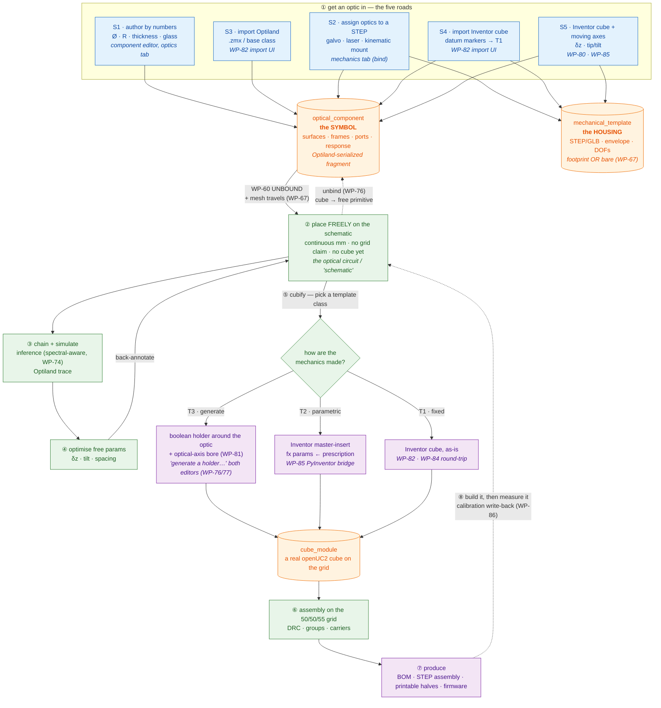
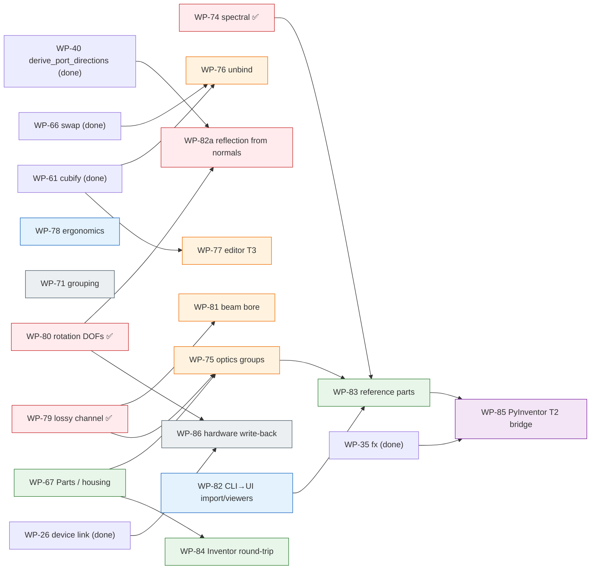

# OptiKit — the MVP roadmap: Scenarios 1–5, end to end through the UI

**Consolidates** the open packages from `kicad-for-optics-part2j.md` (WP-67, 70,
71, 55, 56, 59, 72, 73) and all of `kicad-for-optics-part2k.md` (WP-74…81),
plus the new packages this round adds (WP-82…86), into ONE dependency-ordered
sequence. The verbatim per-WP prompts still live in 2j/2k and the main ledger
(`kicad-for-optics-execution.md`); this file is the map that says **what to
build, in what order, and why** — so that when it is done a user can drive every
one of the five scenarios through the editor, then simulate → optimise → cubify
→ produce.

**Status date:** 2026-07-28. Everything through WP-69 has landed (Parts 2a–2j
bugs + the free-placement/holder round + the starter library + the legacy
sweep). This roadmap is the work *from here to the MVP*.

---

## 0. The North Star

A user can, entirely in the browser:

1. **get an optic in** by any of five roads (author it, import a `.zmx`, assign
   optics to a STEP, import an Inventor cube, or import an Inventor cube with
   moving axes);
2. **place it freely** on the schematic as a primitive, with no cube yet;
3. **wire and simulate** the optical circuit (chain inference + Optiland);
4. **optimise** the free parameters;
5. **cubify** — snap each optic into a real cube module, generated (T3),
   parametric (T2), or fixed from Inventor (T1);
6. **produce** — BOM, STEP assembly, printable holders, firmware.

Everything below is scoped to make exactly that true. Anything that is not on
that path (accounts, the public website, the OSHWLab social layer) is
explicitly deferred to the last phase.

### The five scenarios, and what each still needs

| Scenario | One line | Works today | Remaining packages |
|---|---|---|---|
| **1 — pure primitive** | author a lens/mirror by its numbers, place it, wrap it in a cube | author ✅, place ✅, T3 wrap ✅ | T2 wrap (WP-85), editor-side T3 (WP-77), black-box paraxial (WP-75) |
| **2 — housed device** | a galvo/laser STEP with optics assigned, on the grid | assign optics ✅ | mesh travels with a free part (WP-67), beam bore (WP-81), Inventor round-trip (WP-84), moving axes (WP-80), lossy frames (WP-79) |
| **3 — Optiland import** | `.zmx` / base-class primitive → part | `.zmx` engine ✅ (CLI only) | import UI (WP-82), per-class T2 insert (WP-85) |
| **4 — Inventor T1 cube** | predesigned cube → fixed module | ✅ (CLI) | import UI + viewer (WP-82) |
| **5 — Inventor variable axes** | T1 cube whose optic moves | translations ✅ | rotation DOFs reach geometry (WP-80), the T2 Inventor bridge (WP-85), hardware write-back (WP-86) |

The through-line: **almost every scenario is blocked by the same handful of
plumbing gaps** (authored data not reaching the engine, verbs living in only one
view, CLI power not reachable from the UI). Fix those first and four scenarios
light up at once. That is why the phases are ordered by *how many scenarios each
unblocks*, not by scenario number.

---

## 1. How everything fits together

The integration model, from "where an optic comes from" to "a built instrument".
The five scenarios are the five entry arrows on the left; they all converge on
one **optical component** (the symbol), which is placed **freely** on the
schematic, then **bound** into a cube by one of three template classes, then
**produced**.

Three things this picture makes explicit, and that the work packages exist to
enforce:

- **The symbol is the hub.** Every road produces the same `optical_component`;
  everything downstream (place, simulate, cubify) only ever sees the symbol. A
  Thorlabs KM05 and a printed holder are interchangeable because the beam only
  touches the optic at its datum — that is the property WP-76/77/81 protect.
- **"Freely placeable" and "in a cube" are two states of one part**, connected
  by two inverse verbs: **cubify** (WP-61, shipped) and **unbind** (WP-76). Both
  are one undo step; the round trip is the whole "KiCad for optics" claim.
- **Any part reaches the grid.** A bare housing (Thorlabs laser body, kinematic
  mount) is not an exception — it is placed as a symbol whose mesh travels
  (WP-67), then either gets a generated T3 holder or is exported at its
  cube-relative pose for an ME to build the module around and re-attach (WP-84).
  **No part is left off the grid.**

---

## 2. The phases

Ordered by dependency and by scenario-unblock count. Phases 1–6 are the MVP;
Phase 7 is explicitly after it.

### Phase 1 — Make authored data correct and lossless *(blocks all five scenarios)*

Nothing above the datamodel can be trusted until what the user authors actually
reaches the engine, and until the physics the engine runs is the right physics.
These three are prerequisites for everything and are mostly mechanical.

- **WP-74 — Spectral & polarization response** *(the physics gate; do first)*.
  A `response:` block on a fragment surface (`kind`, `reflect_bands_um`,
  `transmit_ratio`, `polarization_deg`); consumed by inference pruning
  (a 505 nm dichroic's reflected arm is not proposed at 488 nm), a filter-stack
  compatibility check, and a **photon budget** (how much light reaches the
  sensor — the BOM analogue). Wavelength gating is implemented; Jones is
  declared only. Ships the filter + dichroic reference seeds. *Full prompt:
  2k WP-74.* **Unblocks:** every fluorescence and BB84 design; scenario-agnostic.

- **WP-79 — The lossy channel: authored data must travel.** Three fields are
  authored and then silently dropped between record and engine: frame
  **rotation** (a bound 45° mirror simulates axis-aligned — the index and
  `paletteOpticsOf` drop the quaternion), **clear aperture** (authored in the
  bind workbench, never written; `DRC_APERTURE` is a stub), and the
  **interaction model** (hardcoded to `RefractiveReflectiveModel`). Ship all
  three through the index and preserve them through placement; implement
  `DRC_APERTURE`. *Full prompt: 2k WP-79.* **Unblocks:** S2 (assigned mirror
  poses), S4/S5 (Inventor frames), and honours the "don't lose Optiland detail"
  principle directly.

- **WP-80 — Rotation DOFs reach geometry.** ✅ *done (`6265e9b` + `5e5aba7`).*
  A rotation DOF is declarable, validated, firmware-bindable, sliderable,
  sendable, and *back-annotation can write one* — but the compiler dropped it
  (*"only translation DOFs move poses yet"*). The rotation branch, the cubify
  residual-tilt projection, `value-deg` in fx, and the panel counterparts
  landed. *Full prompt: 2k WP-80.* **Unblocks:** S5 (a galvo/kinematic mirror
  that actually tilts in the trace).

- **WP-82a — Reflection from normals: a tilted mirror deviates by 2θ.**
  *(carved out of WP-80 during implementation — the remaining Phase-1 item.)*
  WP-80 delivers a **rigid θ rotation**, which is correct for a refractive
  tilt, a tip/tilt platform and a rigid kinematic mount — but wrong by a factor
  of two for a **reflective** surface, and it leaves `DofSpec.surface` (which
  mirror of a dual-axis galvo a DOF drives) still inert. The reflection law
  already exists in the repo as a *validator* (`library/derive.py`, WP-40);
  this promotes it to the geometry source whenever a reflective element is off
  its nominal pose, and gives DOF-named surfaces their own tilt. Sharpest
  motivation: the browser's fast 2D preview **already applies 2θ**, so the
  approximation and the "authoritative" trace disagree today — and the
  approximation is the correct one. *Full prompt: 2k, amendment section.*
  **Unblocks:** S5 properly (independent galvo axes), and restores
  preview↔trace agreement.

### Phase 2 — The core verbs, in the UI where the user stands *(S1, S2, S3)*

The capabilities that exist but live in the wrong place, plus the one genuinely
missing verb.

- **WP-76 — The unbind verb: take the optic out of the cube.** The inverse of
  WP-61's cubify. `unbindPart(partId)` re-points the placed part at its module's
  component (reusing WP-66's `swapPartModule` machinery) — same pose, becomes a
  free UNBOUND primitive, one undo. "generate a holder…" moves to **both**
  editors (today it is Assembly-only). Completes the *unbind → move → re-hold*
  round trip. *Full prompt: 2k WP-76.* **Unblocks:** the S1/S2 "place any
  primitive freely even if it lives in a fixed cube" ask.

- **WP-77 — The component editor learns T3 (and stops asking pointless
  questions).** Fixes the real bug behind "how do I associate T3?" — the
  mechanics tab emits a `generative` template with *no generator block* (a dead
  record). Adds "generate a holder…" driven by the draft's own prescription
  (same `/v1/generate`), collapses the record-pair chooser to one line when the
  answer is the draft you are editing, refuses to save a generative template
  with no generator, and renders the live `paraxialEflMm` focus estimate in the
  mechanics tab (the "quick lensmaker focus" ask). *Full prompt: 2k WP-77.*
  **Unblocks:** S1 authored-lens → cube from the editor.

- **WP-81 — Beam-aware generators: the optical axis as a boolean.** The T3
  holder currently seals its own beam path — it subtracts the part cavity and
  M3 features but *no bore*. Pass ports/directions/aperture into generator
  params (they never reach a generator today) and cut the optical-axis
  channel(s), derived from the record's own ports + WP-79's aperture.
  *Full prompt: 2k WP-81.* **Unblocks:** S1/S2/S3 — the generated holders become
  physically usable.

- **WP-75 — Optics groups: achromats, objectives, black boxes.** An achromat
  already compiles (a fragment *is* an optics group); what breaks is (a) solid
  generation for **air-spaced** groups (`solids_from_prescription` → one solid
  per glass group, each cut by the holder), (b) the **paraxial black box** — one
  surface with `ThinLensInteractionModel` + EFL for a catalog objective you have
  no prescription for (needs WP-79 step 3 to let the interaction model travel),
  and (c) the barrel housing (→ WP-67). Ships achromat + paraxial-20× reference
  seeds. *Full prompt: 2k WP-75.* **Unblocks:** the "multi-element lens /
  objective" ask directly.

### Phase 3 — Part-first library: any part reaches the grid *(S2, S4)*

- **WP-67 — The "Parts" editor + housing without a cube** *(carried from 2j,
  extended)*. One nav entry **"Parts"** replaces "Components" + "Bind" (tabs
  "optics (symbol)" / "mechanics (housing)"); `footprint_grid` becomes optional
  so a template can be a **bare housing** with no cube; the index ships a
  `housings` section so the frontend can tell bare symbol / symbol+housing /
  cube module apart; and an unbound part's mesh **travels with it** (today
  unbound palette entries hardcode `glbUrl: null`). *Full prompt: 2j WP-67.*
  **Extension for this round (the user's explicit ask):** *every* part is
  grid-compatible in the end — a Thorlabs kinematic mount holding a mirror, a
  bare laser body — via **either** an auto-generated T3 holder **or** the export
  path in WP-84. There is no "lives off the grid forever" state; housing-without-
  a-cube is a *stage*, not a destination. **Unblocks:** S2 (a housed device
  visible with its mesh in free space), and the whole part-first philosophy.

- **WP-83 — The reference/test parts corpus.** *(new — the user's "add the
  important reference parts so we can test everything" ask.)* One reviewed,
  zero-flag reference record per scenario branch, committed to the library so
  every WP has something real to test against and the golden designs exercise
  the real paths:
    - S1: `openuc2.lens.starter_50mm` (exists), `openuc2.lens.achromat_starter`
      (cemented doublet, WP-75), `openuc2.objective.paraxial_20x` (black box).
    - S2: a Thorlabs kinematic-mirror **assembly** reference (KM05-class mount +
      circular mirror, STEP + assigned reflective datum + tip/tilt DOFs) and a
      laser-body reference (bare housing, WP-67).
    - S3: `thorlabs.lens.ac254-050-a` (exists, `.zmx` provenance).
    - S4: an Inventor-datum-marker cube reference (the `MAS-2000-CUSTOM.stp` /
      marker-stamped GLB from `~/Downloads/PyInventor`, imported via `import
      glb`).
    - S5: `openuc2.galvo.dual_axis` (exists) + `openuc2.stage.z_motor` (exists).
    - Spectral: `openuc2.filter.emission_525`, the re-authored dichroic (WP-74).
  Each is an acceptance fixture: a golden `.dsn` per scenario that a test
  compiles/simulates/cubifies. **Unblocks:** trustworthy testing of all of the
  above; this is the safety net the other packages lean on.

- **WP-84 — Inventor round-trip: identity-preserving re-attach.** *(new —
  the user's "attach the Inventor zip+stp back onto the same record" ask.)* A
  per-part STEP export **posed w.r.t. its cube frame** (`optikit-core export
  step --component <key>`, and a `/v1/export/step/part` endpoint + a frontend
  "export for Inventor" button), so an ME can design the cube module around the
  device in Inventor; and the return leg — **attach** the resulting STEP + GLB
  (or a zip) back onto the **existing** record id rather than minting a fresh
  one, keeping the optical model untouched (the user's explicit simplification:
  "we're fine attaching files back since the optical model doesn't change"). No
  merge logic, no fresh ids — just "here are the mechanics for the part you
  already assigned." **Unblocks:** S2's hand-crafted-in-Inventor path and S4's
  rework loop.

### Phase 4 — Reach the CLI from the frontend *(S3, S4; general usability)*

- **WP-82 — CLI ↔ frontend parity: importers, viewers, editors.** *(new — the
  user's "reach most CLI commands from the frontend, with viewers and editors"
  ask.)* Today `.zmx` and `import glb` are **CLI-only** with no UI and an
  auto-write-with-no-confirmation into `library/`. This package:
    - a **`/v1/import/zmx`** and **`/v1/import/glb`** endpoint pair (the CLI
      importers already exist; wrap them), returning the *proposed* record trio
      for review rather than writing blindly;
    - a frontend **import drop-zone** (drag a `.zmx` or a marker-stamped GLB →
      preview the parsed surfaces / datum frames / review flags → accept into
      the library via the existing dev-write / zip exits);
    - a read-only **viewer** for the other engine outputs that are today
      terminal-only: the compiled optic (2D layout PNG the engine already draws),
      the cubify/DRC report, the photon budget (WP-74), and the `optikit-fx.json`
      changeset (WP-85). The principle: **anything the CLI can produce, the
      editor can at least view.**
  **Unblocks:** S3 and S4 become real UI flows instead of terminal rituals.

- **WP-78 — Schematic ergonomics: context menu, copy/paste, chaining that
  proposes.** Right-click menu on a placed part (copy · paste · duplicate ·
  delete · open in library · take out of cube · put in a cube… · swap module…),
  keyboard copy/paste/duplicate, and chaining that surfaces inference proposals
  as one-click **Adopt** chips with a non-modal manual fallback (answering "is
  manual chaining still necessary?" — no, it becomes the ambiguous-case
  fallback). *Full prompt: 2k WP-78.* **Unblocks:** daily usability across all
  scenarios; the copy/paste and "manual chaining" asks directly.

### Phase 5 — The T2 parametric-insert loop, hardware-in-the-loop *(S1, S3, S5)*

This is the one loop that touches a real Inventor install. The scripts already
exist on the Inventor machine (`~/Downloads/PyInventor/apply_fx_params.py`,
`batch_iam_to_stp_glb.py`) but have never been tested end to end against a live
Inventor — so this phase is a **human-driven** test package plus the service
that makes it callable from OptiKit.

- **WP-85 — PyInventor parametric-insert bridge (human WP + FastAPI Inventor
  service).** *(new — the user's explicit ask.)* Two halves:
    1. **The connection that already exists, verified by a human.** A step-by-
       step manual test the user runs on the Inventor machine: take the
       master-insert `.ipt`, set the fx user parameters (`lens_diameter`,
       `radius`, `thickness`, and the placement `dz`/pose) to match a specific
       lens (e.g. `starter_50mm`), confirm the lens mounts inside the cube
       module, run `batch_iam_to_stp_glb.py` to produce the STP/GLB/thumbnail
       trio, and confirm `apply_fx_params.py` consumes an `optikit-fx.json`
       changeset. This closes the T2 loop the ledger claims (WP-35) but which was
       never exercised. **Deliverable from the human:** the run log + one golden
       marker-stamped `.iam → STP/GLB` pair, which becomes the WP-83 S1-T2
       reference fixture and unblocks WP-20.
    2. **A FastAPI Inventor bridge** so OptiKit can drive that loop remotely: a
       small service that runs on the Inventor/Windows machine and exposes
       `POST /inventor/apply-fx` (takes a changeset + a template id → sets the
       user parameters, exports the trio, returns the files) and
       `POST /inventor/batch-export`. OptiKit's `/v1/generate` gains a `T2`
       branch that, instead of running CadQuery, calls this bridge — and the
       `pocket_params()` → fx wiring (which exists but has no caller) becomes its
       input: a placed lens's prescription derives the insert's fx parameters
       automatically. When the bridge is unreachable, the editor falls back to
       "download the fx changeset" (which already works).
  **Unblocks:** the T2 branch of S1 and S3 (the last unimplemented cell of every
  scenario matrix), and S5's parametric-insert story.

### Phase 6 — Grouping and the hardware return leg *(polish + S5 closure)*

- **WP-71 — Ad-hoc grouping** *(carried from 2j)*. Shift-select, Ctrl+G to group
  a selection with a name (WP-44's instance mechanism, no library record), Ctrl+
  Shift+G to ungroup, and "save as group record…" to graduate an ad-hoc cluster
  into a reusable OPM. *Full prompt: 2j WP-71.* **Unblocks:** building
  arbitrarily complex setups without pre-authoring every subassembly.

- **WP-86 — Calibration write-back: derive from a running instrument.** *(new —
  the user confirmed adding this.)* Back-annotation exists for the *optimiser*
  leg only (a simulation result → `dof_value`). Add the **hardware** leg: a
  measured axis position from a running instrument (via the WP-26 UC2-REST
  device link, read direction) writes back into the design's `dof_values` with
  `provenance: {source: instrument, run: …}`, the exact same classified-delta
  path the optimiser uses. So a focus found by turning a real motor is captured
  in the design, not just a simulated one. **Unblocks:** the "code → CAD →
  running instrument → back" closure that is OptiKit's genuine differentiator
  over PyOpticL/KiCad.

### Round-11 additions (Part 2l, 2026-07-29) — folded into Phases 1–4

Collected from real use; full prompts in `kicad-for-optics-part2l.md`. They
interleave with the phases above (all **before** Phase 7):

- **WP-92 — Editor bug sweep, round 2** *(with Phase 1)*. WebGL context loss
  after the holder preview (the canvas dies until reload — this is also why a
  generated cube doesn't appear); decimal-comma number inputs yielding NaN;
  an unbound lens's yaw snapping to N·90° with snap off (the residual yaw is
  not rendered for a part with no cube shell); interface-part (puzzle/plate)
  glyphs still invisible. The daily-use blockers.
- **WP-89 — The part inspector shows the optics** *(Phase 2)*. Clicking a part
  surfaces its optiland facts (EFL, aperture, per-surface radius/thickness/
  material, source lines) + a legible port list + a ray sketch — and answers
  "do we still need ports?" by making them visible (yes; they are the pins).
- **WP-90 — Parts editor per-category authoring** *(Phase 3, extends WP-67/77)*.
  Category-driven fields (a mirror gets a substrate + reflective surface, not a
  lens's radii); rectangular apertures; a `mechanics:` reference so a hand-
  authored record can name its housing STEP; template-class routing (T1→WP-84,
  T2→WP-85, T3→WP-77).
- **WP-87 — Import an Optiland setup** *(Phase 3–4)*. A whole Optiland system
  JSON → a row of unbound free primitives on the schematic (no T-class until
  cubify), each a temporary component promotable to the library. The third
  import road beside zmx (WP-82) and glb.
- **WP-88 — Sequential beam-path scripting** *(Phase 4, with WP-78)*. A small
  Optiland/PyOpticL-style DSL that builds the circuit line by line and stays
  two-way in sync with the canvas — the inverse authoring direction to chain
  inference.
- **WP-91 — Library UX + multispectral sources** *(Phase 4)*. A list view for
  the palette beside the icon grid; a multi-line source shows all its lines
  with an active-line picker and "simulate all lines".

Answers (not work) also in Part 2l: why ports stay (they are the pins — chain
inference, compilation, the WP-74 spectral gate all walk them); why inference
snaps within 20° not 45° (after grid placement a real target is ~0° off and a
non-target ≥90°, so 20° is the tolerant-but-safe band); sources are already
multi-line in the datamodel; and how to attach Inventor mechanics to an
optics-only record (WP-67 housing / WP-84 attach).

### Phase 7 — After the MVP: community, accounts, UX *(explicitly last)*

None of these are on the Scenario 1–5 path; they are the product layer on top of
a working editor. Per the user's instruction, they come last.

- **WP-70 — The publish loop** (Store-repo CI index + live Explore fetch +
  prefilled-PR "Publish to community"). *2j WP-70.*
- **WP-55 — GitHub docs sideload**; **WP-56 — embedded viewer v2** (`.dsn` in a
  static page). *2j WP-55/56.*
- **WP-59 — OSHWLab-for-optics** phased plan (design pages → BOM→cart ordering →
  social). *2j WP-59.*
- **WP-72 — Accounts & user-owned storage ADR** (GitHub App vs OAuth vs Google —
  a decision document + thin prototype, no UI investment yet). *2j WP-72.*
- **WP-73 — The UX overhaul** (website ↔ editor split, the design system
  everywhere). Deliberately last, on a working machine. *2j WP-73.*

---

## 3. Dependency graph of the packages

Read it as: **Phase 1 (red) feeds everything.** WP-79 in particular gates the
mechanics phases (a bore needs the aperture; a black box needs the interaction
model). WP-83 (reference parts) depends on the physics being right first, then
becomes the test bed everything else leans on. WP-85 sits at the end because it
needs a real Inventor and a verified reference lens.

---

## 4. Decisions confirmed this round

1. **`response:` on the surface, not the port** — a cut-on is a surface
   property; stays inside the Optiland-serialized fragment. ✅
2. **Jones declared, not implemented** — `polarization_deg` gets a schema home;
   wavelength gating is implemented (it is what fluorescence needs). ✅
3. **Unbind drops the template, keeps the component** at the same pose, one undo
   step; does not delete the module record, does not prompt. ✅
4. **Paraxial black box is a first-class surface kind** — one surface,
   `ThinLensInteractionModel` + EFL. ✅
5. **Lose no Optiland detail** — records store the Optiland serialization
   verbatim; every new field (response, interaction model) lives inside the
   fragment where `extra="allow"` carries it losslessly, and the importers keep
   following Optiland's own parser rather than re-deriving. ✅ *(new this round)*
6. **CLI power is reachable from the UI** — anything the CLI produces, the editor
   can at least view; the import commands get real UI with a review step instead
   of a blind auto-write. ✅ *(new this round)*
7. **Every part reaches the grid** — housing-without-a-cube is a stage, not a
   destination; a T3 holder or the WP-84 export path always lands it on the
   50/50/55 grid. ✅ *(new this round)*
8. **Identity-preserving re-import is file attachment, not a merge** — attach the
   Inventor STP/GLB/zip back onto the existing record; the optical model is
   untouched, so no reconciliation is needed. ✅ *(new this round)*

---

## 5. A note to Ethan (the Go side)

The Go `.dsn` renderer has stalled, so this roadmap **deliberately diverges**
where waiting on a ratification call would block the MVP. Specifically:

- The `response:` block (WP-74), the surviving `interaction_model` (WP-75/79),
  the frame `rotation`/`clear_aperture_mm` that now travel (WP-79), and the
  rotation-DOF geometry (WP-80) are all implemented on the Python side first.
  They live inside the Optiland-serialized fragment or as additive record
  fields, so a Go loader with `extra="allow"` round-trips them losslessly — but
  the Go renderer will not *act* on them until it is caught up.
- The multi-part-in-one-cube question (`module.parts: {…}`, flagged in
  `GO_INTEGRATION.md:130`) is **not** taken up in this MVP — an objective is one
  optics group in one barrel, which the current 1:1:1 shape already fits, so no
  schema break is forced. It stays open for the two-independent-optics-in-one-
  cube case and still wants a joint call.

Action: fold this divergence note into `optikit-core/DOCS/GO_INTEGRATION.md` as
the current E2 delta, and package the E2 asks (#1–11 + WP-74's new `response`
ask) for Ethan when he re-engages.

---

## 6. Suggested build order (one line)

~~**WP-74 → WP-79 → WP-80**~~ ✅ *(physics correct & lossless — done)* →
**WP-82a** *(the 2θ reflection fix carved out of WP-80)* → ~~**WP-76 → WP-77**~~ ✅
→ **WP-81 → WP-75** *(the verbs, in the UI)* → **WP-67 → WP-83 → WP-84**
*(part-first + test bed + round-trip)* → **WP-82 → WP-78** *(CLI→UI +
ergonomics)* → **WP-85** *(the human-tested T2 Inventor loop)* → **WP-71 →
WP-86** *(grouping + hardware closure)* → **WP-70/55/56/59/72/73** *(community,
accounts, UX — last)*.

At the end of Phase 6, all five scenarios are drivable through the editor and the
North Star holds: design the optical circuit, simulate it, optimise it, cubify
it, produce it — and measure it back.
