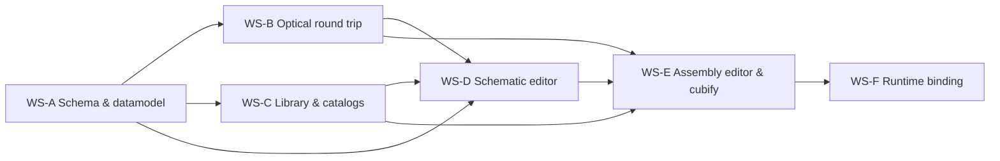

# OptiKit → "KiCad for Optics" — Workplan

> **⚠ Superseded for execution:** the M0 decisions below are resolved and the WP
> numbering is replaced by [kicad-for-optics-execution.md](kicad-for-optics-execution.md)
> (Go-independent track: Pydantic schema in a new `optikit-core` Python repo dictates
> the standard; engine = Python FastAPI absorbing `optikit_exporter`; per-WP Claude
> Code prompts + Ethan TODOs there). This document remains the strategic reference
> (KiCad mapping, principles, stream rationale, risks).

**Status:** working plan · 2026-07-12
**Builds on:** [datamodel-unification.md](datamodel-unification.md) (adopted architecture C),
the component-model concept note (T1/T2/T3, four entities, DOF block), and the
meeting decisions of 2026-07-04/07/08 (Go `.dsn` = system of record, React app =
editor, Go engine behind an HTTP service, cubify/back-annotate as the SCH↔PCB bridge).

**Target picture:** a web tool in the spirit of 3DOptix — free placement of optical
primitives with live raytracing — but with the step 3DOptix does not have: every
primitive can later be *wrapped into a UC2 cube* via a mechanical template
(T1 fixed / T2 adaptive / T3 generative), producing a manufacturable assembly,
BOM, and firmware-bindable degrees of freedom. Two linked documents, like
KiCad's schematic + board:

| KiCad | OptiKit | Owner |
|---|---|---|
| Symbol | Optical component (verbatim Optiland surface fragment) | library |
| Footprint | Mechanical template (T1/T2/T3, DOF block, envelope, ports) | library |
| Library part | Cube module = component + template + electronics contract | library |
| Schematic | Optical layout: primitives posed in world mm, `paths:` = netlist | `.dsn` |
| Board | Cube assembly: `offset-grid` + `offset-mm` + 24-rotation + inserts | `.dsn` |
| Forward annotation | `cubify` (p = S·g + δ, R = R₂₄·ΔR) | Go engine |
| Back annotation | `back-annotate` (typed outcomes, may reject) | Go engine |
| DRC | residual-range / clear-aperture / collision checks | Go engine |
| ERC | path continuity, port facing, chain inference errors | Go engine |
| Gerber | STEP/GLB + BOM + setup descriptor + lockfile | Go engine |

**Repos involved:**

- `openUC2-OptiKit` (this repo) — React/TS frontend. Becomes the *editor pair*
  (schematic + assembly views) over the `.dsn` model. Current state: flat
  `PlacedModule[]` in `src/stores/appStore.ts` (1.9k lines), 2D `GridCanvas`,
  `Editor3DPage`, `RayOpticsAdapter` 2D live sim, `PartLibrary`, BOM/ImSwitch panels.
- `optikit` (Ethan's Go repo, local: `optikit-ethan`) — system of record. `.dsn` /
  `optikit-design.yml` (`DesignDecl` in `exp/designs/designs-decl.go`), pose engine
  (`Flattened()`, `PrimReport`), adapters in `internal/clients/` (build123d,
  optiland, graphviz, echarts).
- **New:** `optikit-library` — git-backed component/template/module records with CI
  (KiCad-library governance model).
- Aux: [pyinventor](https://github.com/openUC2/pyinventor) (Inventor automation),
  [openuc2-cadquery](https://github.com/openUC2/openuc2-cadquery) (T3 generators),
  [Optiland](https://github.com/HarrisonKramer/optiland) (sequential raytracing).

---

## 0. Principles (already decided — restated so no WP re-litigates them)

1. **One direction of truth.** The part-centric `.dsn` record is canonical; per-path
   `optic.json` files are compiled build artifacts with a trace manifest; Optiland
   never becomes a second source of truth (unification doc §5–§8).
2. **Zero invented optical vocabulary.** A primitive's optics are a *verbatim*
   Optiland surface fragment. Vendor formats (Thorlabs/Zemax) are import converters
   at library-ingestion time only.
3. **Template classes are DOF classes.** T1 = 0 DOF, T2 = bounded DOF inside the
   envelope, T3 = parametric DOF that regenerates geometry. Resolution after
   optimization is a mechanical table lookup, not a special case.
4. **The DOF block is load-bearing.** One definition feeds Optiland (bounds), CAD
   (offset/regeneration), firmware (`actuatable` + `axis_map`), and calibration
   (design / optimized / measured = three fields of the same DOF).
5. **Don't over-invest in the current React prototype.** Refactor the store to the
   new model; reuse the canvas/3D components where cheap; delete where not.
6. **Schematic and assembly are two linked documents**, synchronized only by
   `cubify` / `back-annotate` — never one merged model, never silent sync.

---

## 1. Work streams and dependency graph

Milestones:

- **M0 — Schema freeze** (WP-A1…A4): everything downstream builds on stable schemas.
- **M1 — Round trip on the CLI** (WP-B1…B4): place→compile→optimize→back-annotate
  works headless on example designs. *Demoable without any UI.*
- **M2 — Library seeded** (WP-C1…C3): ≥1 real cube family (e.g. CUBLEND12.7F40)
  and ≥10 Thorlabs singlets/achromats importable.
- **M3 — Schematic editor MVP** (WP-D1…D4): 3DOptix-comparable free placement +
  live sim, saving `.dsn`.
- **M4 — Assembly editor + cubify** (WP-E1…E4): the KiCad moment — press "Update
  assembly from schematic", review, DRC, export.
- **M5 — Runtime** (WP-F1…F2): DOF → ImSwitch/firmware axis, calibration write-back.

Each WP below is sized for one focused Claude Code session (or 1–3 dev-days),
with explicit inputs and acceptance criteria. WPs within a stream are ordered;
streams can proceed in parallel after M0.

---

## WS-A · Schema & datamodel (Go repo, with TS mirror)

### WP-A1 — Grid pitch + residual rotation fixes
**Repo:** optikit (Go) · **Depends:** — · **Owner decision needed:** none (bugfix + agreed ask)

- Fix `UC2GridSpacings` in `exp/designs/geometry.go`: values `{5,5,5.5}` are
  commented "centimeters" but consumed as mm; real pitch is **50/50/55 mm**. Add a
  unit-explicit constant name (`UC2GridSpacingsMM`) and regression tests pinning
  flattened positions of `examples/designs/**`.
- Add `rotation.offset-deg` (extrinsic ZXY residual tilt on top of the 24-rotation)
  to `CompPoseRotSpec` — required to represent ΔR from cubify and optimizer tilt
  write-back. Update `Check()`, `TransfMat`, `PrimReport`, examples, and docs.

**Accept:** golden-file test showing a design with `offset-deg` round-trips
YAML→struct→flatten→PrimReport; grid test asserts 50 mm neighbor spacing.

### WP-A2 — `optics:` block and `paths:` section
**Repo:** optikit (Go) · **Depends:** A1

Implement unification doc §5.1/§5.2 in `DesignDecl`:

- `CompSpec.optics`: `fragment` (verbatim Optiland surface schema, inline or file
  ref — replaces `primitive.type: optiland` pointer), `frames` (named datum frames:
  `optical`, `mount`, `mass` + fixed transforms), `ports` (named entry/exit:
  `{frame, direction, after-surface}`).
- Top-level `paths:` — named ordered port traversals (`lens1.front>back`,
  branch ports for beamsplitters, same part twice allowed) + per-path simulation
  context (`aperture`, `fields`, `wavelengths` in Optiland's own schema).
- Fragments are opaque to Go (stored as `map[string]any` / raw nodes) except for
  surface count and per-surface identity — Go never interprets radii.

**Accept:** the fluorescence-microscope example from the unification doc (§5.2)
parses, `Check()` validates port references, and a new
`examples/designs/optics/fluo-scope.dsn` is committed as the canonical test case.

### WP-A3 — DOF / adjustability model (T1/T2/T3 made machine-readable)
**Repo:** optikit (Go) · **Depends:** A2

- Add continuous input variables to `InstSpec` (agreed schema ask #2): named
  scalars with `{range, resolution, unit, actuatable}` that bind into pose offsets
  (`offset-mm`, `offset-deg`) and/or fragment parameters.
- Add template metadata on components/designs: `template.class: fixed|adaptive|generative`,
  `template.envelope` (mm box), and for `generative` a
  `template.generator: {script, params}` reference (CadQuery).
- Encode the resolution rules: T1 — any optimizer delta on it is a validation
  error; T2 — delta must lie within the declared range (else DRC error); T3 —
  deltas map to generator params.
- `dof_values` live only in setup instances (design-level `instantiation`), never
  in library records.

**Accept:** a T2 lens-insert example with `dz ∈ [−7.5,+7.5]` declared, an
instantiation with `dz: +1.85`, and a table-driven test of the three resolution
rules (accept / DRC-reject / regenerate-params).

### WP-A4 — TS schema mirror + golden round-trip
**Repo:** openUC2-OptiKit · **Depends:** A1–A3

- `src/model/dsn/` — TypeScript types + Zod schemas mirroring `DesignDecl`
  (incl. optics, paths, DOF). YAML parse/serialize (`yaml` package).
- Lossless round-trip tests over `optikit-ethan/examples/designs/**` as golden
  fixtures (byte-stable emit or semantic-equality comparison).
- A `PlacedModule[] ↔ CompsSpec` bidirectional converter for the legacy store
  (the current flat model is exactly the `Flattened()` form — document that).

**Accept:** `npm test` round-trips every example design; converting a current
demo setup to `.dsn` and back is identity.

### WP-A5 — JSON Schema + CI validation (shared)
**Repo:** optikit (Go) + optikit-library · **Depends:** A2, A3

Generate JSON Schema from the Go structs (or hand-write and test against both Go
and Zod), publish versioned schemas, and provide `optikit dsn validate` for CI
use. Semver discipline: every library record carries `version:`; setups export
with a lockfile of exact resolved versions.

**Accept:** CI job in the library repo template that fails on schema violation
and on version-less records.

---

## WS-B · Optical round trip (compile / chain / back-annotate / service)

### WP-B1 — `optikit dsn optics compile`
**Repo:** optikit (Go) + small Python shim · **Depends:** A2

Deterministic compiler per unification doc §6.1: instantiate → `Flattened()` →
walk the chain → unfold consecutive port frames into Optiland `thickness`/`cs`
(pose residuals → tilt/decenter) → prepend path simulation context → emit
`optic.<path>.json` **plus** `optic.<path>.manifest.yml` (surface ↔ part/port map).
Typed errors: `E_NO_OPTICS`, `E_BAD_PORT`, `E_GEOMETRY`, `E_UNSUPPORTED`.

**Accept:** compiling `fluo-scope.dsn` emission path produces an optic.json that
Optiland loads and traces without error (verified by a pytest in the shim);
manifest maps every surface to a part/port; each error class has a failing fixture.

### WP-B2 — Auto-chain inference (`optikit dsn optics chain --infer`)
**Repo:** optikit (Go) · **Depends:** B1

Chief-ray propagation through flattened world poses: start at a source port, snap
to the nearest facing port within clear aperture, repeat until a sensor. Ambiguity
(`E_AMBIGUOUS_CHAIN`) is a hard error demanding a manual `paths:` entry — never a
silent guess. Output is a `paths:` block written into the design (or printed).

**Accept:** infers the single-path examples correctly; the beamsplitter fixture
errors with the two candidate ports named.

### WP-B3 — `optikit dsn optics back-annotate`
**Repo:** optikit (Go) · **Depends:** B1, A3

Manifest-driven diff classifier per §6.2: `POSE_UPDATE` (→ `offset-mm`, re-cubify,
DRC on T2 range), `TILT_UPDATE` (→ `offset-deg` / insert params), `PART_PARAM`
(parametric primitive) or `PART_SUBSTITUTION` (propose closest catalog part),
`E_TOPOLOGY` (reject). Dry-run mode prints the classified delta table; apply mode
writes `dof_values` into the instance.

**Accept:** table-driven tests, one per classification, over hand-mutated
optic.json fixtures; `E_TOPOLOGY` refuses a surface-count change.

### WP-B4 — HTTP service
**Repo:** optikit (Go, `cmd/serve` or sidecar) · **Depends:** B1–B3

Wrap the CLI verbs as an HTTP microservice (the agreed frontend↔engine boundary):
`POST /designs/validate | flatten | compile | chain | back-annotate | cubify | drc`,
plus a `POST /simulate` endpoint that shells to a Python Optiland runner (trace,
spot diagram, optimization with bounds from the DOF model) and returns results +
the optimized optic.json. Dockerized; CORS for the Vite dev server.

**Accept:** `docker compose up` + a `curl` walkthrough in the README covering the
full loop on `fluo-scope.dsn`; frontend can reach it from `npm run dev`.

---

## WS-C · Library & catalogs

### WP-C1 — Library repo layout + governance
**Repo:** new `optikit-library` · **Depends:** A5

KiCad-library model: git repo(s) of YAML records — `components/` (optical),
`templates/` (mechanical), `modules/` (bindings) — each with semver, `docs:`,
thumbnails, and CI (schema validation via `optikit dsn validate`, semver bump
check, preview rendering). Namespacing `openuc2.*`, `thorlabs.*`, `user.*`.

**Accept:** repo scaffold with CONTRIBUTING, CI green on seed records, and the
frontend `PartLibrary` able to consume a built `index.json`.

### WP-C2 — Inventor GLB ingestion (T1/T2 templates from existing CAD)
**Repo:** optikit-library tooling (Python) · **Depends:** C1

The Inventor exports already carry a parseable convention (verified on
`ASS_-_2028_-_CUBLEND12.7F40_-_V04.glb`): node prefixes `ASS` (assembly),
`SUB … virt ass` (sub-assembly, e.g. master insert `MASINSLEND12.7F40`),
`PRT` (printed part, e.g. `MASINS`, `MASLCK`, `CUBHLF111`), `BUY` (purchased
optic — name encodes the prescription: `Lens - f40 D12.7 sI2.8 R25 pl-cx`),
`TP` (trade parts/screws), plus a `__mm_scale__` unit node.

Build `glb2template.py`: parse the scene tree → emit a **mechanical template**
record (class T1/T2, envelope from bbox, insert node = DOF carrier, optical
frame at the BUY part's vertex) + a **component** stub (fragment pre-filled from
the BUY name where parseable) + a **module** binding + thumbnail. Flag anything
unparseable for human review rather than guessing.

**Accept:** running it on the sample GLB yields records that validate, load in
the frontend library, and place correctly (lens vertex on the cube axis).
Document the naming convention as the contract for future Inventor exports.

### WP-C3 — Vendor catalog importers (Thorlabs first)
**Repo:** optikit-library tooling (Python) · **Depends:** C1

- Zemax `.zmx` importer → Optiland fragment (Optiland has Zemax file support —
  reuse it, then extract the surface list into a component record).
- Glass handling: adopt Optiland/refractiveindex.info material names as-is;
  vendor glasses normalize at import (agreed: one canonical namespace + imports).
- Batch mode: given a list of Thorlabs part numbers, fetch/convert/emit records
  with `vendor: {name, mpn}` and datasheet links.
- Frame normalization at ingestion: every imported component gets `optical` and
  `mount` datum frames (fixes the vendor-origin mess once, per meeting decision).

**Accept:** ≥10 Thorlabs singlets/achromats imported; one of them traces in a
compiled path with correct EFL (cross-checked against the datasheet).

### WP-C4 — T3 generative mounts (CadQuery)
**Repo:** openuc2-cadquery + optikit-library CI · **Depends:** C1, A3

Formalize the existing openuc2-cadquery experiments into versioned generators:
`generators/lens_mount.py(params) → STEP/STL`, run headless in library CI, outputs
attached as release artifacts keyed by param hash. Start with the highest-frequency
case: round optic (diameter, edge thickness, clear aperture) in a 1×1 insert.
Inventor remains the source of truth for the cube envelope; CadQuery only
generates what lives inside it.

**Accept:** changing `clear_aperture_mm` in a T3 template regenerates STEP/STL in
CI; the GLB preview renders in the frontend.

### WP-C5 — pyinventor bridge (optional, parked until needed)
**Repo:** pyinventor · **Depends:** C2

Automate the Inventor side: batch-export ASS/SUB trees to GLB/STEP with the C2
naming contract enforced, optionally drive iLogic master-insert parameters.
Manual release discipline is fine for M2–M4; do not block anything on this.

---

## WS-D · Schematic editor (2.5D, 3DOptix-like)

### WP-D1 — Store refactor onto the `.dsn` document model
**Repo:** openUC2-OptiKit · **Depends:** A4

Introduce a document layer: `designStore` holding a `DesignDecl` (via the A4
mirror) as the single source, with the current `PlacedModule[]` derived as a
selector during transition. Two linked documents in one workspace: *optical
layout* (primitives, world-mm poses, paths) and *cube assembly* (grid poses,
inserts) — same `.dsn` directory, two views. Save/load/export `.dsn`; keep the
legacy JSON import as a converter. Undo/redo moves to document-level patches.

**Accept:** open one of Ethan's example designs, see it in the app, edit a pose,
save, and `optikit dsn validate` passes on the output.

### WP-D2 — Component editor ("symbol editor")
**Repo:** openUC2-OptiKit · **Depends:** D1, C1

Form-based editor per category (lens / mirror / filter / beamsplitter / source /
detector / stage): edits the Optiland fragment fields (surfaces table: radius,
thickness, material, semi-aperture; category-specific extras), datum frames, and
ports. Single-element ray preview via the B4 `/simulate` endpoint (or
RayOpticsAdapter fallback). "Save to library" writes a record for the library repo
(download or PR-ready file); "wrap into module" links a template.

**Accept:** create a plano-convex lens from a datasheet in <2 min, preview its
focus, save, and place it from the library sidebar.

### WP-D3 — 2.5D schematic canvas
**Repo:** openUC2-OptiKit · **Depends:** D1

The 3DOptix-comparable view. Evolve `GridCanvas`/`Editor3DPage` into a schematic
scene: place optical primitives *freely in world mm* (no cubes yet), constrained
by default to a working plane with layer/height control (2.5D), optional
grid-snap off. Render ports as directional pins; draw the active `paths:` as a
polyline through port frames; click-to-chain (click source port, then next
element…) writes the `paths:` block; `chain --infer` button (B2) as the automatic
alternative. Selection/property panel edits pose incl. `offset-deg`.

**Accept:** build the fluorescence-scope layout from scratch by dragging from the
library and chaining ports; the emitted `.dsn` compiles (B1) without geometry errors.

### WP-D4 — Live simulation + optimization round trip in the UI
**Repo:** openUC2-OptiKit · **Depends:** D3, B4

Keep `RayOpticsAdapter` for instant 2D in-plane feedback while dragging; add the
authoritative loop against the service: compile → trace → overlay real ray fans /
spot diagrams per path; "Optimize" dialog listing free DOFs (from A3) with their
bounds → run → show classified back-annotation delta (B3) → user accepts →
`dof_values` land in the instance. Deviations surface as ERC/DRC-style markers,
never silent merges.

**Accept:** the demo scope's focus DOF optimizes end-to-end from the UI, with the
delta review step, and the saved `.dsn` shows the optimized `dz` in `dof_values`.

---

## WS-E · Assembly editor & cubify (the "PCB")

### WP-E1 — `cubify` + DRC in the engine
**Repo:** optikit (Go) · **Depends:** B1, A3

The forward annotation: for each schematic primitive, decompose pose
p = S·g + δ (g = round(p/S) → `offset-grid`; δ → `offset-mm`, bounded by the
insert envelope), R = R₂₄·ΔR (nearest of the 24 → `rotation.grid`; ΔR →
`offset-deg`), then resolve a module binding (library lookup: which cube module
holds this component?). DRC checks: δ within T2 range, clear aperture vs. port
axis, cube-cube collision, unsupported ΔR on T1. Exposed as
`optikit dsn cubify` and `POST /cubify`.

**Accept:** cubifying the fluo-scope schematic yields a valid assembly `.dsn`;
moving a lens 3 mm off-grid lands in `offset-mm`; 30 mm off-grid triggers the
range DRC with a named module and axis.

### WP-E2 — 3D assembly editor
**Repo:** openUC2-OptiKit · **Depends:** E1, C2, D1

Evolve `Editor3DPage` into the board editor: render cube templates (GLB from the
library, honoring `__mm_scale__`), skeleton/frame context, and inserts as
manipulable children — dragging an insert is clamped to its DOF range and writes
`dof_values`; T1 parts are locked. Grid move/rotate keeps the existing gizmo
work. DRC markers render in-scene (KiCad-style). Optical elements show their
port axes so misalignment is visible.

**Accept:** open the cubified fluo scope, slide the T2 lens insert within
±7.5 mm, see the DRC marker appear beyond it, save, re-compile, and the sim
reflects the moved lens.

### WP-E3 — Cross-probing + sync discipline
**Repo:** openUC2-OptiKit · **Depends:** D3, E2

KiCad ergonomics: selecting a part in either view highlights it in the other
(shared refs via `CompID`); "Update assembly from schematic" (re-cubify, showing
a change list before applying) and "Back-annotate to schematic" as explicit,
reviewable actions. A status chip shows sync state (in-sync / schematic ahead /
assembly ahead) based on content hashes.

**Accept:** rename/move a component in the schematic → sync chip flips → update
dialog lists exactly that change → assembly follows.

### WP-E4 — Manufacturing export
**Repo:** openUC2-OptiKit + Go engine · **Depends:** E2

One export action producing the release bundle: BOM (printed parts, BUY optics
with vendor/MPN, trade parts — extend `BOMPanel`), merged GLB/STEP of the
assembly, setup descriptor JSON + **lockfile** (exact versions), per-T2-insert
offset annotations for assembly instructions, and T3 generator param sets (C4
artifacts referenced, not regenerated client-side).

**Accept:** export of the demo scope rebuilds bit-identically from the lockfile
in CI; BOM lists the Thorlabs lens with its MPN.

---

## WS-F · Runtime binding (after M4)

### WP-F1 — Actuator binding / ImSwitch
**Repo:** openUC2-OptiKit + firmware pipeline · **Depends:** A3, E4

`axis_map` on module records (`{dof, can_object}` firmware contract); the
existing `ImSwitchConfigWizard` consumes the setup descriptor and emits an
ImSwitch config where every `actuatable: true` DOF appears as a positioner axis.
Manual DOFs render as target offsets in assembly instructions instead.

### WP-F2 — Calibration write-back
**Repo:** service + newswitch · **Depends:** F1

`POST /setups/{id}/measured` writes measured DOF values into the setup instance
(as-built state), keeping design/optimized/measured as three fields of the same
DOF; optional aggregation into library tolerance statistics.

---

## Decisions needed before/at M0

| # | Decision | Recommendation | Blocks |
|---|---|---|---|
| 1 | Grid pitch constant (cm-vs-mm bug) | 50/50/55 mm, unit-suffixed name | A1 |
| 2 | Fragment storage | verbatim Optiland schema, opaque to Go | A2 |
| 3 | Glass catalog | Optiland/refractiveindex.info names canonical; vendors normalize at import | C3 |
| 4 | Library hosting | separate `optikit-library` repo(s), KiCad-GitLab governance | C1 |
| 5 | Service language | Go HTTP service + Python Optiland runner subprocess | B4 |
| 6 | Ethan schema asks (offset-deg, InstSpec vars, named-frame anchors, optics sidecar vs inline, envelopes) | inline `optics:` block per unification doc §7; confirm with Ethan before A2 | A2, A3 |
| 7 | 2.5D canvas tech | evolve existing three.js `Editor3DPage` scene; don't adopt a new engine | D3 |

## Risks

- **Ethan-repo coupling:** WS-A changes land in his repo — agree the §7 delta
  (the six schema asks are already ranked from the 07-07 meeting) before writing
  code; keep PRs small per WP.
- **Two sources of truth creep:** enforced structurally — optic.json is
  gitignored/artifact-only, back-annotation is the only reverse channel and may
  reject.
- **Prototype gravity:** the current store/canvas are prototypes; D1 must not
  become a big-bang rewrite — the `PlacedModule ↔ CompsSpec` converter (A4) keeps
  the app shippable at every step.
- **Inventor automation rabbit hole:** C5 is parked; manual export discipline +
  the C2 naming contract carry us through M4.
- **Chain inference over-promising:** B2 errors loudly on ambiguity by design;
  the manual click-to-chain (D3) is the primary UX, inference the convenience.
