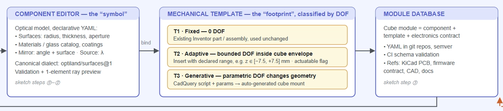
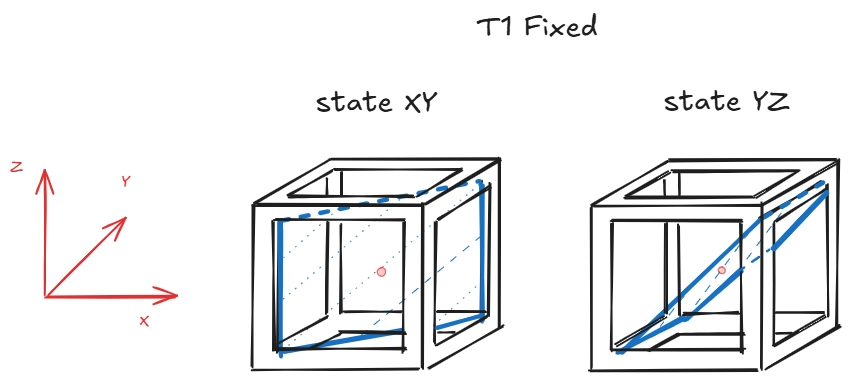
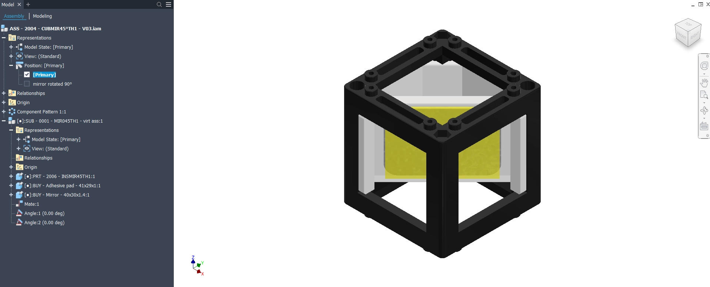
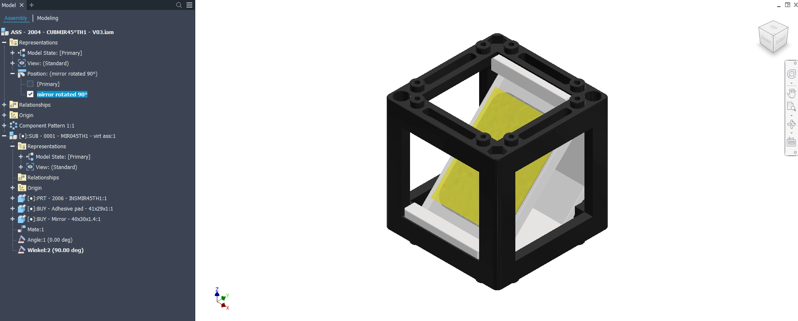
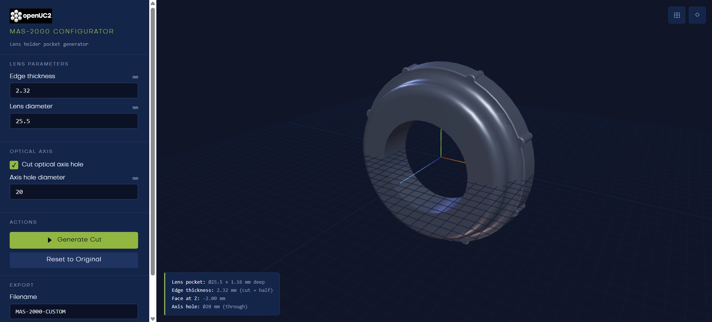
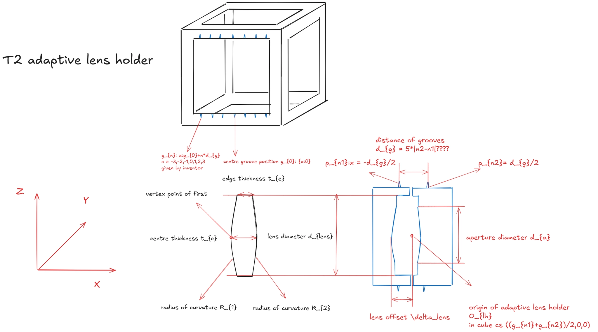
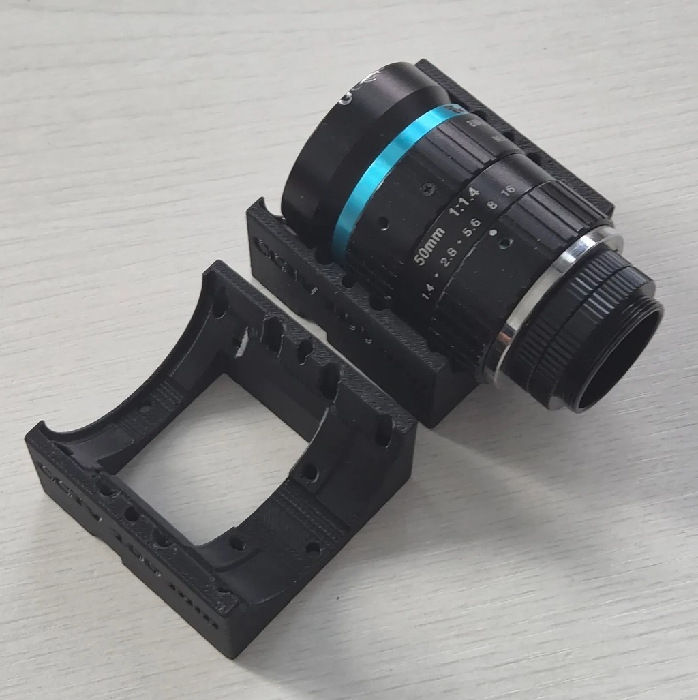
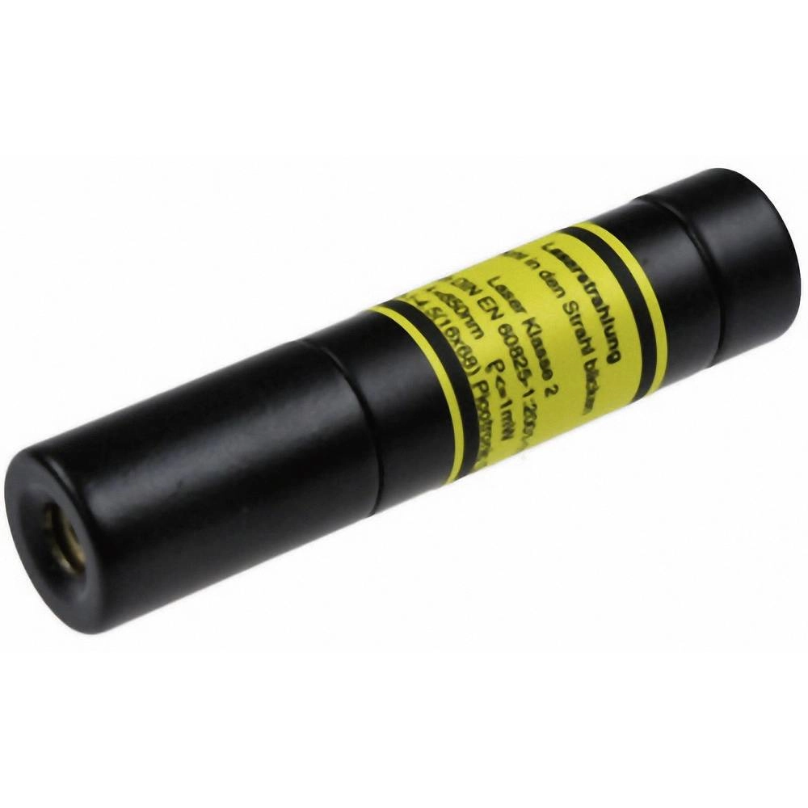

**Mechanical templates**

{width="6.3in" height="1.4in"}

This document explains how an optical component works together with the
mechanical template to become a cube module. The core idea is components
first, then use the corresponding mechanical template to place them into
the cube system. Cube module = component + template + electronics
contract.

A mechanical template connects the component data in the OptiKit
database with the CAD model Inventor. The template reads the component
information stored in the database and translates it into a
corresponding mechanical model. Depending on the required degrees of
freedom for mechanical design tasks, mechanical templates can be divided
into three categories:

T1: templates for existing fixed designs.

T2: templates for adaptive designs.

T3: templates for generative designs.

**Template T1: existing fixed designs**

{width="5.902777777777778in"
height="2.638888888888889in"}

T1 is used for existing fixed module designs that have already been
fully developed and validated. These modules typically can be used
unchanged. Some of them may support a known and finite set of
configurations and can only switch between these predefined states.

**Example: 45° Mirror module**

{width="6.3in"
height="2.551388888888889in"}

{width="6.3in"
height="2.5381944444444446in"}

For example, a 45° Mirror module, it has two states: the normal vector
of the mirror stays in the XY plane or the YZ plane. To use this
existing design, we only need to fill in a few parameters to get the
mechanical design in Inventor, and then these parameters are sent to
Inventor to switch the module state.

{width="6.3in"
height="2.8465277777777778in"}

Warning: Before working on an existing design, make a copy first. Parts
or assemblies may be linked to other designs---especially if the same
model has been added to the system multiple times.

**Template T2: adaptive designs**

T2 is used for components that require more degrees of freedom to move
inside the cube. Typically, these components can be placed within a
bounded region inside the cube, and we use the cube's grooves to design
a holder that places the optical components stably after optimization.

**Example: lens holder**

The idea is similar to the openuc2 lens designer
website([[https://youseetoo.github.io/openuc2-lens-designer/]{.underline}](https://youseetoo.github.io/openuc2-lens-designer/)).
Once the lens parameters are provided, it can be used to build a lens
holder that is inserted directly into the cube at a precise position.

{width="6.3in"
height="2.8465277777777778in"}

{width="6.3in"
height="3.5006944444444446in"}

The relationship between a thick lens, an adaptive lens holder, and the
cube groove is shown below.

**Template T3: generative designs**

T3 is used for components that require the maximum degree of freedom to
integrate into the cube module. For these components, we need to crop an
area to fit the component in. For example, the laser holder and camera
holder.

{width="2.896213910761155in"
height="2.9019608486439195in"}{width="2.8431375765529308in"
height="2.8431375765529308in"}

---

## Platform notes (added 2026-07-17 with the round-3 plan review)

What this document pins down beyond the earlier T-class model — normative for
WP-34/WP-35:

- **T1 has STATES, not zero knobs.** A fixed design may support a finite set
  of named configurations, implemented in Inventor as *positional
  representations* (`Position: [Primary] / "mirror rotated 90°"`, driven
  Angle/Winkel parameters — see `ASS - 2004 - CUBMIR45°TH1`). The template
  record therefore carries `states:` (name → optical pose/plane), the placed
  component selects one state (an enum DOF), and the optikit→Inventor
  pipeline switches the representation before export. The WP-29 mirror pair
  (flat_45 / flat_0) are exactly two states of one physical module.
- **T2 lives on the groove lattice.** Holder positions are quantized by the
  cube grooves `g_n = g_0 + n·d_g` (n = −3…3, d_g given by Inventor; the
  sketch proposes d_g·|n2−n1| — confirm the pitch). The holder clamps a
  groove pair (n1, n2), its origin sits at the pair midpoint, and the LENS
  carries a continuous offset δ_lens inside the pocket. So the T2 DOF
  decomposes into: discrete groove-pair choice + bounded continuous offset —
  cubify/DRC must snap and validate against the lattice, and optimize
  results decompose into nearest-groove-pair + residual.
- **T2 pockets are generated from the prescription.** The MAS-2000 lens-
  holder pocket generator (edge thickness, lens diameter, axis-hole ⌀ →
  "Generate Cut" → `MAS-2000-CUSTOM.stp`) is the reference: a standard
  master insert with a parametric pocket. T2 = lattice-placed master insert
  + prescription-driven pocket; T3 = free-form cavity crop anywhere
  (laser/camera holders — the boolean generator).
- **Copy before editing** existing Inventor designs — parts/assemblies may
  be linked across designs (the document's warning; belongs in the ME guide).
