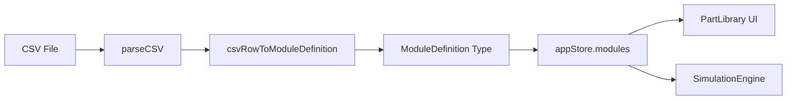
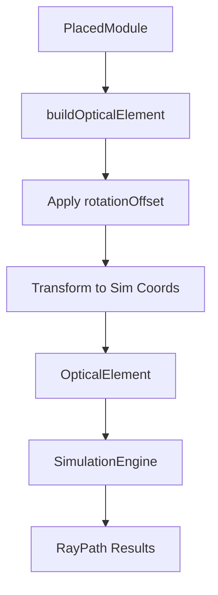

# OptiKit Module Database & Repository Structure Guide

**Version:** 1.0  
**Date:** January 2026  
**Purpose:** Developer reference for creating unified module repositories

---

## Table of Contents

1. [CSV Database Structure](#csv-database-structure)
2. [Module Consumption in OptiKit](#module-consumption-in-optikit)
3. [Grid & Coordinate System](#grid--coordinate-system)
4. [Ray Tracing Integration](#ray-tracing-integration)
5. [Storage Architecture](#storage-architecture)
6. [Proposed Unified Repository Structure](#proposed-unified-repository-structure)

---

## CSV Database Structure

### Location
- **Standard Modules:** `/public/modules_updated.csv`
- **User Modules:** External GitHub repository (e.g., `openUC2-OptiKit-Store`)

### CSV Schema (Semicolon-delimited)

```csv
id;name;group;color;width;height;thumbnail;cadUrl;description;defaultParams;autodeskInventor;price;notification;Done;ImSwitch
```

#### Field Descriptions

| Field | Type | Required | Description | Example |
|-------|------|----------|-------------|---------|
| `id` | string | ✅ | Unique module identifier (kebab-case) | `lens-pos-1x1` |
| `name` | string | ✅ | Display name | `Lens (positive)` |
| `group` | string | ✅ | Category for organization | `lenses`, `cameras`, `stages` |
| `color` | hex | ✅ | Module color in UI | `#7cc142` |
| `width` | int | ✅ | Grid cell width (1 cell = 50mm) | `1` |
| `height` | int | ✅ | Grid cell height | `1` |
| `thumbnail` | path | ⚠️ | Icon/preview image | `/icons/uc2_lens.svg` |
| `cadUrl` | path | ⚠️ | 3D CAD file (STL) | `/cad/lens-1x1.stl` |
| `description` | string | ⚠️ | Module description | `Optical lens module...` |
| `defaultParams` | JSON | ⚠️ | Default parameters | `{"focalLength": 100}` |
| `autodeskInventor` | string | ❌ | Autodesk file reference | `ASS-2021-...` |
| `price` | float | ❌ | Estimated cost (EUR) | `100` |
| `notification` | string | ❌ | Warnings/notices | `"Only few left!"` |
| `Done` | string | ❌ | Status flag | |
| `ImSwitch` | JSON | ❌ | ImSwitch integration config | See [ImSwitch](#imswitch-integration) |

### Example Row

```csv
lens-pos-1x1;Lens (positive);lenses;#7cc142;1;1;/icons/uc2_lenspositive_1x1.svg;/cad/lens-1x1.stl;Optical lens module for beam focusing;"{""focalLength"": 100}";ASS - 2021 - CUBLEND40F50 - V04.iam;100;;;
```

---

## Module Consumption in OptiKit

### Loading Pipeline



### Code Flow ([moduleLoader.ts](src/utils/moduleLoader.ts))

```typescript
// 1. Load CSV
const csvText = await fetch('/configurator/modules_updated.csv');

// 2. Parse CSV rows
const rows = parseCSV(csvText);

// 3. Convert to ModuleDefinition
const modules = rows.map(csvRowToModuleDefinition);

// 4. Store in appStore
appStore.modules = modules;
```

### ModuleDefinition Type ([index.ts](src/types/index.ts))

```typescript
export interface ModuleDefinition {
  id: string;
  name: string;
  group: string;              // Category
  color: string;              // Hex color
  footprint: Size;            // { width, height } in grid cells
  thumbnail?: string;         // Icon path
  cadUrl?: string;            // STL/CAD file path
  description?: string;
  defaultParams?: Record<string, unknown>;
  isWildCard?: boolean;
  price?: number;
  notification?: string;
  imSwitchConfig?: string;    // Electronics/firmware config
}
```

---

## Grid & Coordinate System

### Coordinate Spaces

OptiKit uses **three coordinate systems**:

#### 1. Grid Coordinates (UI Placement)
- **Unit:** Grid cells (integer indices)
- **Origin:** Top-left corner (0, 0)
- **Usage:** Module placement on canvas
- **Example:** A 2×1 module at position `{x: 3, y: 2}` occupies cells (3,2) and (3,3)

```typescript
interface PlacedModule {
  position: Point; // Grid coordinates (integers)
  rotation: 0 | 90 | 180 | 270; // Degrees
}
```

#### 2. Canvas Pixel Coordinates (Rendering)
- **Unit:** Pixels
- **Scale:** Configurable (default: 80px per grid cell)
- **Usage:** Konva rendering layer
- **Transformation:** `canvasX = gridX * gridCellSize`

#### 3. Simulation Coordinates (Ray Tracing)
- **Unit:** Millimeters (mm)
- **Scale:** 1 grid cell = 50mm (fixed physical dimension)
- **Origin:** Center of grid cell
- **Usage:** Optical simulation calculations

```typescript
// Transformation: Grid → Simulation
function gridToSimCoords(gridPos: Point): SimPoint {
  return {
    x: (gridPos.x + 0.5) * 50, // Center of cell, in mm
    y: (gridPos.y + 0.5) * 50
  };
}
```

### Grid System Architecture

```
┌─────────────────────────────────────────────────┐
│  Grid Space (0,0 = top-left)                    │
│  ┌───┬───┬───┬───┐                              │
│  │0,0│1,0│2,0│3,0│  Each cell = 50mm × 50mm     │
│  ├───┼───┼───┼───┤                              │
│  │0,1│1,1│2,1│3,1│  Module: {x:1, y:1}          │
│  ├───┼───┼───┼───┤  Sim coords: (75mm, 75mm)    │
│  │0,2│1,2│2,2│3,2│                              │
│  └───┴───┴───┴───┘                              │
└─────────────────────────────────────────────────┘
```

### Rotation System

Modules can be rotated in 90° increments:
- **0°:** Default orientation
- **90°:** Clockwise 90°
- **180°:** Upside down
- **270°:** Counter-clockwise 90°

**Footprint Swap:** When rotated 90° or 270°, width and height are swapped.

```typescript
const isRotated = rotation === 90 || rotation === 270;
const effectiveWidth = isRotated ? footprint.height : footprint.width;
const effectiveHeight = isRotated ? footprint.width : footprint.height;
```

---

## Ray Tracing Integration

### Simulation Model Mapping

Each optical module has a simulation model defined in [MODULE_SIMULATION_MODELS](src/types/index.ts):

```typescript
export const MODULE_SIMULATION_MODELS: Record<string, ModuleSimulationModel> = {
  'lens-pos-1x1': {
    elementType: 'lens',
    defaultParams: { focalLength: 100, aperture: 25 },
    rotationOffset: 0, // Correction for icon vs optical orientation
    parameterMappings: { 'focalLength': 'focalLength' }
  },
  'led-470nm': {
    elementType: 'led',
    defaultParams: { wavelength: 470, divergence: 30, rayCount: 7 },
    rotationOffset: 180, // LED icon faces opposite to emission
    parameterMappings: { 
      'wavelength': 'wavelength',
      'divergence': 'divergence'
    }
  }
};
```

### Scene Building Pipeline



### Coordinate Transformation ([sceneBuilder.ts](src/utils/sceneBuilder.ts))

```typescript
// 1. Calculate module center in simulation space
const center = getModuleCenterSimCoords(module, definition, 50);
// Result: { x: 75mm, y: 125mm }

// 2. Apply rotation offset (compensate for icon orientation)
const effectiveRotation = (module.rotation + simModel.rotationOffset) % 360;

// 3. Create optical element
const element: OpticalElement = {
  position: center,      // Simulation mm coordinates
  rotation: effectiveRotation,
  params: buildElementParams(module, simModel)
};
```

### Optical Element Types

| Element Type | OptiKit Modules | Simulation Behavior |
|--------------|-----------------|---------------------|
| `laser` | `laser-*` | Collimated beam, single direction |
| `led` | `led-*`, `torch-*`, `laser-fcsm-*` | Point source, divergent rays |
| `lens` | `lens-*`, `objective-*`, `tube-lens-*` | Refraction with focal length |
| `mirror` | `mirror-*`, `kinematicmirror-*` | Specular reflection |
| `beamsplitter` | `beamsplitter-*` | Split ray into T/R paths |
| `dichroic` | `filter-dichroic` | Wavelength-selective splitting |
| `detector` | `camera-*`, `photodiode`, `screenholder-*` | Ray impact detection |
| `aperture` | `pinhole-*`, `iris-*` | Spatial filtering |
| `filter` | `filter-bandpass`, `polfilter-*` | Transmission attenuation |

### Compound Elements

Some modules create multiple optical elements (e.g., Fiber Combiner):

```typescript
'fiber-combiner': {
  elementType: 'compound',
  compoundElements: [
    { type: 'led', offsetX: -20, offsetY: -20, params: { wavelength: 488 } },
    { type: 'led', offsetX: -20, offsetY: 20, params: { wavelength: 635 } },
    { type: 'beamsplitter', offsetX: 0, offsetY: 0 }
  ]
}
```

---

## Storage Architecture

### State Management (Zustand)

OptiKit uses Zustand for state management:

```typescript
// appStore.ts - Main application state
interface AppStore {
  modules: ModuleDefinition[];        // Loaded from CSV
  placedModules: PlacedModule[];      // User's design
  annotations: Annotation[];
  layers: Layer[];
  // ... actions
}

// simulationStore.ts - Simulation state
interface SimulationStore {
  config: SimulationConfig;
  elements: OpticalElement[];         // Built from placedModules
  rays: RayPath[];                    // Simulation results
  detectorReadings: DetectorReading[];
  // ... actions
}
```

### File Format (.json)

Saved setups use JSON format:

```json
{
  "metadata": {
    "name": "My Microscope",
    "author": "John Doe",
    "description": "...",
    "version": "1.0"
  },
  "placedModules": [
    {
      "id": "module-uuid-1",
      "moduleId": "lens-pos-1x1",
      "position": { "x": 2, "y": 3 },
      "rotation": 0,
      "layer": 0,
      "params": { "focalLength": 120 }
    }
  ],
  "annotations": [...],
  "layers": [...]
}
```

### Local Storage

- **Auto-save:** Periodic save to `localStorage`
- **Key:** `optikit-autosave`
- **Undo/Redo:** History stack in memory (not persisted)

---

## ImSwitch Integration

Modules can include electronics/firmware configurations for ImSwitch hardware control:

```json
{
  "lasers": {
    "532": {
      "managerName": "ESP32LEDLaserManager",
      "managerProperties": {
        "rs232device": "ESP32",
        "channel_index": 2
      },
      "wavelength": 532
    }
  }
}
```

This enables OptiKit designs to export hardware control configurations.

---

## Proposed Unified Repository Structure

### Goal
Create a standardized repository structure for each UC2 module that includes:
- **Electronics** (schematics, PCB files)
- **Firmware** (Arduino/ESP32 code)
- **CAD** (mechanical designs, STL files)
- **Math Model** (optical simulation parameters)
- **Documentation** (assembly instructions, BOM)

### Recommended Structure

```
openUC2-Module-{ModuleName}/
├── README.md                      # Module overview, specs, assembly guide
├── module.json                    # Unified module definition (replaces CSV row)
├── electronics/
│   ├── schematic.pdf              # Circuit schematic
│   ├── pcb/                       # KiCad/Eagle files
│   │   ├── module.kicad_pro
│   │   ├── module.kicad_sch
│   │   └── module.kicad_pcb
│   └── BOM.csv                    # Bill of materials for electronics
├── firmware/
│   ├── platformio.ini             # PlatformIO config
│   ├── src/
│   │   └── main.cpp               # ESP32/Arduino firmware
│   └── README.md                  # Flashing instructions
├── cad/
│   ├── assembly/                  # Inventor/SolidWorks assemblies
│   │   └── module-assembly.iam
│   ├── parts/                     # Individual part files
│   │   ├── cube-base.ipt
│   │   └── lens-holder.ipt
│   ├── stl/                       # 3D printable files
│   │   ├── cube-base.stl
│   │   └── lens-holder.stl
│   └── README.md                  # Print settings, material specs
├── optics/
│   ├── simulation-model.json     # Ray tracing parameters
│   ├── measurements/              # Optical characterization data
│   │   ├── focal-length.csv
│   │   └── transmission.csv
│   └── README.md                  # Optical specifications
├── docs/
│   ├── assembly-instructions.pdf
│   ├── images/
│   │   ├── thumbnail.svg          # For OptiKit UI
│   │   └── assembly-step-*.jpg
│   └── videos/                    # Assembly tutorials
└── tests/
    ├── electronics/               # Test procedures
    ├── firmware/                  # Unit tests
    └── integration/               # System tests
```

### module.json Specification

Replaces CSV row with structured JSON:

```json
{
  "id": "lens-pos-1x1",
  "name": "Lens (positive)",
  "version": "2.0",
  "group": "lenses",
  "color": "#7cc142",
  "footprint": {
    "width": 1,
    "height": 1
  },
  "description": "Optical lens module for beam focusing",
  "thumbnail": "./docs/images/thumbnail.svg",
  "cadUrl": "./cad/stl/lens-assembly.stl",
  "price": {
    "parts": 5.50,
    "assembly": 3.00,
    "total": 8.50,
    "currency": "EUR"
  },
  "defaultParams": {
    "focalLength": 100,
    "aperture": 25
  },
  "optics": {
    "elementType": "lens",
    "rotationOffset": 0,
    "parameterMappings": {
      "focalLength": "focalLength"
    },
    "simulationFile": "./optics/simulation-model.json"
  },
  "electronics": {
    "hasElectronics": false
  },
  "firmware": {
    "hasFirmware": false
  },
  "imSwitch": null,
  "links": {
    "documentation": "./docs/assembly-instructions.pdf",
    "video": "https://youtube.com/...",
    "shop": "https://shop.uc2.de/..."
  },
  "maintainer": {
    "name": "UC2 Team",
    "email": "info@uc2.de",
    "github": "openUC2"
  }
}
```

### Benefits of Unified Structure

1. **Version Control:** Each module in separate Git repository
2. **Modularity:** Easy to update individual components
3. **Collaboration:** Clear ownership and contribution guidelines
4. **Testing:** Standardized test procedures
5. **Documentation:** Consistent across all modules
6. **Automation:** CI/CD for validation, testing, release
7. **Distribution:** Package as NPM/PyPI for easy installation

### Migration Path

1. **Phase 1:** Create template repository with structure
2. **Phase 2:** Migrate existing modules (priority: popular ones)
3. **Phase 3:** Update OptiKit to load from module repositories
4. **Phase 4:** Deprecate CSV database in favor of distributed `module.json` files

---

## Implementation Notes for Developers

### Creating a New Module

1. Clone template: `git clone https://github.com/openUC2/Module-Template`
2. Update `module.json` with specifications
3. Add CAD files to `/cad/stl/`
4. Add thumbnail to `/docs/images/thumbnail.svg`
5. If optical: Update `/optics/simulation-model.json`
6. If electronics: Add schematics to `/electronics/`
7. If firmware: Add code to `/firmware/src/`
8. Write assembly instructions in `/docs/`
9. Test and validate
10. Submit PR to module registry

### OptiKit Integration

OptiKit will need updates to:
- **Loader:** Fetch `module.json` instead of CSV rows
- **Validation:** JSON schema validation
- **Caching:** Local cache for module definitions
- **Discovery:** Module registry API for available modules
- **Versioning:** Handle multiple module versions

---

## Questions for Developers

When creating the unified repository structure, consider:

1. **Licensing:** How to handle different licenses (CAD vs firmware)?
2. **Versioning:** Semantic versioning for modules?
3. **Dependencies:** How to specify module dependencies (e.g., requires electronics-v3)?
4. **Testing:** Automated tests for CAD file validity, firmware compilation?
5. **Localization:** Support for multiple languages in documentation?
6. **Backwards Compatibility:** How to maintain compatibility with legacy CSV?

---

## Contact & Contributing

For questions or contributions to this specification:
- **GitHub:** [openUC2/openUC2-OptiKit](https://github.com/openUC2/openUC2-OptiKit)
- **Issues:** Use GitHub Issues for discussions
- **Wiki:** Detailed technical documentation

---

**Document Status:** Draft for Developer Review  
**Next Steps:** Community feedback → Finalize structure → Create template → Begin migration
